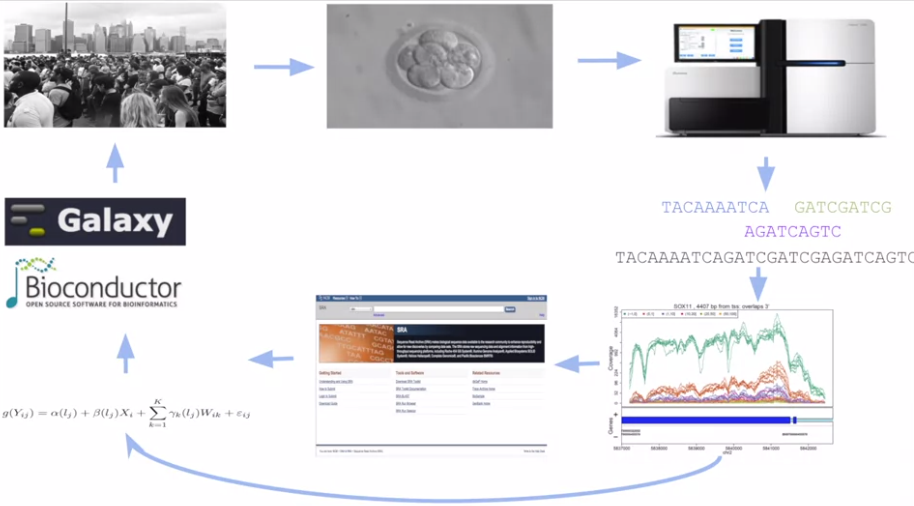

# Overview

* [Course site](https://www.coursera.org/learn/introduction-genomics/home/week/1)

## Why genomics ?

### Central dogma 不是標準原則

* Central dogma 不是準則，有非常多的變異點
  * DNA 生成的 Protein 可以回來和 DNA 結合
  * 一些 modifiers (methylation) 可以改變 DNA
* 所以 information 不只順著影響，也會逆向影響

### Sequencing

* Sequencing 是 genomics 的核心
  * 了解 gene 的所有影響
  * 因為 sequencing 的進步，可以測出單個 tumor 的 genome
  * 但目前無法完整分析

可以到 NCBI (National Center for Biotechnology Information) 下載這些已經定序好的 gene data

## What is genomics ?

如果是指 strucutre:

* 人類身體大約有 3 billion 個 nucleotides (As, Cs, Gs, Ts) 組成 genome
  * 所有 genome 都被分成 23 個 chromosomes (22 + XX or XY)
  * Chromosome 又有 centromere 和 telomere

如果是指 function:

* Genome 能做什麼 ?
  * Encode 所有身體會用到的東西
  * Respiration metabolism
  * Building brain

如果是指 evolution:

* 一代一代傳下來的 genome 是幾乎沒有什麼變的
  * 但可以和其他生物比較

### Difference between Biology-Genetics and Genomics

|            | Biology-Genetics                     | Genomics                            |
| ---------- | ------------------------------------ | ----------------------------------- |
| Scope      | targeted one or few genes            | all genes in a genome               |
| Technology | targeted, low-throughput experiments | global, high-throughput experiments |
| Hard part  | 設計良好實驗、不斷重複實驗           | 大數據、大量計算、不確定性          |

## What Is Genomic Data Science?

* Genomic Data Science = Bioinformatics
  * 包含 biology, statistics, computer science

Bioinformatics 在做什麼 ?

1. 收集任意 subject (e.g. human) 的細胞樣本
2. 對樣本執行 sequencing
3. 產生大量的 data
4. 每個 sequences 都是小片段，又稱為 reads
5. 將這些 reads 和 reference genome (e.g. average european male) 對齊
6. 開始分析差異
7. 儲存這些資料、分析結果到公開的 database (e.g. NCBI)
8. 對這些公開資料可以進一步分析

上圖順時針共有 8 個步驟，對應於一些重要領域

* **Experimental design** (1, 2, 3)
  * 設計出你想研究的東西，產生 data
* **Alignment & Assembly** (3, 4)
  * 將 data 與 reference genome 對齊，找出差異，集中結果
* **Preprocessing & Normalization** (4, 5)
  * 避免巨量 data 產生 bias 所以要正規化
* **Statistics & Machine learning** (5, 7)
  * 用一些技巧來得出結論
* **Software development** (8)
  * 利用現成軟體來加速進行
* **Population genomics** (5, 7, 8, 1)
  * 不一定只有找出 cancer 原因，也能找出同一群人的特徵 (e.g. 容易得到疾病)
*  **Integrative genomics** (6, 7, 8, 1)
  * 把所有結果整合

# Molecular Biology

## Just Enough Cell Biology

