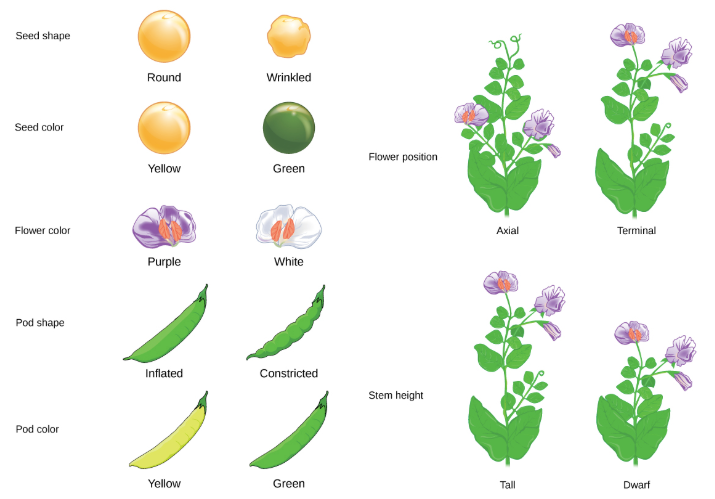
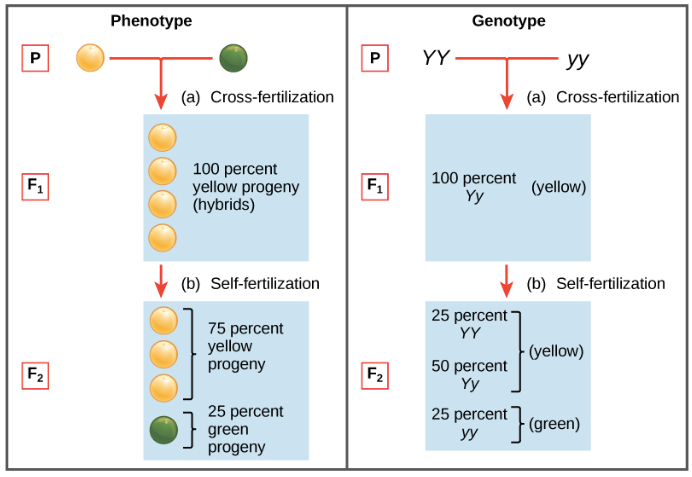
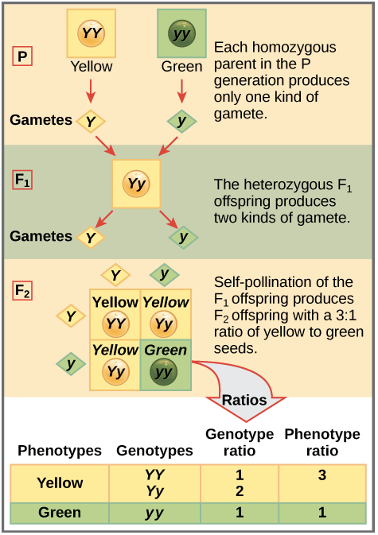
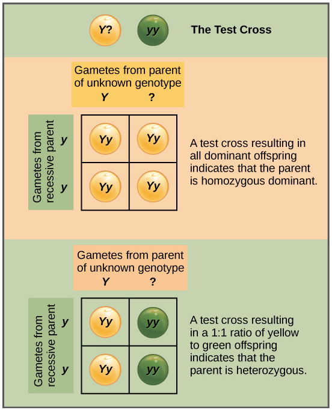
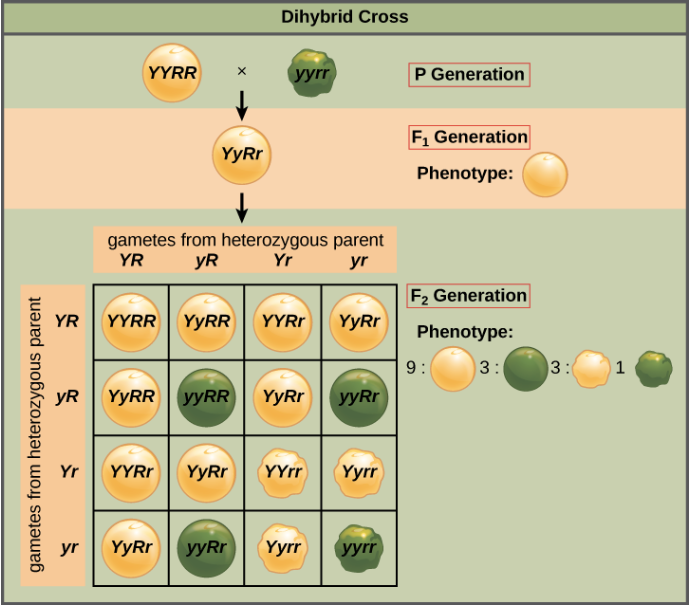
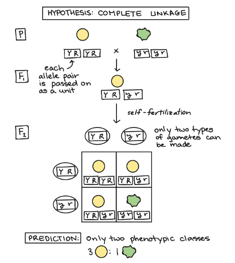
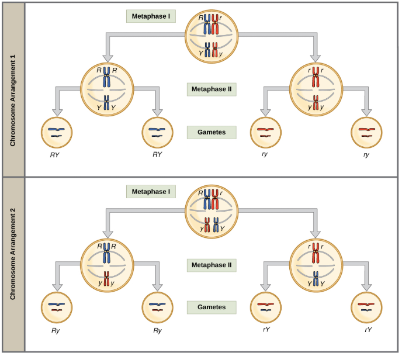
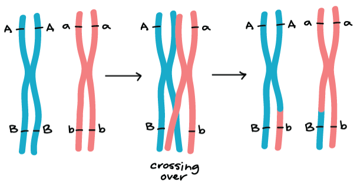
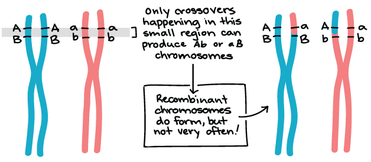

# Mendelian genetics

## Research on heredity

人類的遺傳特徵 (髮色、身高等) 來自父母親 genes 的影響，而 chromosome 上的任意一段 DNA 就是 genes

* 150 年前還不懂 gene 的概念
  * 是由 **Gregor Mendel** (father of genetic) 進行實驗所發現遺傳
  * Mendel 的發現有兩大定理
    * The law of segregation
    * The law of independent assortment

### 3:1 ratio

* Mendel 使用 pure-breeding 的 pea plants 作為研究對象
  * 研究交配後的顏色、大小、形狀等
  * 最初的世代稱為 P generation (parental)
  * 下一代稱為 F1 generation (first filial)
  * 再下代稱為 F2 generation (second filial)

Mendel 把擁有紫色花朵和白色花朵的 pea 交配，得到 100% 是紫色花朵的後代

* 他稱 F1 generation 中擁有紫色花朵為 **dominant trait** (顯性)
  * 被隱藏的白色花朵特徵稱為 **recessive trait** (隱性)

Mendel 進一步將這些 F1 generation 良好分類，並讓他們 **self-fertilize**

* F2 generation 中共有 705 紫色和 224 白色
  * 大概為 3:1 的比例，而這並非巧合
  * 其他所有的特徵在 F2 也是 3:1 的情況

### Mendel's model of inheritance

Mendel 將 3:1 ratio 和一些成果，統整成 model for the inheritance (單特徵的)

* 在 Mendel's model 中，父母會向孩子傳遞 "heritable factors"
  * 也就是我們現在所說的 genes
  * 每個獨立的個體都會有 2 個 gene 的複製
    * e.g., gene for seed color
  * 兩個 gene 表現在同個地方但不同特徵的地方稱為 allele
    * e.g., allele for green/yellow color
  * 當 allele 同時擁有 dominant 和 recessive 時
    * dominant 會將 recessive trait 完全隱藏起來

* **Genotype** 指的是生物中的一組組 alleles
  * YY, Yy, yY, yy
* **Phenotype** 指的是 genotype 所顯現的外部特徵
  * 黃色、綠色種子
* **Homozygous** 指的是兩個 gene 的同個 allele 是相同的
  * YY, yy
* **Heterozygous** 指的是兩個 gene 的同個 allele 不同
  * Yy, yY

> 這邊沒講到，但 phenotype 也會受到外部環境影響而改變

## The law of segregation

上面的 model 還不能完整解釋 3:1 ratio 的原因，需要 law of segregation 來講解

* Law of segregation
  * 控制特徵的兩個 genes 只有一個會由 gamete (egg, sperm cell) 方式傳遞給孩子，且 genes 的配置也是隨機的
  * 孩子的 genotype 就會是兩個 gametes 的 alleles 組合，如下圖

上方在 F2 展示的 four-squared box 稱為 **Punnett square**

* 在 Punnett square
  * 一邊寫著父親的 allele
  * 一邊寫著母親的 allele
  * 可以產生所有可能的 gametes
  * 因為 F2 是 self-fertilize，所以兩邊都是自己

因為 Punnett square 的每個方塊都是 equally likely event，
所以就可以從中得到 genotype 和 phenotype 的結果 (3:1 ratio)

### The test cross

Mendel 也想出辦法來找出特徵為 heterozygote (Yy) 或是 homozygote (YY)

* 因為 Yy 和 YY 都會是 dominant trait
* 所以要使用 **test cross** 找出誰才是真正的 genotype
  * 使用的生物包含 1 個 dominant phenotype (YY 或 Yy)
  * 還有一個 homozygous recessive (一定是 yy)

* 如果 dominant phenotype 是 homozygous (YY)
  * 那麼 F1 一定全部都是 dominant trait
* 如果 dominant phenotype 是 heterozygous (Yy)
  * 那麼 F1 的 phenotype 就會一半是 dominant 一半是 recessive
  * 1:1 ratio

## The law of independent assortment

Mendel 也解決了 genes 互相是否會影響的疑問，就是 law of independent assortment

* Law of segregation 預測了單一特徵的走向
  * 但能否用 2 個完全不同的 genes 來預測 2 個完全不同的特徵呢

首先，這 2 個 genes 是否是 inherited independently ?

* **Law of independent assortment** 說
  * Gamete 從一個 gene 收到的 allele
  * 並不會和從另一個 gene 收到的 allele 有任何關係

### Example: Pea color + pea shape genes

* Yellow, round seeds 為 YYRR
* Green, wrinkled seeds 為 yyrr

因為兩個都是 homozygous，所以根據 law of independent assortment

* Wrinkled, green plant 全都是 ry
* Round, yellow plant 全都是 RY
* 所以 F1 這代全都是 RrYy
  * 全都是 round, yellow plant 的 heterozygotes
  * 稱為 **dihybrids** (di-: two, -hybrid: heterozygous)

Dihybrid 的交配或 self-fertilization 稱為 **dihybrid cross**

* Mendel 在進行 Dihybrid cross 產生了 4 種後代
  * 機率分配是 9:3:3:1
  * 這個 ratio 是 law of independent assortment 的關鍵
  * 因為跟數學 (Punnett square) 算出來的一模一樣

### Independent assortment vs. linkage

我們用另一個角度看為何 law of independent assortment 會成立

* 若 color 和 shape 的 genes 真的會互相影響
  * 例如控制兩者的 genes 在 chromosome 上非常非常接近
  * 那 color 和 shape 的特徵就不可分離了吧

我們將 yellow, round 給成 2 個 YR，而 green, wrinkled 給成 2 個 yr

* F1 當然全都是 YyRr (yellow, round)
* F2 則變成了 3:1 ratio

所以如果兩個特徵真的會同時影響彼此 (**completely linked**)

* **Dihybrid cross** 就只會產生 **2 種**可能性的子代
  * 也就是 3:1 ratio

而 Mendel 的結果顯然不是 3:1 而是 9:3:3:1，這告訴他 genes 是 assorted independently

### The reason for independent assortment

為何會發生 independent assortment 要從 chromosomes 上面的 genes 看起

* 更準確的說，要觀察 **homologous pair** (相同位置的 alleles)
  * 在 meiosis I 的時候，這些 homologous pairs 會隨機排列
  * 然後就可以得到由不同 combo 組成的 gametes

考慮到下圖，兩種不同的 chromosome arrangement

* 一種是 red "mom" chromosomes 合併在一起
  * 一種是 red, blue 互相混合
* 在 meiosis 不斷發生的情況下
  * RY, Ry, rY, ry 就應該是相同的頻率出現

* 所以不同 chromosomes 的 genes 將會 assort independently
  * seed color 和 seed shape 的 genes 分別在 1, 7 chromosomes
* 在相同 chromosome 的 gene 只要離的夠遠也會 assort independently
  * 因為 crossing over 的發生

* 但有時候 genes 真的太靠近了，並不會 assort independently
  * 我們稱這些 genes 為 **linked**
  * 只有在非常少數的 crossing over 才會發生 assort independently

# Variations on Mendelian genetics

上面學到的 Mendel's law 可以概括整個遺傳的內容，但總會有些例外

## Variations involving single genes

* **Multiple alleles**
  * 一個 gene 可以有超過 Mendel 研究的兩個以上的 alleles
* **Incomplete dominance**
  * 兩個 alleles 不一定會完全 dominate 另一個的 phenotype
  * 可能會出現介於中間的 phenotype
* **Codominance**
  * 兩個 alleles 可能會同時 dominant (特徵一起出現)
* **Pleiotropy**
  * 某些 gene 可以一次影響很多特徵，不只一個
* **Lethal alleles**
  * 有些 genes 在 homozygous 或 heterozygous 時會導致死亡
* **Sex linkage**
  * Sex chromosomes 的 genes (e.g., X chromosome of humans)
  * 會有不同 inheritance patterns

## Variations involving multiple genes

有些變化會發生在 gene pairs 或大量 genes，也就是兩個以上 genes 影響了相同的 process

* **Complementary genes**
  * 兩個不同 genes 的 recessive alleles 反而給出一樣的 phenotype
* **Epistasis**
  * 某個 gene 的 alleles 可能將另個 gene 的 alleles 給隱藏
* **Genetically linked**
  * Gene pairs assort independently

## Polygenic inheritance and environmental effects

很多生物特徵是由多個 factors 所控制，這些 factors 可能包括 genetic, environmental (or both)

* **Polygenic inheritance**
  * Polygenic 代表該特徵是由多個不同的 genes 所控制
  * 這類特徵可能很模糊，而非一個簡單明確的特徵
* **Environmental effects**
  * Phenotype 不見得完全由 genotype 所控制
  * 有的 phenotype 還會受到環境的影響

因為 genetic 跟 environment 造成了兩個事件

* **Incomplete penetrance**
  * 不是每個 genotype 都能完整顯現出對應的 phenotype
* **Variable expressivity**
  * 一個 genotype 可能有較強或較弱的 phenotype

