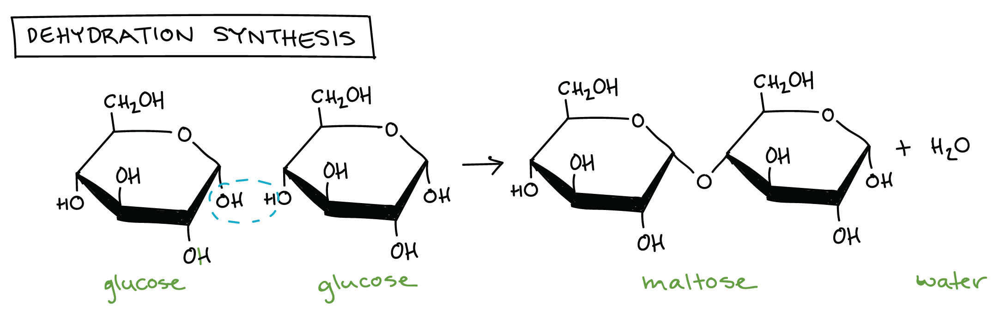
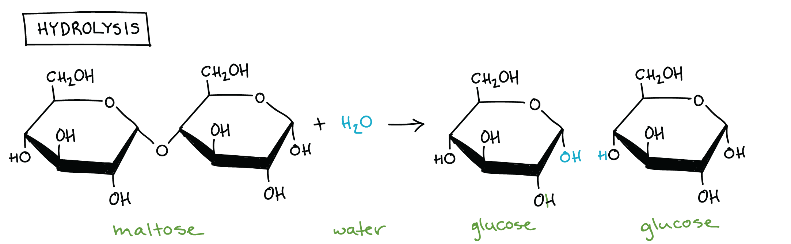

# Introduction

* 人類是由一堆 large biological molecules 組合而成
* 更可以將人類看成由 4 major types of large biological molecules 組成
  * carbohydrates (such as sugars)
  * lipids (such as fats)
  * proteins
  * nucleic acids (such as DNA and RNA)

- 這些 large biological molecules 在生物中處理非常多的工作
  - **carbohydrates** : store fuel, energy
  - **lipids** : key structure components of cell membranes
  - **nucleic acids** : store, transfer hereditary information (instruction for making proteins)
  - proteins : 最多功能性
    - structural support
    - carry out specific jobs in a cell, such as **catalyzing** metabolic reactions, **receive** or **transfer** signals

## Monomers and polymers

* 這些大多數的 large biological molecules 都是 **polymers** (視為 necklaces, series of beads)
* Polymers 又是由很多小單位重複的組成，這些小單位叫作 **monomers** (視為 beads)
* Carbohydrates, nucleic acids, proteins 這三類通常在自然中為 long polymers
  * 這三種又會被稱作 **macromolecules** (marco- : big, large, huge)
* Lipids 則是四個裡面最小的，甚至不會是一個 polymer
  * 有的時候 lipids 不會被考慮在 macromolecules 中
  * 但很多時候還是會稱這四個 large biological molecules 為 "**macromolecule**" (more loosely)

> 只要記得 lipids 也是 large biological molecules 的一員，但只是他不常形成 polymers

## Dehydration synthesis

- 這些 large biological molecules 通常透過 dehydration synthesis reaction 聚集起來
  - 也就是 monomers 之間會透過 covalent bond 起來，且過程中會釋放水分子
  - 這也是為什麼叫作 dehydration

- 例如上圖的 dehydration synthesis reaction 
  - 可以看到 2 個 sugar glucose 組合成 1 個 sugar maltose + 水分子
  - 其中一個 glucose 損失一個 H，另一個損失一個 OH group
  - 失去的兩個東西 (H 和 OH) 用 covalent bond 的形式組合成水分子
- 其他的 monomers 也用這個方式合成，最後就形成越來越長的 polymer

* polymers 雖然單純重複 monomer 組成，但可以有非常多的 shape, composition
  * composition, sequence 的不同會影響 function
  * carbohydrates, nucleic acids, proteins 都能有非常多不同類型的 monomers
    * 例如 DNA 有 4 種 nucleotide monomers
    * proteins 有 20 種 amino acid monomers

- 單一種類的 monomer 也可以組成不同的 polymers (當然就擁有不同 properties)
  - 例如 starch, glycogen, cellulose 都是由 glucose monomers 組成的 carbohydrates
  - 但都有不同的 bonding 和 branching patterns

## Hydrolysis

* polymers 有時需要**被轉換回** monomers
  * 例如身體會回收 molecule 來重新 build 其他的 molecule
* polymers 會透過 **hydrolysis reaction** 來**分解**成 monomers 
  * 也就是原本組合 monomers 的 bond 會被水分子**斷開**

- 在 hydrolysis reaction 當中，原本的組成分子會被一分為二
  - 其中一個 molecule 得到 hydrogen atom $$(\text{H})$$
  - 另一個 molecule 則得到 hydroxyl $$(\text{-OH})$$ group
  - H 和 -OH 兩者都是從 dehydration synthesis 產生的水分子而來
  - 所以 hydrolysis 其實就是 dehydration synthesis 的逆反應

* 這些被轉換回的 monomer 可以重組成新的 polymer
  * 例如下圖中水分子把 maltose 拆成 2 個 glucose monomers
  * 這是原先上圖那個 dehydration synthesis 的 reverse

* Dehydration synthesis reactions 需要能量來組合 molecules
* Hydrolysis reactions 則是把 molecules 拆解並釋放能量
* Carbohydrates, proteins, nucleic acids 就是透過這些 reactions 不斷建立又拆解，儘管他們的 monomers 都是不同的

> * 在 cell 中的 nucleic acids 實際是不會用 dehydration synthesis 來合成
> * 有些種類的 lipids 也會使用 dehydration synthesis 來合成，儘管 lipids 不是 polymers

## Enzymes

* 身體中的 enzymes 通常會加速 (catalyze) dehydration synthesis 和 hydrolysis 兩種反應
* 而破壞 bond 的 enzymes 通常命名的結尾會有 **-ase**
  * 例如 maltase enzyme 用來分解 maltose
  * lipases 用來分解 lipids
  * peptidases 用來分解 proteins
* enzymes 可以分解任何 large biological molecules
  * 將物質釋放成 small building blocks 供身體吸收及使用
