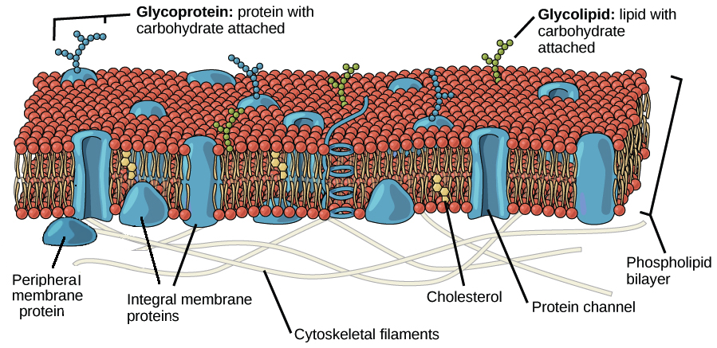
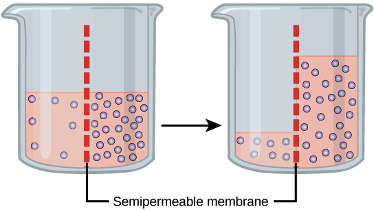
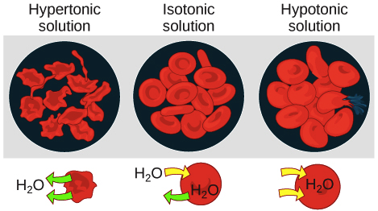
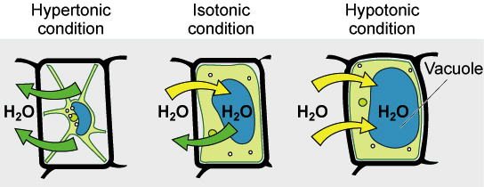

# The plasma membrane

每個 cell 都是被包覆在 membrane 泡沫當中

* membrane 的質地其實就像沙拉油一樣
  * 看起來隨便就可以破掉，但其實非常適合作為 cell 的包裝
* Membrane 的工作有很多
  * 包覆 cell
  * 與外部環境互動
  * 輸入輸出一些物質
  * 認知其他 cells，並跟其溝通

為了能處理這些工作，membrane 必須包含 lipids (semi-permeable barrier), proteins (transport, communication), carbohydrates (decorate lipids and proteins, recognition)

## Fluid mosaic model

現今最正確稱呼 membrane 架構的說法為 **fluid mosaic model**

* fluid mosaic model (1972) 用來定義各種 cells 的 membrane 架構
  * 元件 (phospholipids, cholesterol, proteins 等) 自由浮動在 membrane 的平面上
  * 像 mosaic 一樣的鑲嵌畫板
  * 例如下圖只是 membrane 在 dynamic process 中的任一 snapshot 而已

Membrane 主要元素有 lipids (phospholipids, cholesterol), protein, carbohydrate groups 附在一些 lipids 和 proteins 上面

* **Phospholipid** 由 1 個 glycerol 和 2 個 fatty acid tails 還有 1 個 phosphate group 的頭組成
  * 生物細胞的 membranes 主要會有兩層 phospholipids 形成 phospholipid bilayer
* **Cholesterol** 主要由 4 個 fused carbon rings 組成
  * 主要影響 fluidity
* **Proteins** 有的作為橫跨整個 membrane 作為通道，有的只出現在內外表面
  * 又可以分成 **integral membrane protein** 和 **peripheral membrane protein**
  * Integral membrane protein 能夠穿過整個 membrane 的又叫 **transmembrane proteins**
* **Carbohydrate groups** 只出現在外部，作為 ID markers 讓 cell 互相辨識
  * 和 proteins 形成 **glycoproteins**
  * 和 lipids 形成 **glycolipids**

在人類細胞的 membranes 中，proteins 佔了約 50%，lipids 40%，carbohydrates 10%

# Diffusion and osmosis

植物沒有澆水就會萎縮，這是因為水分子都從細胞跑出來了，但為什麼 ?

* 這是因為 osmosis 作用發生
  * 隨著外部 solute concentration 的增加
  * 它們能夠將水分子從 cell 中拉出來

正式來講，**osmosis** 指的是水從 **lower solute concentration** 區域通過 semipermeable membrane 到 **higher solute concentration** 區域所產生的 net movement

* semipermeable 代表只有水分子可以穿過但一些 molecule 無法穿過的意思
* osmosis 對於生物的一些作用十分重要，特別是跟 solute diffusion, transportion 有關的

## Diffusion

要了解 osmosis 之前，先來了解基本的 diffusion 作用

* 通常 higher concentration 的 molecules 最終會和 lower concentration 形成平衡
  * 也就是高濃度區域的 molecules 會移動到低濃度的區域
  * 這不是什麼定理，只是單純的機率問題
  * 因為 molecules 只是隨機跳動，高濃度的區域一定更高機率移動到低濃度區域

## Osmosis

基於一般 diffusion 的現象，我們在 higher 和 lower concetration 中間加入一個 **semipermeable membrane**，並且加入一個 **solute** 到其中一邊，他將影響整個機率問題 !

* 有很多的理論提出不同的原因
  * 主要就是新加入的 solute molecules 也在跳動，但無法通過 membrane
  * 不斷反彈，影響水分子移動到對面
* 不管理論如何，我們知道某一邊 solute 加入越多，該邊的水就越難流到對面
  * 造成低濃度 solute 的水流到高濃度 solute 的區域

## Tonicity

細胞外部 solution 讓細胞水分因為 osmosis 作用移動的現象稱為 **tonicity**

* 一個 solution 的 tonicity 跟他的 **osmolarity** 有關
  * Osmolarity 代表該 solution 中的 solutes 濃度
    * 所以當一邊為 low osmolarity 一邊為 high osmolarity
    * 水分子就會從 low 移動到 high

有三個詞彙可以用來比較細胞內部和外部的 osmolarity，並且通常代表 solute 是無法通過 membrane 的 !

* **Hypotonic** 代表 osmolarity A < B
  * hypo-: less than
  * 所以水會往 B 流
* **Isotonic** 代表 osmolarity A = B
  * iso-: the same
  * 水很平衡
* **Hypertonic** 代表 osmolarity A > B
  * hyper-: greater than
  * 所以水會往 A 流

舉個例子，細胞內部是跟外部的 solute 濃度比起來是 hypertonic，代表外部的濃度跟內部比起來是 hypotonic !

## Tonicity in living systems

現在從動物細胞角度來看 tonicity，也就是當細胞置入三種不同的 solution 時

* Place in **hypertonic** solution
  * 水會離開細胞，細胞萎縮
  * 紅血球可能會死亡
* Place in **isotonic** solution
  * 不會有水移動
  * 紅血球最適合的環境
* Place in **hypotonic** solution
  * 水會進入細胞，細胞膨脹
  * 紅血球可能會爆炸

紅血球在 isotonic 環境是最好，但植物則需要 hypotonic 環境才是最好 !

* 因為植物細胞絕對不會被撐破 (cell wall)
* 所以通常植物細胞的 cytoplasm 會比外界還要 hypertonic (讓水流進來)
  * 直到達到內部壓力 (**turgor pressure**) 防止過多水進入

維持 tonicity 關係到植物的死活

* 如果沒澆水，外部可能會變成 isotonic 或是 hypertonic
  * 造成水流失，降低 turgor pressure，最終枯萎
  * 最終達到 **plasmolysis** 的狀況 (下圖最左)
  * Plasmolysis: membrane detach from wall and constrict the cytoplasm

