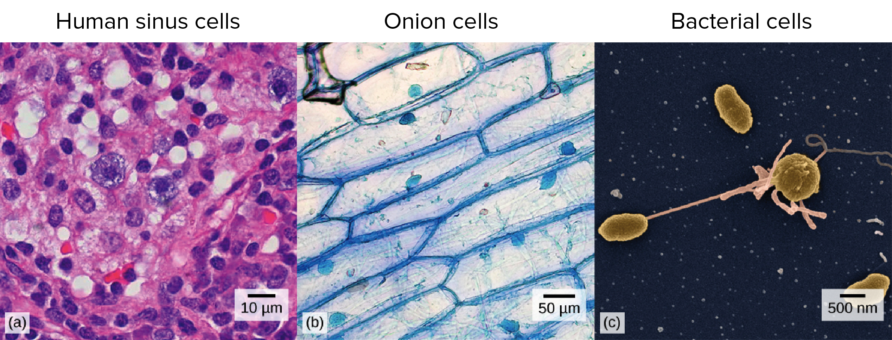
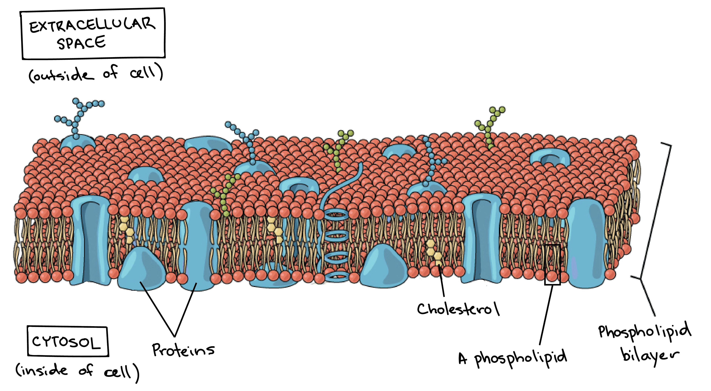
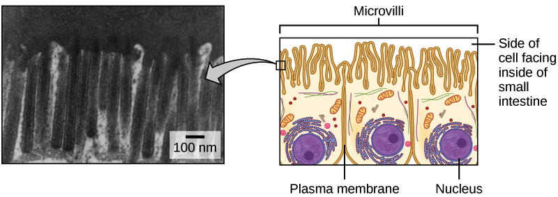
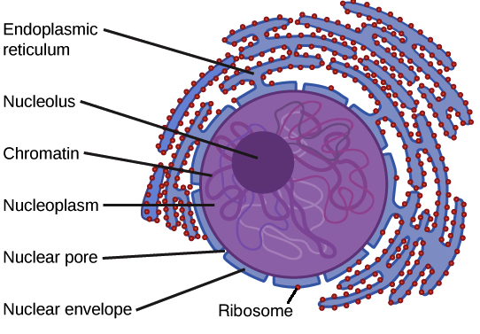
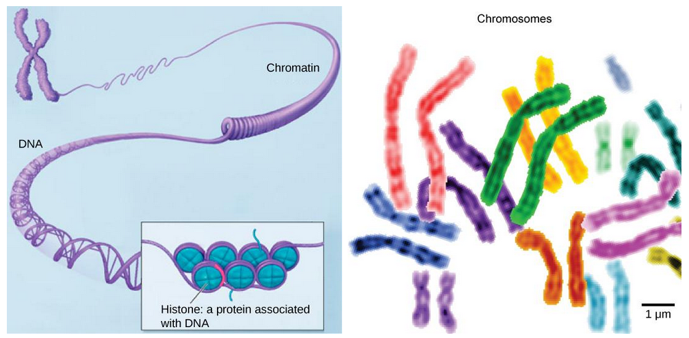
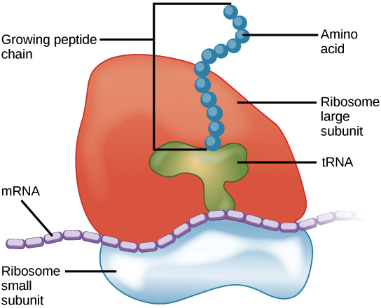

# Intro to cells

牆是"磚"砌成的，人是"細胞"組成的 (standard building block)

* 但細胞不像磚塊無趣，細胞的可能性非常多
  * 有各種形狀、各種功能
  * 還能到處移動
* 各種細胞會扮演各種不同角色，幫助我們成長、生存
  * epithelial cell 負責保護身體的表面，例如皮膚或器官
  * bone cell 負責建構骨骼支撐身體
  * cells of immune system 對抗細菌
  * blood cells 在身體裡四處運送養分及氧氣，並移除 carbon dioxide
* Cell 不只人類擁有，其他動物、植物、甚至細菌都有
  * 雖然會有很大不同，但都會有一些相同的地方

## Scale of cells

雖然我們知道 atom, protein, virus, cell, ... 都是小到肉眼看不到的東西，但他們還是有大小之分 !

* Water molecules : ~0.275 nm (約 10 億分之 1 公尺)
* Hemoglobin (protein) : 5 nm (約 10 億分之 5 公尺) 
* HIV (virus) : 120 nm
* Red blood cell : 6 to 8 μm (micrometer, 約 100 萬分之 7 公尺)
  * 含有 280 million 個 hemoglobin !

## Cell theory

其實到 1600s 根本沒有人知道 cell 的存在

* 因為細胞實在太小了，沒有很強力的 **microscopes** 能夠看到細胞

> * 附帶一提，最適合觀測細胞的是 **light microscope**
> * 而最適合觀測到細胞內部架構的是 **transmission electron microscope**

直到第一個人看到，並且在他的書中命名為 cell

* **Robert Hooke** 這位英國科學家是第一個用他的 microscope 看到細胞這個 microscopic structures
  * 他將看到的一切和命名都寫在他的 *Micrographia* 書中
  * 他看到的細胞是 dead cork tissue
  * 因為外型非常像寺院中僧侣所居住的小房間 (cells of a monastery)
  * 所以就取名為 cell

但 Hooke 所看到的只是一個死掉的細胞

* 第一個看到活著的細胞的是一個荷蘭貿易家 Anton van Leeuwenhoek
  * 他在 1670s 改善了 Hooke 的 microscopes
  * 建立出更強大的 microscopes
  * 這些加強的 microscopes 可以看到一些 single-celled organisms
    * 例如 bacteria, sperm cells
    * 他將這些 cell 稱作 animalcules

儘管如此，還是沒有人相信 cell 是組成動物、植物、細菌最基礎的 building block，直到 160 年後 ...

* 植物學家 Matthias Schleiden 和動物學家 Theodor Schwann
  * 兩人在 1830s 提出了跨世紀的突破理論
* 也就是所有植物和動物的所有部位，都是由 cell 組合而成
* 以及 cells 是可以被其他 cells 所生產出來的

接著德國科學家 Rudolf Virchow 盜用了別人的點子，也就是

* 波蘭科學家 Robert Remak 基於上面兩位所提出的第三個理論
  * 所有的 cells 都是從其他 cells 而來 !!!
  * 這在今日聽起來也是非常匪夷所思的理論

這三點總結起來就是 modern **cell theory**

1. All living things are composed of one or more cells.
2. The cell is the basic unit of life.
3. New cells arise from pre-existing cells.

# Prokaryotic and eukaryotic cells

人體是一個細胞的家，總共有 100 trillion 的細胞在人體中

* 人體其實就是一個 ecosystem
  * 包含了 prokaryotic, eukaryotic cells
* 所有的細胞就是分成了這兩類
  * Prokaryotic (**pro-** : before, **kary-** : nucleus)
    * 目前只有 single-celled organisms (Bacteria, Archaea) 被分類在此
  * Eukaryotic (**eu-** : true)
    * Animals, plants, fungi, protists 是該分類
    * 而他們又是由很多的 eukaryotic cells 組成

Cell 的大小範圍在 0.1 到 100 μm

* 其中 prokaryotic cells 在 0.1 到 5 micrometers (μm)
* 而 eukaryotic cells 在 10 到 100 micrometers (μm)
* 為什麼不能更小 ?
  * 因為細胞必須要放得下需要的元件
* 為什麼不能更大 ?
  * 因為細胞越大越難和外界交換足夠的養分來供給
  * 可以從 **surface-area-to-volume ratio** 看得出來

## Prokaryotic cells

不同的細胞主要還是有四種重要的元件

* **plasma membrane**
  * 幫助細胞分開內部和外部環境的接觸
* **cytoplasm** (細胞質)
  * 包含像果凍的 cytosol，還有一些 cellular structures
  * 通常在 nucleus 和 membrane 之間
* **DNA**
  * 是該細胞的 genetic material
* **Ribosomes**
  * 是一個 molecular machines 用於合成 proteins

上面講的是和 eukaryotes 共同的地方，再來講點相異的地方

* Prokaryote 指的是簡單的 single-celled 生物
  * 沒有 nucleus 和 membrane-bound 的 organelles
  * 內部沒有被切成多個功能的部分，是一個開放空間
* prokaryotic DNA 會在開放空間的最中間 (**nucleoid**)
  * 通常包含了 circular chromosome (single large loop)
  * 下圖是一個 rod-shaped bacterium 剖面

* 一般的 bacteria 含有這些構造 :
  * 用 **peptidoglycan** (肽聚醣) 組成的 rigid cell wall
    * **Cell wall** 保護細胞、維持形狀、避免 dehydration
  * 有的還有用 **carbohydrates** 組成最外層的 capsule
    * **Capsule** 幫助細胞跟當下環境表面接觸
  * 一些外部構造幫助移動細胞，甚至交換 genetic material
    * **Flagella** 像 rotary motors 依樣幫助 bacteria 移動
  * 另外還有跟頭髮很像的 **fimbriae** 用來跟 host cell 或其他表面接觸
  * 有的 bacteria 還有各種不同的桿狀架構 **pili**
    * 有些幫助 bacteria 之間傳遞 DNA molecules
    * 有些也幫助 bacteria 移動

## Eukaryotic cells

如果把 prokaryotic cells 譬喻為比較窄的單人房，那麼 eukaryotic cells 就是合租公寓了吧

* 就像大房子一樣，有浴室、廚房、臥室、客廳一樣
  * Eukaryotic cells 會含有各種不同功能的 **compartments**
  * Compartments 被層層的 membrane 分隔開來
  * 所以每個 compartment 都有獨自的 conditions 進行自己的工作

以下舉幾個常見的 compartments

* **Lysosomes (溶酶體)** 是細胞的回收中心
  * 必須要保持正常的 acidic pH 才能 dispose 細胞垃圾
* **Peroxisomes (過氧化體)** 負責處理一些 chemical reaction
  * 例如 oxidation reactions 和生產 hydrogen peroxide
  * 這兩件是都有可能傷及細胞，所以 comparment 起到很好的保護

就是因為 eukaryotic cell 可以維持多種環境在一個細胞的能力，而 prokaryotes 不行

* 所以 eukaryotic cells 可以比 prokaryotic cells 還能成長好幾倍

Eukaryotic cells 還比 prokaryotic cells 多了幾種重要特徵

* Membrane-bound **nucleus**
  * 在細胞中央被 membrane 包住的洞，是 genetic material 的家
* Number of membrane-bound **organelles**，各種浮在 cytosol 上的 **compartments**
* Multiple **linear chromosomes**
  * 對應到 prokaryote 中的 single circular chromosome

## Plasma membrane and cytoplasm

* Cell 非常簡單來說就是 bag of goo
  * Plasma membrane 就是 bag
  * Cytoplasm 就是 goo
* 但 cell 其實非常精緻，所以 bag 和 goo 也非常複雜
  * Membrane 是包含 lipids 和 proteins 的雙層架構，負責任何東西進出 cell
  * Cytoplasm 不只包含 cytosol，更包含 organelles, structural proteins (skeleton of the cell)

### Plasma membrane

* Membrane 所含的 lipids 是 **phospholipids**
  * phospholipid 由 hydrophilic 的 phosphate head 和兩個 hydrophobic 的 fatty acid tails 組成
  * hydrophilic head 朝外，hydrophobic tails 朝內，自然形成雙層架構
  * 這個 energetically faborable 的雙層架構又稱為 **phospholipid bilayer**

* Protein 會傳過整個 membrane，作為 channels 或 signal receptors 的角色
* 有的 lipids 如 cholesterol 則是控制了 membrane 的 fluidity

Plasma membrane 是 cell 內部和外部的邊界，控制一些 molecules 的通過

* 所以 sugars, water, ions, amino acids 都需要通過 plasma membrane 才能到達 cell 內部
  * 簡單的 nonpolar molecules (e.g., oxygen) 可以直接從 phospholipid 部分通過
  * 較大的 polar, hydrophilic molecules (e.g., amino acids) 必須從 protein channel 通過

Plasma membrane 的 **surface area** 會限制 cell 和周遭環境物質交換的上限

* 某些特別需要物質交換的 cell 的 membrane surface area 就會較大
  * 例如為了吸收養分的 cells 會折成 fingerlike projection 形狀
  * 這些稱為 **microvilli (singular: microvillus)**
  * Microvilli 分布在小腸表面，從食物中吸收養分
  * 因為增加表面積的關係，讓 microvilli 幫助小腸最大化的得到養分

### Cytoplasm

Cytoplasm 在 eukaryotes 和 prokaryotes 中有些微的不同

* 在 eukaryotes 指的是 nucleus 和 membrane 間的所有東西
* 在 prokaryotes 因為沒有 nucleus，所以指的是在 membrane 裡所有的東西

兩者共同有的是 cytosol

* Gel-like 的 **cytosol** 是 cytoplasm 主要物件
  * 組成物是 water-based solution (含有 ions, small molecules, macromolecules)
* 為什麼 cytosol 主要是水組成，但為何會是 Jello-like 的呢
  * cytosol 包含大量的 macromolecules (e.g., proteins) 還有 small organic molecules 懸浮其中
  * 有 glucose, sugars, polysaccharides, amino acids, nucleic acids, fatty acids, ...
  * Ions of sodium, potassium, calcium, ...
  * 很多的 metabolic reaction (e.g., protein synthesis) 也都是在 cytosol 進行

在 eukaryotes 有特別的一些東西在 cytosol 當中

* Membrane-bound organelles
* cytoskeleton (network of fibers)
  * give the cell shape
  * organize cellular components

## Nucleus and ribosomes

汽車、房子、模型，都需要藍圖，人體也有藍圖，不只給了建造的重點，更給了所有建造的步驟

* 這麼重要的資訊一定存在很保密的地方
  * 這正是 eukaryotic cells 所做的事
    * 將 genetic material 存放在 membrane-enclosed 的 nucleus 當中

Eukaryotes 甚至不會讓重要資訊離開 nucleus 中

* Eukaryotic DNA 透過 transcribe (copy) 至 RNA molecules 再離開 nucleus
  * RNA 接著再 cytosol 與 ribosomes 相遇，創造出 proteins

### Nucleus

* **Nucleus** (plural: **nuclei**) 就是 genetic materia (DNA) 的家
  * 可以生成 ribosomes
  * 收集 proteins
  * **chromatin** (纏繞 protein 的 DNA) 儲存在 **nucleoplasm** (gel-like)

* 包住 nucleoplasm 的是 **nuclear envelope**
  * Envelope 包含 2 層的 membrane (outer & inner)
    * Membrane 又再包含 2 層的 phospholipids bilayer (tails inward)
  * Envelope 的 2 層 membrane 的中間有一個小空間
    * 小空間將會連接到 **endoplasmic reticulum** (membranous organelle)

再來是控制物質進去的部分

* **Nuclear pores** 將 envelope 些微張開，控制物質進出 nucleus
  * 控制進出的開關稱為 **nuclear pore complex**

若用顯微鏡可以看到一點黑點在中心

* **Nucleolus** 產生新的 ribosomes
  * 一些 chromosomes 含有 DNA 片段能夠 encode ribosomal RNA
  * 這類 RNA 和 protein 結合成為 ribosom
  * 在 nucleolus 中，新的 ribosomal RNA 和 proteins 合成出 ribosome 的 subunits
  * 這些 subunits 就會穿過 nuclear pores 移動到 cytoplasm 開始他們的工作

有些 cell 可以多達 6 個 nucleoli (e.g., mouse cell)，而 prokaryotes 沒有半個 nucleus，需要在 cytosol 中製造 ribosomes

### Chromosomes and DNA

了解 nucleus 後來深入了解內部的 DNA

* DNA 主要由 1 至多個 **chromosomes** 組成
  * 一個 chromosome 是非常長的 string 或 DNA loop
  * 一個 chromosome 可以承載非常多 genes
* 在 prokaryotes 中 DNA 通常是單個 circular chromosome (a loop)
* 在 eukaryotes 中則是 linear structures (strings)
  * 每個 eukaryotes 都有特定數量的 chromosomes 在 cells 的 nucleus 當中
    * 例如人類細胞有 46 個 chromosomes
    * 果蠅的細胞只有 8 個 chromosomes

Chromosomes 只有在細胞進行 division 時才可以很好的觀測到

* 所以細胞在生長和維護的階段時
  * Chromosomes 會變成 unwound, jumbled bunch threads
  * 此時 enzyme 就可以介入將 DNA 編譯成 RNA 來利用

不論是 loose 還是 compact 的 chromosomes 都會和 structural proteins 結合在一起

* 例如下圖的 DNA 和 histone 這種 protein 結合在一起
  * 這些跟 DNA 相關的 proteins 幫助 DNA 進入 nucleus
  * 他們也扮演讓 genes 啟動或不啟動的角色
  * 這種 DNA 和 proteins 組合的複雜結構叫作 **chromatin**

* 一個人類細胞的 DNA 通常有 2 m
 * 一個 nucleus 的半徑大約只有 0.006 mm

所以要把整個 DNA 塞進 nucleus 相當於將 40 km 的直線塞到一顆網球裡 !!

### Ribosomes

接下來是用來產生 protein 的重要角色 **ribosomes**

* Ribosome 由 RNA 和 proteins 組成
  * 含有兩個分開的 RNA-protein complexes (small, large subunits)
  * 大的在小的上面，中間夾著 RNA template (mRNA)

在 eukaryotes 中， ribosomes 是怎麼樣從 nucleus 獲得製造 protein 的指令呢 ?

* Nucleus 中一部分的 DNA (genes) 被轉錄 (transcribed) 成 messenger RNAs (mRNAs)
* mRNAs 從 nucleus 來到 ribosome 並告訴他基因給予製造 protein 的訊息 
  * 例如用什麼特別的 amino acids 序列
* 這一連串的動作叫作 **translation**
* 另外在 prokaryotes 因為沒有 nucleus，所以直接在 cytoplasm 轉錄成 mRNAs 然後直接給 ribosomes

在 eukaryotes 的 ribosomes 可以出現在各種地方

* 例如漂浮在 cytoplasm
* 或是 bound (attach) 在 endoplasmic reticulum 和 nuclear envelope 的外部
  * Nucleus 那張圖的**紅點**就是 bound ribosomes
  * ribosomes 和 endoplasmic reticulum 結合在一起會成為 **rough endoplasmic reticulum**

因為 protein synthesis 是細胞中非常基本且重要的功能，幾乎所有 cell 都有 ribosomes (甚至 bacteria)

* 而某些特別需要產生 proteins 的細胞會有非常大量的 ribosomes
  * 例如 pancreas (胰臟) 為了產生大量 digestive enzymes
  * 所以 pancreatic cells 擁有異常多數量的 ribosomes

# Tour of eukaryotic cell

## The endomembrane system

# Extracellular structures and cell-cell junctions

