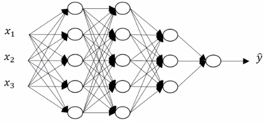
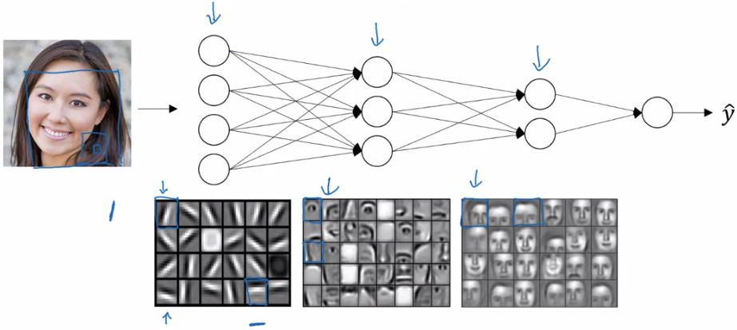
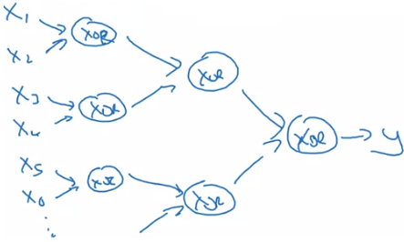
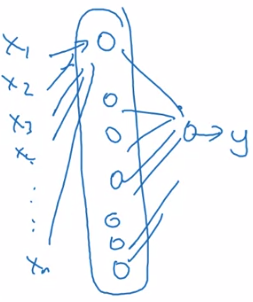
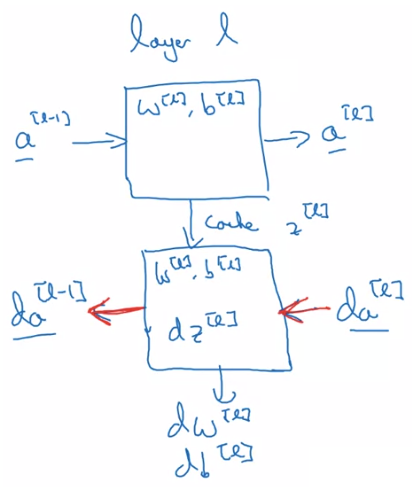
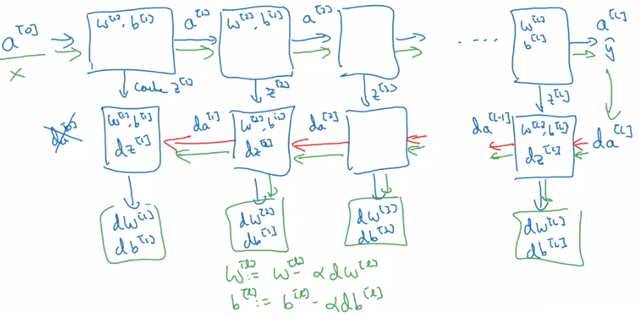

# Deep L-layer Neural Network

* 只有 1-layer 的 logistic 及一些層數較少的 nn 會稱作 "**shallow**" neural network
* 當你有越多的 hidden layers 代表你的 nn 越接近 **deep** neural network
* 介紹一些 deep neural networks 的 notation
* $$L$$ 表示 layer 數
* $$n^{[l]}$$ 表示第 l 層的 units 有幾個
* $$a^{[l]}$$ 表示第 l 層的 activations
  * $$a^{[l]} = g^{[l]}(z^{[l]})$$
* $$w^{[l]}$$ 和 $$b^{[l]}$$ 表示 $$z^{[l]}$$ 的 weights
* 另外補充
  * $$x = a^{[0]}$$ 表示 input layer，共有 $$n^{[0]} (n_x)$$ 個 units
  * $$\hat{y} = a^{[L]}$$ 表示 output layer，共有 $$n^{[L]}$$ 個 units

# Forward Propogation in a Deep Neural Network

* 要在上面的 5-layer nn 進行 forward propogation
* 方法跟之前學的 2-layer 很像，只是不斷對下面這個步驟 iterate 而已
* 下面是一個 generalize 的 forward propogation step

$$
\begin{aligned}
Z^{[l]} &= W^{[l]}A^{[l-1]} + b^{[l]} && X = A^{[0]}\\
A^{[l]} &= g^{[l]}(Z^{[l]})
\end{aligned}
$$

* 若有 l layers，那就要 iterate `for i = 1:l`
* 通常跑完所有 layer 需要一個 explicit for-loops 而不是 vectorization

# Getting your matrix dimensions right (Debug)

* 在建置一個 nn 時，考慮好每一個 vector 及 matrix 的 dimension 非常重要
* 是防止 program 產生問題的重點

## Parameters $$W^{[l]}$$ and $$b^{[l]}$$

* 先看計算第一層 $$z$$ 時 $$w$$ 和 $$b$$ 的 dimension 

$$
\begin{aligned}
&z^{[1]} = &w^{[1]} &\times &x &+ &b^{[1]}\\
&(3, 1) &(3, 2) & &(2, 1) & &(3, 1)\\
&(n^{[1]}, 1) &(n^{[1]}, n^{[0]}) & &(n^{[0]}, 1) & &(n^{[1]}, 1)
\end{aligned}
$$

* 可以一般化 $$w$$ 和 $$b$$ 在計算 $$z$$ 時的 dimension 
* 在 backprop 時，產生的 $$dw, db$$ 也會和 $$w, b$$ 一模一樣 dimension

$$
\begin{aligned}
w^{[l]} &= (n^{[l]}, n^{[l-1]}) \\
b^{[l]} &= (n^{[l]}, 1) = z^{[l]}
\end{aligned}
$$

## Vectorized Implementation

* 使用 vectorization 一次執行 m 筆 training examples 於 forward propogation 時
* 原本的 z 變成一個 m columns 的矩陣

$$
Z^{[1]} = \begin{bmatrix}
|&|&&|\\
z^{[1](1)}&z^{[1](2)}&\cdots&z^{[1](m)}\\
|&|&&|
\end{bmatrix}
$$

* z 的運算變成這樣
  * b 保持不變是因為 python 會自動使用 broadcasting 技巧
$$
\begin{aligned}
&Z^{[1]} = &W^{[1]} &\times &X &+ &b^{[1]}\\
&(n^{[1]}, m) &(n^{[1]}, n^{[0]}) & &(n^{[0]}, m) & &(n^{[1]}, 1)
\end{aligned}
$$

* 簡單來說，$$z, a$$ 變成 $$Z, A$$ 在 dimension 上就是從 1 column 變成 m columns

$$
z^{[l]}, a^{[l]} : (n^{[l]}, 1) \rightarrow
Z^{[l]}, A^{[l]} : (n^{[l]}, m) 
$$

# Why Deep Representations ?

以下用兩個方向來解釋為什麼 nn 越 deep 越好

## Intuition

* 有了 Deep neural network
* 我們可以在第一層 hidden layer 對圖片做簡單運算和偵測
  * 例如找出圖片的水平或垂直邊緣線
* 接著組合上一層結果，在下一層進一步運算
  * 例如找出五官或是一些部位
* 越往下層走，就可以得到越複雜的計算
  * 例如到最後可以進行人臉辨識
* 另一個例子是語音辨識系統
  * Audio -> low level audio waves -> phonemes -> words -> sentences
* 所以 deep learning 能將一件是從 simple 做到 complex 得到近似解

## Circuit Theory

* 另一個例子是用邏輯電路來呈現
* 假設我要運算出 $$x_1 \text{ XOR } x_2 \text{ XOR } x_3 \text{ XOR } \cdots \text{ XOR } x_n$$
* 一般的做法都會是使用一個 $$O\log(N)$$ 的方法 (意指 deep nn 的好處)

* 另一種 shallow 的方法則需要展開 $$O(2^N)$$ 的 nodes 才能做到

> Informally:
> 
> There are functions you can compute with a "**small**" L-layer deep neural network
> 
> that **shallower** networks require exponentially more hidden units to compute.

# Building Blocks of Deep Neural Networks

* 在實際建置 dnn 時，可以把每一個 $$A^{[l]} \rightarrow A^{[l+1]}$$ 的 forward 想成一個 block
* 同理的，也可以將 $$dA^{[l-1]} \leftarrow dA^{[l]}$$ 的 backward 想成一個 block
* forward 會將計算好的值 cache 起來給 backward 使用

## Forward Propogation

* Input : $$a^{[l-1]}$$
* Output : $$a^{[l]}$$
* Cache : $$z^{[l]}, w^{[l]}, b^{[l]}$$
* Process : 

$$
\begin{aligned}
Z^{[l]} &= W^{[l]} \cdot A^{[l-1]} + b^{[l]} \\
A^{[l]} &= g^{[l]}(Z^{[l]})
\end{aligned}
$$

## Backward Propogation

* Input : $$da^{[l]}$$
* Ouput : $$da^{[l-1]}, dW^{[l]}, db^{[l]}$$
* Process :

$$
\begin{aligned}
dZ^{[l]} &= dA^{[l]} \cdot \ast g^{[l]'}(Z^{[l]}) \\
dW^{[l]} &= \frac{1}{m} dZ^{[l]} \cdot A^{[l-1]T} \\
db^{[l]} &= \frac{1}{m} \text{np.sum}(dZ^{[l]}) \\
dA^{[l-1]} &= W^{[l]T} \cdot dZ^{[l]}
\end{aligned}
$$

* 整個組合起來的 blocks 會長成這樣

# HyperParameters

* 一般的 parameters 是指 $$W^{[1]}, b^{[1]}, W^{[2]}, b^{[2]}, \cdots$$
* hyperparameters 指的是那些足以影響 parameters 的參數
* 這些 hyperparameters 的設定往往依靠著經驗來做
* 現有的舉例有
  * learning rate $$\alpha$$
  * number of iterations
  * number of hidden layers $$L$$
  * number of hidden units $$n^{[1]}, n^{[2]}, \cdots$$
  * choice of activation functions $$tanh, ReLU, ...$$
* 未來還會有
  * momentum
  * mini-batch size
  * regularization algorithms
* 所以 deep learning application 其實是一個 very **empirical** process
  * 常需要在 Idea -> Code -> Experiment 中不斷循環