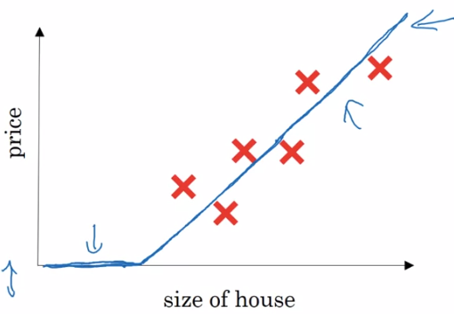
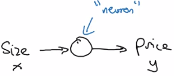
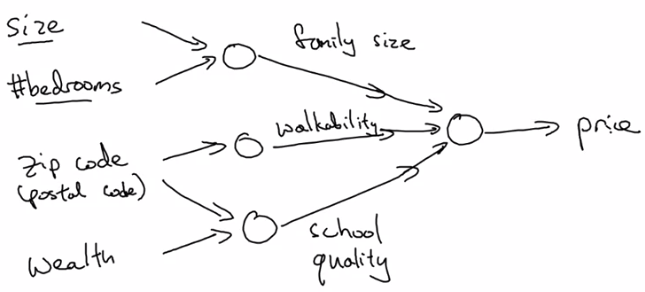
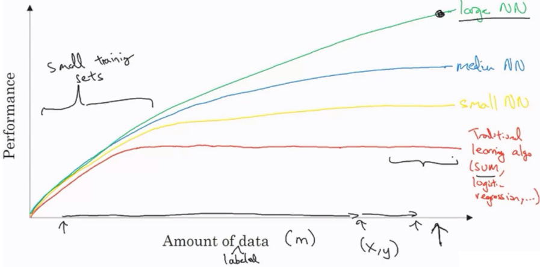

# What is Neural Network ?

我們可以用一個 linear regression 的例子來解釋 Neural network

假設我們要用房子大小來預設價格

這裡我們生出一個最簡單的 neural network

* x 是我們的 **input** (house size)
* 他會經過一個 **neuron** (activation function)
  * 這邊使用的為 **ReLU** function (**Rectified Linear Unit**)
  * ReLU function 的圖形跟上面的 house prediction 一模一樣
* 最後我們吐出一個 **ouput** y (price)

Neural networks 可以像樂高一樣層層堆疊起來

像是一步一步把結果導向最佳解

每一個 hidden layer 的 neuron 我們都可以自行定義他的意思

例如 input 1, 2 所產生的第一個 neuron 代表的是 family size

他可以比 1, 2 更有效的來預判 price

所以給予 neural networks 足夠的 input 通常能產生不錯的 output

# Supervised Learning with NN

目前非常成熟的 neural networks 通常都是 supervised learning

也就是給定 label x 與 y 來做訓練

以下是一些 neural networks 中熱門的 supervised learning

| Input (x)         | Output (y)            | Application         | Type        |
| ----------------- | --------------------- | ------------------- | ----------- |
| House features    | Price                 | Real Estate         | Standard NN |
| Ad, User info     | Click ad ?            | Advertising         | Standard NN |
| Image             | Object (0, ..., 1000) | Photo tagging       | CNNs        |
| Audio             | Transcript            | Speech Recognition  | RNNs        |
| English           | Chinese               | Machine Translation | RNNs        |
| Image, Radar info | Position of other car | Autonomous Driving  | Custom NN   |

## Data Type

### Structured Data

| Size | Bedrooms | ... | Price |
| ---- | -------- | --- | ----- |
| 2104 | 3        |     | 400   |
| 1600 | 3        |     | 330   |
| 2440 | 3        |     | 350   |
| ...  |          |     |       |
| 3000 | 4        |     | 500   |

### Unstructured Data

* Audio
* Image
* Raw Text

Neural networks 的進步能夠被大家看見

也有一些原因是因為 neural networks 開始能夠分析 unstructured data !

# Why is Deep Learning taking off ?

**"Scale"** drives deep learning progress !

* 傳統的 learning algorithm 在 data 越來越多時，並不能有顯著的提升
* 一開始發現小型的 Neural networks 在 data 變多時，可以提升 performance
* 接著發現中型、大型的 Neural networks 又能更加提升 performance
* 直到今日，越大的 Neural networks 利用越多的 data 就可以有越好的 performance
* 所以 scale 指的是 Both Neural networks 和 data 的大小

另外 deep learning 的進步也受益於

* **Data** : 現在的生活中能夠數位化的東西非常多
* **Computation** : GPU 等硬體的出現及升級
* **Algorithm** : 不時的有更強大的演算法被發表出來，例如 ReLU

