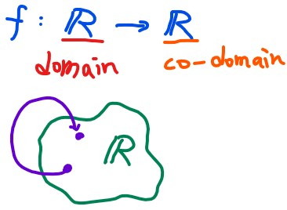

# Matrix Transformations

## Functions and linear transformations

###  formal understanding of functions

我們都知道 function 的表示如下
$$
f:X\to Y
$$

我們可以帶入更多的術語進到 function 裡面，這裡用一個 x 變成 x^2 的 function 來示範
$$
f(x) = x^2 \mid f:\mathbb{R} \to\mathbb{R}
$$

這個 function 從 R map 到還是 R，而且可以表示成另一個方式
$$
f: x \mapsto x^2
$$

我們稱還沒轉換的前一個物件為 domain ，而轉換過後的物件為 co-domain

因為 x 轉換成 x^2 還是在 real number 裡面，所以 f 的 domain & co-domain 都是 real number

> 那什麼是 Range 呢？
>
> Range 是 co-domain 的 subset ，這個 subset 為 function 真正 map 到的地方
>
> 例如有個 function 讓任何 R2 都會 maps 到 2
> $$
> g: \mathbb{R}^2 \to \mathbb{R} \mid g(x_1, x_2) =2
> $$
> 所以他的 domain 為 R2，co-domain 為 R，range 為 { 2 }

另外，若是 function map 到的 co-domain 為 R，那我們稱之為 **scalar (real) valued function** 

而 co-domain 為 R2, R3, R100, Rn，那我們稱之為 **vector valued function**

### Vector Transformation

我們可以將 function apply 到 vector 上面，這時候雖然做的事情一樣，不過我們稱為 transformations
$$
f: \mathbb{R}^n \to \mathbb{R}^m
$$

例如我們可以將 R3 的 vector 轉換到 R2 的 vector
$$
f\left(\begin{bmatrix} x_1\\x_2\\x_3\end{bmatrix}\right) = \begin{bmatrix} x_1+2x_2\\3x_3\end{bmatrix}
$$
若 domain 為 (1, 1, 1) 就會有對應的 co-domain (3, 3)
$$
f\left(\begin{bmatrix} 1\\1\\1\end{bmatrix}\right) = \begin{bmatrix} 3\\3\end{bmatrix}
$$

### Linear transformations

我們將給予 vector transformation 一個新名詞，叫作 **linear transformation**

只要 transformation 能夠符合兩項條件，那這個 transformation 就是 linear transformation

1. 兩個向量相加後再 transform 等於兩個向量先 transform 再相加
2. 任一向量先做 scalar multiplication 再 transform 等於先 transform 再做 scalar multiplication

$$
T: \mathbb{R}^n \to \mathbb{R}^m \\
\begin{align}
\text{Linear transformation } \iff &\vec{a}, \vec{b} \in\mathbb{R}^n\\
&T(\vec{a}+\vec{b}) = T(\vec{a})+T(\vec{b})\\
&T(c\vec{a}) = cT(\vec{a}) \mid c\in \mathbb{R}

\end{align}
$$

舉個符合 linear transformation 的 T function
$$
\begin{align}
&T: \mathbb{R}^2 \to \mathbb{R}^2\\
&T(x_1, x_2) = (x_1+x_2, 3x_1) \\\\
&\vec{a} = (a_1, a_2)\\
&\vec{b} = (b_1, b_2)\\
\end{align}
$$

1. T(a + b) = T(a) + T(b)

$$
\begin{align}
&\vec{a} + \vec{b} = (a_1+b_1, a_2+b_2)\\
&\color{red}{T(\vec{a}+\vec{b})} = ((a_1+b_1)+(a_2+b_2), 3a_1+3b_1)\\\\

&T(\vec{a}) = (a_1+a_2, 3a_1)\\
&T(\vec{b}) = (b_1+b_2, 3b_1)\\
&\color{red}{T(\vec{a})+T(\vec{b})} = ((a_1+b_1)+(a_2+b_2), 3a_1+3b_1) \\\\

&T(\vec{a}+\vec{b}) = T(\vec{a})+T(\vec{b})

\end{align}
$$

2. T(ca) = cT(a)

$$
T(c\vec{a}) = T((ca_1,ca_2)) = (ca_1+ca_2, 3ca_1)=c(a_1+a_2,3a_1)=cT(\vec{a})
$$

另外舉例一個不符合 linear transformation 的 T function
$$
\begin{align}
&T: \mathbb{R}^n \to \mathbb{R}^n\\
&T\left(\begin{bmatrix}x_1\\x_2\end{bmatrix}\right) = \begin{bmatrix} x_1^2\\0\end{bmatrix}\\\\

&\vec{a} = \begin{bmatrix}a_1\\a_2\end{bmatrix} \in \mathbb{R}^n
\end{align}
$$

這時我們試著 apply linear transformation 的第二個條件，很明顯他不符合第二項條件
$$
T(c\vec{a}) = T\left(\begin{bmatrix} ca_1\\ca_2\end{bmatrix}\right)=
\begin{bmatrix} c^2a_1^2\\0\end{bmatrix} = 
c^2\begin{bmatrix} a_1^2\\0\end{bmatrix} =
c^2T(\vec{a})
$$
所以這個 transformation **不是 Linear transformation**

### Visualizing linear transformations

知道 Linear transformation 的定義之後，先來看幾個不是 linear 的 transformation

1. [Lines do not remain straight & origin does not remain fixed](https://youtu.be/x1dGfxBdDlM)
2. [Look like linear but diagonal lines get curved](https://youtu.be/MgWkNwczVb0)

然後來看看 linear transformation with indicator

* https://youtu.be/XUw95PFP1RE

我們可以看到 i hat 從 (1, 0) 變到了 (1, -2)，而 j hat 從 (0, 1) 變到了 (3, 0)

也就是說，平面上任何一個 x 座標向量，他會跟 (1, 0) 一樣轉換了 (1, -2)
$$
\begin{bmatrix}x\\0\end{bmatrix} = 
x\begin{bmatrix}1\\0\end{bmatrix} \to
x\begin{bmatrix}1\\-2\end{bmatrix} =
\begin{bmatrix}x\\-2x\end{bmatrix}
$$
而平面上任何一個 y 座標向量，則會跟 (0, 1) 一樣轉換了 (3, 0)
$$
\begin{bmatrix}0\\y\end{bmatrix} = 
y\begin{bmatrix}0\\1\end{bmatrix} \to
y\begin{bmatrix}3\\0\end{bmatrix} =
\begin{bmatrix}3y\\0\end{bmatrix}
$$
這下我們就可以知道為什麼 (1, 1) 會變到 (4, -2) 了，因為
$$
\begin{bmatrix}1\\1\end{bmatrix} = 
\begin{bmatrix}1\\0\end{bmatrix} + 
\begin{bmatrix}0\\1\end{bmatrix}
\to
\begin{bmatrix}1\\-2\end{bmatrix} +
\begin{bmatrix}3\\0\end{bmatrix} =
\begin{bmatrix}4\\-2\end{bmatrix}
$$

> 我們可以從[這個影片](https://youtu.be/gNMGlQ62MBY)看到上面座標向量改變的動畫

最後，我們可以利用 matrices 來表達 linear transformation
$$
\begin{bmatrix}x\\y\end{bmatrix} = 
x\begin{bmatrix}1\\0\end{bmatrix} +
y\begin{bmatrix}0\\1\end{bmatrix}
$$
我們知道任意 x 可以表示成 x 乘 i hat，任意 y 可以乘 j hat

而 i, j hat 的 transformation 可以 apply 到其他 x, y 上面
$$
x\begin{bmatrix}\color{green}a\\\color{green}c\end{bmatrix} +
y\begin{bmatrix}\color{red}b\\\color{red}d\end{bmatrix} =
\begin{bmatrix}\color{green}{a}x+\color{red}{b}y\\\color{green}{c}x+\color{red}{d}y\end{bmatrix}
$$
如此一來，就有代表 transformation 的 matrix A 和要被我們轉換的 vector v

Av 即為轉換後的結果：
$$
\mathbf{A} = \begin{bmatrix}a&b\\c&d\end{bmatrix}, 
\vec{v} = \begin{bmatrix}x\\y\end{bmatrix}\\
\mathbf{A}\vec{v} = 
\begin{bmatrix}a&b\\c&d\end{bmatrix}
\begin{bmatrix}x\\y\end{bmatrix} =
\begin{bmatrix}ax+by\\cx+dy\end{bmatrix}
$$
