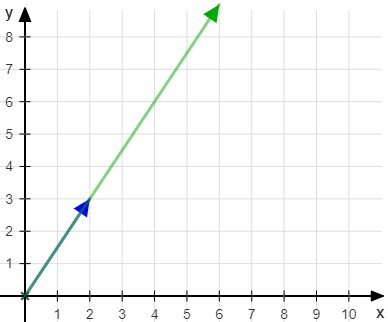
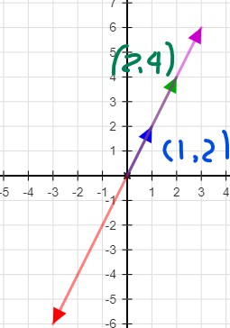
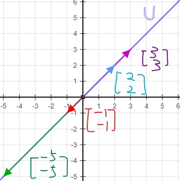
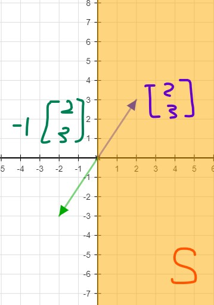
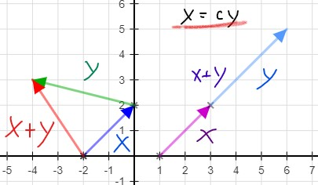
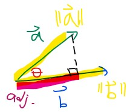
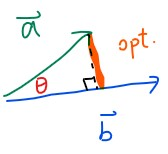
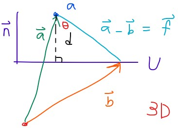

# Vectors and spaces

## Vectors

賦予任意坐標方向性，並且可以從任意起點開始

* Scalar multiplication
  * 視覺上就像一個向量，被直直的拉長 10 倍

$$
\vec{v} = (2,3) 
\\10\vec{v} = (20, 30)
$$

* Unit vector
  * A unit vector has a magnitude \(or length\) of 1.

$$
\begin{align}
&\vec{v} = \left(2,3\right)
\\ &\text{unit vector of } \vec{v} = \left(\frac{2}{\sqrt{13}},\:\frac{3}{\sqrt{13}}\right)\\
\\ &\text{check: }\sqrt{\left(\frac{2}{\sqrt{13}}\right)^2+\left(\frac{3}{\sqrt{13}}\right)^2} = 1
\end{align}
$$

* Add & subtract vectors
  * 視覺上就像先往第一個向量前進後，再往第二個向量的 \(正或反\) 向前進

$$
\begin{align}
\vec{u} &= (-5, 3)\\
\vec{w} &= (-12, -4)\\
\vec{w} - \vec{u} &= (-7, -7)
\end{align}
$$

## Linear Combination and Span

* [https://youtu.be/Qm\_OS-8COwU](https://youtu.be/Qm_OS-8COwU)

向量加上任意 **實數 scalar** 後，並且透過加法組合在一起時，產生一個 **線性** 的組合即為 _**Linear combination**_

$$
a_1\vec{v_1} + a_2\vec{v_2}+ \cdots + a_n\vec{v_n}. | a_n \in \mathbb{R}
$$

舉個例子，以下兩個向量經過與 scalar 相乘後，可以組合並且表示一個新的向量

$$
3 \begin{bmatrix} 1\\ 2\end{bmatrix}
+2 \begin{bmatrix} 0\\ 3\end{bmatrix}=
\begin{bmatrix} 3\\ 12\end{bmatrix}
$$

因為 Vectors 可以與**任意**實數相乘，產生的 linear combination 就可以任意表示其他向量，這個現象叫作 _**Span**_

例如以下兩個向量不管 a1 和 a2 為何，在 combine 之後只能 span 這兩條向量原本的那條線

$$
\begin{align}
a_1 \begin{bmatrix} 1\\ 2\end{bmatrix}+
a_2\begin{bmatrix} 2\\ 4\end{bmatrix}&=\\
a_1 \begin{bmatrix} 1\\ 2\end{bmatrix}+
2a_2\begin{bmatrix} 1\\2\end{bmatrix}&=\\
a_1 +2a_2 \begin{bmatrix} 1\\ 2\end{bmatrix}&=
a\begin{bmatrix} 1\\ 2\end{bmatrix}
\end{align}
$$

而底下兩個向量卻可以 **span** 整個二維平面的任意兩點，我們可以這樣表示

$$
\begin{align}
&\vec{v_1} = (1,0), \vec{v_2} = (0,1)\\
&a_1\vec{v_1} + a_2\vec{v_2} = \mathbb{R}^2
\end{align}
$$

## Linear Dependence & Linear Independence

* [https://youtu.be/CrV1xCWdY-g](https://youtu.be/CrV1xCWdY-g)

有了 linear combination 和 span 的知識後，很簡單就可以了解 Linear dependence / independence 的意義，

當你想要 span 某個東西時，使用不多不少剛剛好的向量來表示即為 _**Linear Independence**_

> 例如使用 \(1, 0\) 和 \(0, 1\) 來 span 整個 R2 平面時，這兩個向量即為線性獨立

而在 span 時，使用了 **多餘** 的向量，這個向量和本來就足夠的向量，形成了 _**Linear Dependence**_

> 例如本來只用 \(1, 0\) 和 \(0, 1\) 已經可以 span R2 ，
>
> 但我又加了向量 \(1, 3\) 來形成 R2 平面， \(1, 3\) 和另外兩個向量即為線性依賴

---

* [https://youtu.be/Alhcv5d\_XOs](https://youtu.be/Alhcv5d_XOs)
* 正式一點的定義為
  * 當 linear combination 中有任意一個向量可以被表示為其他向量的加總時
  * 或是某個向量的 scalar 不為 0 卻可以讓整個 linear combination 變為 0 時
  * 即為 **Linear dependence**

$$
\begin{align}
\text{Linear dependent} &\iff a_1\vec{v_1} + a_2\vec{v_2}+\cdots+a_n\vec{v_n} = 0 = \begin{bmatrix} 0\\\vdots\\0 \end{bmatrix}\\
&\iff \text{for some }a_i \text{ , not all are zero, at least one non-zero}\\
v_1 = a_2v_2 + a_3v_3+\cdots+a_nv_n&\iff 
\end{align}
$$

上面的定義可以很好的用來檢驗向量間為 linear dependence or linear independence

例如要檢測下面兩個向量是否有 linear dependence

$$
\begin{align}
\vec{v_1} &= (2,1)\\ \vec{v_2} &= (3,2) \\
a_1\vec{v_1}+a_2\vec{v_2} &= 0 = \begin{bmatrix} 0\\0 \end{bmatrix}\\
a_1 \begin{bmatrix}2\\1\end{bmatrix} + a_2 \begin{bmatrix}3\\2\end{bmatrix}&=\begin{bmatrix}0\\0\end{bmatrix}
\end{align}
$$

再將其拆開驗證即可

$$
\left\{\begin{matrix}
2a_1 + 3a_2 &= 0\\
a_1 + 2a_2 &= 0\\
\end{matrix}\right.\\
a_1 = 0
\\a_2 =0
$$

可以得到結果， v1 和 v2 為 linear independence !

> 3 demension example: [https://youtu.be/9kW6zFK5E5c](https://youtu.be/9kW6zFK5E5c)

## Subspaces and basis for a subspace

* https://youtu.be/pMFv6liWK4M

若一個 V 空間為 Rn 空間的 subspace，那這個 V 空間必須滿足三個條件
$$
\begin{align}
&1. \mathbf{V} \text{ contains } \mathbf{0} = \begin{bmatrix} 0\\\vdots \\0 \end{bmatrix}\\\\
&2. \vec{x} \text{ in } \mathbf{V}, c\vec{x} \text{ in } \mathbf{V} \mid c \in \mathbb{R} \text{  (closure under scalar multiplication)}\\\\

&3. \vec{a} \text{ in } \mathbf{V}, \vec{b} \text{ in} \mathbf{V}, \vec{a} + \vec{b} \text{ in } \mathbf{V}\text{  (closure under addition)}
\end{align}
$$

舉個滿足 **subspace** 的例子  (***The span of any set of vectors is a valid subspace***)
$$
\mathbf{U} = span\left( \begin{bmatrix} 1\\1\end{bmatrix} \right)
$$

* U 包含 0 向量
* 滿足 closure under scalar multiplication
  * [-1, -1] * -5 = [-5, -5]
* 滿足 closure under addition
  * [-1, -1] + [3, 3] = [2, 2]

---

舉個不滿足 **subspace** 的例子
$$
\mathbf{S} = \begin{Bmatrix} \begin{bmatrix} x_1 \\ x_2 \end{bmatrix} \in \mathbb{R}^2 \mid x_1 \ge 0 \end{Bmatrix}
$$

* S 滿足了**第一**和**第三項**條件
  * 包含 0 向量
  * 任意兩個 S 底下的向量相加還是維持在 S 空間裡面

* 但 S 沒辦法滿足**第二項**條件
  * 若將任意一個 S 底下的任一個 x1 不為零的向量乘以 **negative scalar** ，則 x1 就不在滿足條件

### Basis

$$
\begin{align}
\text{Subspace }\mathbf{V} = span&\left(\vec{v_1}, \vec{v_2}, \cdots \vec{v_n} \right)\\
&\begin{Bmatrix} \vec{v_1}, \vec{v_2}, \cdots \vec{v_n} \end{Bmatrix} \text{ is linear independence} \\\\

\text{then}\\\\

\mathbf{S} &= \begin{Bmatrix} \vec{v_1}, \vec{v_2}, \cdots \vec{v_n} \end{Bmatrix} \\
\mathbf{S} &\text{ is a } \bold{Basis}  \text{ for }\mathbf{V}
\end{align}
$$

* 若利用 **Minimum set of vectors** 來 span 該 subspace V
* 也就是 span subspace V 的向量都是 linear independence 時
* 這些向量的集合稱為該 Subspace 的 **Basis**

---

我們舉個例子 T
$$
\mathbf{T} = \begin{Bmatrix} \begin{bmatrix}1\\0\end{bmatrix}, \begin{bmatrix}0\\1\end{bmatrix} \end{Bmatrix}
$$
首先他可以 span R2 子空間
$$
\begin{align}
c_1\begin{bmatrix} 1\\0\end{bmatrix} + c_2\begin{bmatrix} 0\\1\end{bmatrix} &= \begin{bmatrix} x_1\\x_2\end{bmatrix} \\

c_1 + 0 = x_1, c_1 &= x_1\\
0 + c_2 = x_2, c_2 &= x_2\\
\end{align}
$$
並且他為 linear independence
$$
\begin{align}
c_1\begin{bmatrix} 1\\0\end{bmatrix} + c_2\begin{bmatrix} 0\\1\end{bmatrix} &= \begin{bmatrix} 0\\0\end{bmatrix} \\

c_1 + 0 = 0, c_1 &= 0\\
0 + c_2 = 0, c_2 &= 0\\
\end{align}
$$
所以 T 為 R2 的 basis (而且是 ***standard basis***)

---

而這些 vectors 所生成的任一個向量在 Subspace 中都是獨一無二的 :
$$
\begin{align}
\vec{a} &\in \mathbf{V}, \\
\vec{a} &= c_1\vec{v_1} + c_2\vec{v_2} + \cdots + c_n\vec{v_n} \\
\vec{a} &= d_1\vec{v_1} + d_2\vec{v_2} + \cdots + d_n\vec{v_n} \text{ (subtract)} \\

\vec{0} &= (c_1-d_1)\vec{v_1}  + (c_2-d_2)\vec{v_1}  + \cdots + (c_n-d_n)\vec{v_n} 
\end{align}
$$

因為相減還是在 subspace 裡面，並且滿足 basis (linear independent)，所以 :
$$
\begin{align}
c_1 - d_1 &= 0 \\
c_2 - d_2 &= 0 \\
c_n - d_n &= 0 \\
c_n &= d_n
\end{align}
$$
證明了生成的向量為唯一

## Vector dot product

**Dot product** 有別於 addition 和 scalar multiplication，他將 output 出一個 scalar value
$$
\vec{a} \cdot \vec{b} = \begin{bmatrix} a_1\\a_2\\\vdots\\a_n \end{bmatrix} \cdot 
\begin{bmatrix} b_1\\b_2\\\vdots\\b_n \end{bmatrix} = a_1b_1 + a_2b_2 + \cdots + a_nb_n \text{ (A scalar value)}
$$

例如
$$
\begin{bmatrix} 2\\5\end{bmatrix} \cdot \begin{bmatrix} 2\\5\end{bmatrix} = 
4+25=29
$$

而向量的 **Length** 可以計算為
$$
\lVert \vec{a} \rVert = \sqrt{\vec{a_1}^2 + \vec{a_2}^2 + \cdots + \vec{a_n}^2}
$$

在二維向量的情況下，計算其 Length 就像 ***Pythagorean Theorem*** 一樣
$$
\vec{a} = \begin{bmatrix} 2\\5\end{bmatrix},
\lVert \vec{a} \rVert = \sqrt{2^2 + 5^2} = \sqrt{29}
$$

但這個方法卻可以很有效的計算超過二、三維以上的長度，並且我們可以定義為
$$
\begin{align}
\lVert \vec{a} \rVert &= \sqrt{\begin{bmatrix} a_1\\a_2\\\vdots\\a_n\end{bmatrix} \cdot \begin{bmatrix} a_1\\a_2\\\vdots\\a_n\end{bmatrix}} = \sqrt{\vec{a} \cdot \vec{a}}\\\\

\lVert \vec{a} \rVert^2 &= \vec{a} \cdot \vec{a}
\end{align}
$$

### Dot Product Properties

* https://youtu.be/rVQ3G9epCjw

* Commutative, Distributive, Associative

$$
\begin{align}
&\text{1. } \vec{v} \cdot \vec{w} = \vec{w} \cdot \vec{v} \\

&\text{2. } \left( \vec{v} + \vec{w} \right) \cdot \vec{x} = \left( \vec{v} \cdot \vec{x}+ \vec{w}\cdot \vec{x} \right) \\

&\text{3. } (c \cdot\vec{v} )\cdot \vec{w} = c \cdot (\vec{v} \cdot \vec{w})
\end{align}
$$

* Cauchy-Schwarz inequality: https://youtu.be/r2PogGDl8_U

$$
\lvert \vec{x}\cdot\vec{y}\rvert \le \lVert x\rVert \cdot\lVert y\rVert\\\\
\lvert \vec{x}\cdot\vec{y}\rvert = \lVert x\rVert \cdot\lVert y\rVert \iff \vec{x} = c\vec{y} \text{ (co-linear)}
$$

* Triangle inequality: https://youtu.be/PsNidCBr5II

$$
\lVert \vec{x} + \vec{y} \rVert \le \lVert \vec{x} \rVert + \lVert \vec{y}  \rVert\\
\lVert \vec{x} + \vec{y} \rVert = \lVert \vec{x} \rVert + \lVert \vec{y}  \rVert \iff \vec{x} = c\vec{y} \mid c>0
$$

我們可以用二維空間來展示，而且好處是可以套用至更高維的空間

* Angle between two vectors: https://youtu.be/5AWob_z74Ks

$$
\begin{align}
\vec{a} \cdot \vec{b} &= \lVert \vec{a} \rVert \cdot \lVert \vec{b} \rVert \cdot cos\theta\\
\vec{a} &= c\cdot\vec{b} \mid c > 0 \Rightarrow \theta = 0\\
\vec{a} &= c\cdot\vec{b} \mid c < 0 \Rightarrow \theta = 180^\circ \\
\end{align}
$$

套用這個公式，我們可以得出當 cos 為 90 度的時候，兩個向量的 dot product 必須為零
$$
\begin{align}
\vec{a} \cdot \vec{b} &= \lVert \vec{a} \rVert \cdot \lVert \vec{b} \rVert \cdot \cos(90^\circ)\\
&= \lVert \vec{a} \rVert \cdot \lVert \vec{b} \rVert \cdot 0\\
&= 0
\end{align}
$$

所以得出了 **Perpendicular** 的結論，但這個結論不是雙向的，因為 0 vector 不算在裡面
$$
\begin{align}
\vec{a}, \vec{b} \text{ are perpendicular} &\Rightarrow \vec{a} \cdot \vec{b} = 0\\
&\Leftarrow \vec{a}, \vec{b} \neq  \mathbf{0}, \vec{a} \cdot \vec{b} = 0
\end{align}
$$

那如果只有給予兩個向量的 dot product 為零，這個情況稱作為 **orthogonal**

同時也可以知道， 0 vector 可以和任何的向量 **orthogonal**
$$
\vec{a} \cdot \vec{b} = 0 \iff \vec{a}, \vec{b}\text{ are orthogonal}
$$

### Defining a plane in R3

接下來，將可以透過上面的 properties 以及 **一個點** 和 **一個 normal vector** 來定義出一個平面的 equation

[平面的 equation](https://youtu.be/UJxgcVaNTqY) 可以表示成這樣，也就是給定 (x, y, z) 可以滿足以下等式
$$
Ax + By +Cz = D
$$

我們可以從兩個向量 (a, b) 得到 **躺在平面** 的向量 (a - b)，並且他會與 **normal vector** (n) 相互垂直

$$
\begin{align}
&\vec{n} \cdot (\vec{a}-\vec{b}) = 0 \\
&\begin{bmatrix} n_1\\n_2\\n_3 \end{bmatrix} \cdot 
\begin{bmatrix} a_1-b_1\\a_2-b_2\\a_3-b_3 \end{bmatrix} = \mathbf{0}\\\\
&n_1(a_1-b_1) + n_2(a_2-b_2) + n_3(a_3-b_3) = 0 \\
&(Ax+By+Cz = D)
\end{align}
$$

舉個例子，假設我們有一個 normal vector 和兩個指到平面的向量
$$
\begin{align}
\vec{n} &= (1, 3, -2)\\ \vec{x_0} &= (1,2,3)\\ \vec{x} &= (x,y,z)
\end{align}
$$

1. 先求出躺在該平面的向量 (x-x0)
2. 再用 dot product 來帶入 n 和 (x-x0) 會等於 0 的結果，就可以得到平面方程式

$$
\vec{n} \cdot \left( \vec{x} - \vec{x_0}\right) = \mathbf{0}\\
\begin{bmatrix} 1\\3\\-2\end{bmatrix} \cdot \begin{bmatrix} x-1\\y-2\\z-3\end{bmatrix} = \mathbf{0}\\
1(x-1)+3(y-2)-2(z-3) =0\\
x-1+3y-6-2z+6=0\\
x+3y-2z=1
$$

3. 其實我們也可以直接帶入剛剛上面的公式

$$
\begin{align}
& n_1(a_1-b_1) + n_2(a_2-b_2) + n_3(a_3-b_3)
\\=\,&1(x-1)+3(y-2)-2(z-3)\\=\,&0
\end{align}
$$

## Cross Product

[Cross Product](https://youtu.be/pJzmiywagfY) 只使用於三維空間中， a × b 將會與 a 和 b 互相垂直 (dot product = 0)

> 要注意的是第二列是顛倒的 !

$$
\vec{a} = \begin{bmatrix} a_1\\a_2\\a_3\end{bmatrix},
\vec{b} = \begin{bmatrix} b_1\\b_2\\b_3\end{bmatrix},
\vec{a} \times \vec{b} = \begin{bmatrix} a_2b_3-a_3b_2 \\ \color{red}{a_3b_1-a_1b_3} \\ a_1b_2-a_2b_1 \end{bmatrix}
$$

舉個例子
$$
\begin{bmatrix} 1 \\-7 \\1 \end{bmatrix} \times \begin{bmatrix} 5 \\2 \\4 \end{bmatrix}= 
\begin{bmatrix} -7\times4-1\times2 \\ \color{red}{1\times5-1\times4} \\ 1\times2-(-7)\times5 \end{bmatrix} = \begin{bmatrix} -30 \\1 \\37 \end{bmatrix}
$$

我們可以利用右手定則看到 cross product 的結果

> Relationship between cross product and sin of angle: https://youtu.be/7MKA2QlKvHc

$$
\begin{align}
\vec{a} \cdot \vec{b} &= \lVert \vec{a} \rVert\lVert \vec{b} \rVert \cos(\theta)
\\
\lVert \vec{a} \times \vec{b} \rVert &= \lVert \vec{a} \rVert\lVert \vec{b} \rVert \sin(\theta)
\end{align}
$$

### Dot and cross product comparison

* https://youtu.be/tdwFdzVqito

* Dot Product

$$
\vec{a} \cdot \vec{b} = \lVert\vec{a}\rVert\lVert\vec{b}\rVert\cos\theta\\
\cos\theta = \frac{adj}{\lVert\vec{a}\rVert}, adj = \lVert\vec{a}\rVert\cos\theta
$$

這個鄰邊 (adj.) 可以說是 a 向量的投影

所以 dot product 可以象徵是 a 向量的**投影**和 b向量在同方向的 **magnitude**
$$
\vec{a}\cdot\vec{b} = \lVert\vec{b}\rVert \times adj
$$

> 所以在 theta 等於 90 度 (垂直) 時，投影便會不見，dot product 也會等於 0
>
> 而 theta 等於 0 (平行) 時，則可以得到 dot product 的最大值

$$
\begin{align}
&\text{when } \theta = 90^\circ, \vec{a} \cdot \vec{b} =
\lVert\vec{a}\rVert\lVert\vec{b}\rVert\cos 90^\circ = \lVert\vec{a}\rVert\lVert\vec{b}\rVert\times 0 = 0 \\

&\text{when } \theta = 0^\circ, \vec{a} \cdot \vec{b} =
\lVert\vec{a}\rVert\lVert\vec{b}\rVert\cos 0^\circ = \lVert\vec{a}\rVert\lVert\vec{b}\rVert\times 1 = 0 = \lVert\vec{a}\rVert\lVert\vec{b}\rVert
\end{align}
$$

* Cross Product

$$
\vec{a} \times \vec{b} = \lVert\vec{a}\rVert\lVert\vec{b}\rVert\sin\theta\\
\sin\theta = \frac{opt}{\lVert\vec{a}\rVert}, opt = \lVert\vec{a}\rVert\sin\theta
$$

這個對邊 (opt.) 可以說是 a 向量垂直於 b 向量的那條線
$$
\vec{a} \times \vec{b} = \lVert\vec{b}\rVert \times opt
$$

> 當 theta 等於 90 度 (垂直) 時，opt 就會變為 a 向量本身，所以得到 cross product 最大值
>
> 當 theta 等於 0 (平行) 時，opt 便會消失，cross product 也會等於 0

$$
\begin{align}
&\text{when } \theta = 90^\circ, \vec{a} \cdot \vec{b} =
\lVert\vec{a}\rVert\lVert\vec{b}\rVert\sin 90^\circ = \lVert\vec{a}\rVert\lVert\vec{b}\rVert\times 1 = \lVert\vec{a}\rVert\lVert\vec{b}\rVert \\

&\text{when } \theta = 0^\circ, \vec{a} \cdot \vec{b} =
\lVert\vec{a}\rVert\lVert\vec{b}\rVert\sin 0^\circ = \lVert\vec{a}\rVert\lVert\vec{b}\rVert\times 0 = 0 
\end{align}
$$

### Normal vector from plane equation

* https://youtu.be/gw-4wltP5tY

我們可以從平面方程式直接得到 **Normal Vector** 的方程式
$$
\begin{align}
\text{Plane } \mathbf{U} &= Ax + By +Cz = D \\
\text{normal vector } \vec{n} &= \begin{bmatrix} A\\B\\C\end{bmatrix}
\end{align}
$$

### Point distance to plane

* https://youtu.be/7rIFO8hct9g

要找出某一個不在平面 U 的點 a 和 U 之間的最短距離 d 時

先找到原點指向該平面的向量 b，再和原點到點 a 的向量 a 相減得到 f

$$
\vec{n} = \begin{bmatrix}A\\B\\C \end{bmatrix},
f = \begin{bmatrix}a_0-b_0 \\a_1-b_1\\a_2-b_2 \end{bmatrix}
$$

透過計算 cos 的公式可以得到 d 的結果，但我們不知道 theta 是多少啊
$$
\cos\theta = \frac{d}{\lvert\vec{f}\rvert}, d = \lvert\vec{f}\rvert\cos\theta
$$

沒關係， f 跟 d 的角度會跟 U 的法向量 n 一模一樣，我們帶入 n 向量發現分子變成 n 和 f 的 dot product
$$
\begin{align}
d &= \frac{\lvert\vec{n}\rvert\lvert\vec{f}\rvert\cos\theta}{\lvert\vec{n}\rvert} = 
\frac{\vec{n}\cdot\vec{f}}{\lvert\vec{n}\rvert} \\
&= \frac{\begin{bmatrix}Aa_0-Ab_0 \\Ba_1-Bb_1\\Ca_2-Cb_2 \end{bmatrix}}{\sqrt{A^2+B^2+C^2}} = \frac{Aa_0+Ba_1+Ca_2-D}{\sqrt{A^2+B^2+C^2}}
\end{align}
$$

舉個例子 `Find the distance between (2, 3, 1) and plane (x - 2y + 3z = 5)`
$$
d = \frac{1\cdot2-2\cdot3+3\cdot1-5}{\sqrt{1^2+(-2)^2+3^2}}
=\frac{2-6+3-5}{\sqrt{1+4+9}}=\frac{-6}{\sqrt{14}}
$$

### Distance between plane

* https://youtu.be/v8plb6V8BQo

$$
\text{現在有一平面方程式為 } Ax - 2y + z = d \\

\text{還有另一平面包含兩條線 } \frac{x-1}{2}=\frac{y-2}{3}=\frac{z-3}{4} \text{ 和 } 
\frac{x-2}{3}=\frac{y-3}{4}=\frac{z-4}{5}\\

\text{並且兩個平面為平行的，且距離為} \sqrt{6} \\
\text{請求出 } \lvert d \rvert
$$

我們先找出第二個平面的方程式，因為是平行的，所以他會跟第一個平面的方程式幾乎一樣，只有 d 不同

首先先找出該平面上兩條線的 cross product 得出該平面的 normal vector 
$$
\begin{align}
&a= (1,2,3) \text{ and } \\&b=(3,5,7)  \text{ from the first line} \\
&c= (2,3,4) \text{ from the second line} \\\\

&\vec{a} = b-a = 2i+3j+4k\\
&\vec{b} = c-a = i+j+k\\\\

&\vec{a} \times \vec{b} = \begin{vmatrix} i &\color{red}{j}&k\\2&3&4\\1&1&1 \end{vmatrix} = 
-i+2j-k =\vec{n}

\end{align}
$$

接著找出平面上任何一點的和 abc 隨便一點所生成的向量，根據 normal vector 來找出該平面的方程式
$$
\begin{align}\vec{c} &= (x-1)i+(y-2)j+(z-3)k \\
\vec{n}\ &= -i+2j-k\\
\vec{n} \times \vec{c} &= \mathbf{0} \\\\

-x+&1+2y-4-z+3=0\\
-x+&2y-z=0\\
x-&2y+z=0
\end{align}
$$

由此可知，A 得值為 1，所以第一個平面的方程式應該為
$$
\begin{align}
&Ax-2y+z=d \\
\Rightarrow &\,\,\,x-2y+z=d
\end{align}
$$

最後帶入 **point to plane** 的公式即可，point 我們帶 (2, 3, 4)，以及題目給的 distance
$$
\begin{align}
\text{distance} &= \frac{2\cdot1-3\cdot2+4\cdot1-d}{\sqrt{1^2+(-2)^2+1^2}} \\

\sqrt{6} &= \frac{-d}{\sqrt{6}}\\
d & =-6 \\
\lvert d \rvert &= 6
\end{align}
$$
算出 d 的絕對值為 6

## Solve Linear System with matrix row-echelon form

我們可以利用矩陣之力，將 Linear system 轉為矩陣快速解出答案
$$
\left\{\begin{matrix}
x_1+2x_2+x_3+x_4=7\\
x_1+2x_2+2x_3-x_4=12\\ 
2x_1+4x_2+6x_4=4
\end{matrix}\right.
$$
可以轉為 Augmented matrix
$$
A=\begin{bmatrix} 
\begin{array}{cccc|c} 
1&2&1&1&7\\
1&2&2&-1&12\\
2&4&0&6&4\\
\end{array}\end{bmatrix}
$$
將矩陣運算至 Reduced Row-echelon form

* 紅色的為 Leading 1s 只在該列有他一個 1 存在
* 而藍色的為 free variables

$$
\begin{bmatrix} 
\begin{array}{cccc|c} 
\color{red}1&\color{blue}2&0&\color{blue}3&2\\
0&0&\color{red}1&\color{blue}-2&5\\
0&0&0&0&0\\
\end{array}\end{bmatrix} = \text{rref}(A)
$$

我們可以將結果轉回 equations
$$
\begin{align}
&\left\{\begin{matrix}
x_1+2x_2+3x_4=2\\
x_3-2x_4=5
\end{matrix}\right.\\\\
\Rightarrow\,& 
\left\{\begin{matrix}
x_1 = 2-2x_2-3x_4\\
x_3 = 5 + 2x_4
\end{matrix}\right.\\
\end{align}
$$
並且可以表示成像 linear combination 的形式
$$
\begin{bmatrix}x_1\\x_2\\x_3\\x_4\end{bmatrix} =
\begin{bmatrix}2\\0\\5\\0\end{bmatrix} +
x_2\begin{bmatrix}-2\\1\\0\\0\end{bmatrix}+
x_4\begin{bmatrix}-3\\0\\2\\1\end{bmatrix}
$$

在圖形上看起來像是這樣

### linear systems

若你的 reduced-row echelon form 算到變成這樣時
$$
\begin{bmatrix} 
\begin{array}{cccc|c} 
1&2&0&3&4\\
0&0&1&-2&4\\
\color{red}0&\color{red}0&\color{red}0&\color{red}0&\color{red}-4\\
\end{array}\end{bmatrix}
$$
表示你的三個 R4 向量在空間內是沒有交集的，所以是**無解 (no solution)**

而每一個 leading ones 都可以對應一個值，這樣子代表**唯一解 (uniqle solution)**
$$
\begin{bmatrix} 
\begin{array}{cccc|c} 
1&x&x&x&a\\
0&1&x&x&b\\
0&0&1&x&c\\
0&0&0&1&d\\
\end{array}\end{bmatrix}
$$
而上面的例題中，含有 free variables 的，代表沒有唯一解，也就是**無限多解**
$$
\begin{bmatrix} 
\begin{array}{cccc|c} 
\color{red}1&\color{blue}2&0&\color{blue}3&2\\
0&0&\color{red}1&\color{blue}-2&5\\
0&0&0&0&0\\
\end{array}\end{bmatrix}
$$

## Null space and column space

### Matrix vector products

* https://youtu.be/7Mo4S2wyMg4

我們接下來可以將 matrix 和 vector 結合運算，我們表達 matrix size 為 m × n 時為
$$
\mathbf{A} = \begin{bmatrix} 
a_{11} & a_{12} & \cdots  & a_{1n}\\
a_{21} & a_{22} & \cdots  & a_{2n}\\
\vdots & &\ddots\\
a_{m1} & & & a_{mn}
\end{bmatrix}
$$

而可以跟他相乘的 vector 的 components 必須要等於 matrix 的 column size

> 例如: m × y matrix 只能跟 y × n 的 vector 相乘，並且會變成 m × n 的 matrix

$$
\begin{bmatrix} 
a_{11} & a_{12} & \cdots  & a_{1n}\\
a_{21} & a_{22} & \cdots  & a_{2n}\\
\vdots & &\ddots\\
a_{m1} & & & a_{mn}
\end{bmatrix}
\cdot
\begin{bmatrix} 
x_{1} \\x_{2}\\\vdots\\x_{n}
\end{bmatrix}
= \mathbf{A}\vec{x}
= \begin{bmatrix} 
a_{11}x_1 + a_{12}x_2+\cdots+a_{1n}x_n\\
a_{21}x_1 + a_{22}x_2+\cdots+a_{2n}x_n\\
\vdots\\
a_{m1}x_1 + a_{m2}x_2+\cdots+a_{mn}x_n\\
\end{bmatrix}=b=
\begin{bmatrix} 
b_{1} \\b_{2}\\\vdots\\b_{n}
\end{bmatrix}
$$

舉個例子
$$
\mathbf{A}\vec{x} = 
\begin{bmatrix} -3 & 0 & 3 & 2 \\1 &7 & -1& 9
\end{bmatrix}
\begin{bmatrix} 2 \\-3\\4\\-1
\end{bmatrix}=
\begin{bmatrix} -6+0+12-2 \\ 2-21-4-9
\end{bmatrix} =\begin{bmatrix} 4\\-32
\end{bmatrix}
$$

我們可以把 matrix A 的兩列視為兩個 row vector ，也就是 column vector 的 **Transpose**

並且把矩陣相乘的結果表示為 Dot Product
$$
\vec{a_1} = \begin{bmatrix} -3\\0\\3\\2\end{bmatrix},
\vec{a_2} = \begin{bmatrix} 1\\7\\-1\\9\end{bmatrix},
\mathbf{A}\vec{x} = \begin{bmatrix} \vec{a_1^T} \\\vec{a_2^T} \end{bmatrix}\vec{x}
= \begin{bmatrix} \vec{a_1}\cdot\vec{x}\\ \vec{a_2}\cdot\vec{x} \end{bmatrix}
$$

我們也可以把矩陣視為一個一個的 column vector
$$
\mathbf{A}\vec{x} = 
\begin{bmatrix} \color{red}-3 & \color{blue}0 & \color{green}3 & \color{orange}2 
\\\color{red}1 &\color{blue}7 & \color{green}-1& \color{orange}9
\end{bmatrix}
\begin{bmatrix} x_1 \\x_2\\x_3\\x_4
\end{bmatrix}
$$
把矩陣相乘的結果表示為每個 vector 和 xi 的乘積相加的 linear combination
$$
\mathbf{A}\vec{x} = \begin{bmatrix}\color{red}\vec{v_1} & \color{blue}\vec{v_2} & \color{green}\vec{v_3} & \color{orange}\vec{v_4}\end{bmatrix} \begin{bmatrix} x_1 \\x_2\\x_3\\x_4
\end{bmatrix} = x_1\vec{v_1} + x_2\vec{v_2} +x_3\vec{v_4} +x_4\vec{v_4}
$$

### Null space of a matrix 

* https://youtu.be/jCwRV1QL_Xs

假設有一個 matrix A: m × n，和 vector x 相乘皆為零向量，我們稱之為 **homogeneous equation**
$$
\begin{align}
&\mathbf{A}: m\times n \\
&\mathbf{A}\vec{x} = \mathbf{0}\\

\end{align}
$$

現在我們想知道所有能夠符合這個 equation 的 x 集合，能不能構成一個 valid 的 subspace ?
$$
\mathbf{N} = \begin{Bmatrix} \vec{x} \in \mathbb{R}^n \mid \mathbf{A}\vec{x} = \mathbf{0}\end{Bmatrix}
$$
答案是可以的，他符合 subspace 的三項條件

* x 包含 0向量
* x 符合加法封閉 (closure under addition)
* x 符合乘法封閉 (closure under scalar multiplication)

$$
\begin{align}
1. \,\,\, &\mathbf{A}\mathbf{0}=\mathbf{0}, \mathbf{0} \in N\\\\
2. \,\,\, &v_1, v_2 \in N, \,\mathbf{A}v_1 = \mathbf{0},\, \mathbf{A}v_2 = \mathbf{0} \\ & \mathbf{A}(v_1+v_2) = \mathbf{A}v_1+\mathbf{A}v_2 = \mathbf{0 + 0 = 0}\\\\
3. \,\,\, &v_1 \in N, c \in \mathbb{R}\\
&\mathbf{A}(cv_1) = c(\mathbf{A}v_1) = c\mathbf{0}= \mathbf{0}
\end{align}
$$

我們稱這個 subspace N 為 **A 的 NullSpace**
$$
\mathbf{N} = N(\mathbf{A}) = \text{Nullspace of } \mathbf{A}
$$

### Calculating the null space of a matrix

* https://youtu.be/qvyboGryeA8

我們來試著計算隨便一個 matrix A 他的 nullspace 為何
$$
\mathbf{A} = \begin{bmatrix} 1&1&1&1 \\ 1&2&3&4 \\ 4&3&2&1\end{bmatrix} 
\begin{bmatrix} x_1\\x_2\\x_3\\x_4\end{bmatrix} =
\begin{bmatrix} 0\\0\\0\end{bmatrix}
$$
也就是解決 equation
$$
\begin{align}
x_1+x_2+x_3+x_4&=0\\
x_1+2x_2+3x_3+4x_4&=0\\
4x_1+3x_2+2x_3+x_4&=0
\end{align}
$$
可以利用 Reduced row echelon form 來解
$$
\begin{bmatrix}\begin{array}{cccc|c} 1&1&1&1&0 \\ 1&2&3&4&0 \\ 4&3&2&1&0\end{array}\end{bmatrix}
\Rightarrow
\begin{bmatrix}\begin{array}{cccc|c} 1&1&1&1&0 \\ 0&1&2&3&0 \\ 0&1&2&3&0\end{array}\end{bmatrix}
\Rightarrow
\begin{bmatrix}\begin{array}{cccc|c} 1&0&-1&-2&0 \\ 0&1&2&3&0 \\ 0&0&0&0&0\end{array}\end{bmatrix}
$$
再轉回 equation
$$
\begin{align}
x_1 -x_3-2x_4&=0  \Rightarrow \color{red} x_1=x_3+2x_4\\
x_2+2x_3+3x_4&=0 \Rightarrow \color{red} x_2=-2x_3-3x_4
\end{align}
$$
最後得出一個 linear combination，其中 x3 和 x4 可以為任何實數，來拖移兩個向量在 R4 nullspace 移動
$$
\begin{bmatrix} x_1\\x_2\\x_3\\x_4\end{bmatrix}=
x_3\begin{bmatrix} 1\\-2\\1\\0 \end{bmatrix}+
x_4\begin{bmatrix} 2\\-3\\0\\1 \end{bmatrix}
$$
也就是這個 nullspace 是由這兩個向量來 span 而成的

其實也可以發現，要求得 N(A) 跟求得 N(rref(A)) 的 nullspace 是一樣的
$$
N(\mathbf{A}) = span\left(\begin{bmatrix}1\\-2\\1\\0\end{bmatrix}, \begin{bmatrix}2\\-3\\0\\1\end{bmatrix}\right)= N(rref(\mathbf{A}))
$$

### Null space's relation to linear independence

* https://youtu.be/-fKh6SNEPr4

當 matrix A 為 m × n 時，其 nullspace 一定為 n 個 components 的 vector
$$
N(\mathbf{A}) = \begin{Bmatrix} \vec{x} \in \mathbb{R}^n \mid \mathbf{A}\vec{x}=\vec{0}\end{Bmatrix}
$$
得出來的 0 矩陣會有 m 個 components
$$
\mathbf{A}_{m \times n} = \begin{bmatrix} \vec{v_1} & \vec{v_2} & \cdots & \vec{v_n} \end{bmatrix}\begin{bmatrix} x_1\\x_2\\\vdots \\ x_n \end{bmatrix} = \begin{bmatrix} 0_1\\0_2\\\vdots \\ 0_m \end{bmatrix}
$$

我們將上面的運算拆出來變成 linear combination 的形式
$$
x_1\vec{v_1} + x_2\vec{v_2} + \cdots + x_n\vec{v_n} = \vec{0}
$$

這時我們思考，若 v1 到 vn 要 linear independence ，那 x1 到 xn 必須都為 0

若 x1 到 xn 都為 0，代表這個 linear combination 只有唯一解

也就是說，A 的 nullspace 在 v1 到 vn 皆為 linear independence 下只有 0 矩陣而已
$$
v_1,v_2,\cdots,v_n \text{ L.I} \iff x_1, x_2,\cdots,x_n =0 \iff N(\mathbf{A}) = \begin{Bmatrix} \vec{0} \end{Bmatrix} 
$$

### Column space of a matrix

* https://youtu.be/st6D5OdFV9M

我們已經知道 m × n 代表 Matrix A 有 n 個 column vector，每個都在 Rm 空間
$$
\mathbf{A}_{m \times n} = \begin{bmatrix} \vec{v_1} & \vec{v_2} & \cdots & \vec{v_n} \end{bmatrix}
, \vec{v_1}, \vec{v_2},\cdots, \vec{v_n}\in \mathbb{R}^m
$$
而 Column space 指的就是由這 n 個 column vector 所 span 的空間
$$
C(\mathbf{A}) = span\left( \vec{v_1}, \vec{v_2},\cdots, \vec{v_n} \right)
$$
我們也知道 span 出來的空間符合 subspace 的三大條件
$$
\begin{align}
\vec{a} &\in C(\mathbf{A})\\
\vec{a} &= c_1\vec{v_1} + c_2\vec{v_2} + \cdots + c_n\vec{v_n}\\\\
1.\,\, &\vec{a} \text{ contains zero vector}\\
2.\,\, &s\vec{a} = sc_1\vec{v_1} + sc_2\vec{v_2} + \cdots + sc_n\vec{v_n},\,\, s\vec{a} \in C(\mathbf{A})\\
3.\,\, &\vec{b} = b_1\vec{v_1} + b_2\vec{v_2} + \cdots + 	b_n\vec{v_n},\,\, \vec{b} \in C(\mathbf{A})\\
&\vec{a}+\vec{b} = (c_1+b_1)\vec{v_1} + (c_2+b_2)\vec{v_2} + \cdots + (c_n+b_n)\vec{v_n} \in C(\mathbf{A})
\end{align}
$$
我們可以用下面 Set 的方式來思考 Column space

Column space 就是 matrix A 和任何可以與他相乘的 vector x 所生成的所有向量集合

> vector x 必須要為 n 個 components 這樣才可以相乘

$$
\begin{Bmatrix}\mathbf{A}\vec{x}\mid\vec{x}\in\mathbb{R}^n  \end{Bmatrix} \mid
\mathbf{A}\vec{x}= x_1\vec{v_1} + x_2\vec{v_2} + \cdots + x_n\vec{v_n}
$$

可以表示成
$$
\begin{Bmatrix}x_1\vec{v_1} + x_2\vec{v_2} + \cdots + x_n \mid x_1,x_2,\cdots,x_n \in\mathbb{R}  \end{Bmatrix} 
= span\left( \vec{v_1}, \vec{v_2},\cdots, \vec{v_n} \right)
= C(\mathbf{A})
$$

舉個例子，若向量 b1 不在 A 的 column space 裡，那 Ax = b1 是永遠不會有解的

相反，若向量 b2 他存在於 A 的 column space 裡，那 Ax = b2 將至少會有一個解
$$
\begin{align}
\vec{b_1} \notin C(\mathbf{A}) &\mid \mathbf{A}\vec{x} = \vec{b_1} \text{ has no solution}\\

\vec{b_2} \in C(\mathbf{A}) &\mid \mathbf{A}\vec{x} = \vec{b_2} \text{ has a least one solution}\\
\end{align}
$$

### Null space and column space basis

* https://youtu.be/_uTAdf_AsfQ

現在要找出下面 matrix A 的 column space 和 null space
$$
\mathbf{A}= \begin{bmatrix} 1&1&1&1\\2&1&4&3\\ 3&4&1&2\end{bmatrix}
$$
我們可以非常輕鬆求得他的 column space 等於每個 column vector span 而成的空間

但他是否為這個空間的 basis 呢 ? (要為 basis 必須要 linear independence)
$$
C(\mathbf{A}) = span\left(
\begin{bmatrix}1\\2\\3\end{bmatrix}, 
\begin{bmatrix}1\\1\\4\end{bmatrix},
\begin{bmatrix}1\\4\\1\end{bmatrix},
\begin{bmatrix}1\\3\\2\end{bmatrix} \right)
$$
要知道 matrix A 有沒有 linear independence 只要看 null space 是否只有包含 0 向量即可
$$
x_1\vec{v_1}+ x_2\vec{v_2} + \cdots + x_n\vec{v_n} = 0 \mid x_1,x_2,\cdots,x_n = 0 \iff \mathbf{A} \text{ is L.I.}\\
A\vec{x}=0, \vec{x} = \begin{Bmatrix}\vec{0} \end{Bmatrix}
$$
要求 A 的 null space 等於求 rref(A) 的 null space
$$
rref(\mathbf{A})= \begin{bmatrix} 1&0&3&2\\0&1&-2&-1\\ 0&0&0&0\end{bmatrix}
 \begin{bmatrix} x_1\\x_2\\x_3\\x_4\end{bmatrix} =
  \begin{bmatrix} 0\\0\\0\end{bmatrix}
$$
將矩陣列回 equation
$$
x_1+3x_3+2x_4=0 \Rightarrow \color{red}x_1=-3x_3-2x_4\\ 
x_2-2x_3-x_4=0 \Rightarrow \color{red}x_2 = 2x_3+x_4\\
$$
並且利用 free variables 來表示 null space 空間
$$
\begin{bmatrix} x_1\\x_2\\x_3\\x_4\end{bmatrix} =
x_3\begin{bmatrix} -3\\2\\1\\0\end{bmatrix} +
x_4\begin{bmatrix} -2\\1\\0\\1\end{bmatrix}
$$
至此，我們可以得到 null space 為下，而且並不是只含有 0 向量
$$
N(\mathbf{A}) = N(rref(\mathbf{A}))=span\left(\begin{bmatrix} -3\\2\\1\\0\end{bmatrix},\begin{bmatrix} -2\\1\\0\\1\end{bmatrix}\right)
$$
所以 A 不為 linear independence，也就是剛剛的 column space 不為 basis

要得到 basis 我們要從剛剛的 column space 刪除多餘的 vectors
$$
\begin{align}
x_1 &= -3x_3-2x_4\\
x_2 &= 2x_3+x_4
\end{align}
$$
透過剛剛求得的 equation，我們知道 x1 和 x2 都可以由 x3 和 x4 組成，所以 x3 和 x4 是多餘的
$$
\text{basis of } C(\mathbf{A}) = span\left(\vec{x_1},\vec{x_2} \right) = span\left(
\begin{bmatrix}1\\2\\3\end{bmatrix}, 
\begin{bmatrix}1\\1\\4\end{bmatrix}\right)
$$

### Visualizing a column space as a plane in R3

* https://youtu.be/EGNlXtjYABw

從上面的例子我們知道兩個 R3 vector 所 span 出來的為**三維空間**中的一個**平面** 

那我們要怎麼找出平面呢 ? 

#### 方法一

* 先找到 normal vector (可以由 (1, 2, 3) 和 (1, 1, 4) 的 Cross product 求得！)
* 再找到任一點向量 (x, y, z) 和 (1, 2, 3) 或 (1, 1, 4) 相減得到一條 **躺在該平面上的向量**
* 最後該向量跟 normval vector 會垂直，所以 dot product 為 0
* 以此找到 plane 的 equation

$$
\vec{n} \cdot (\vec{x} - \begin{bmatrix}1\\2\\3\end{bmatrix}) = \vec{0}
$$

來找 normal vector n
$$
\vec{n} =
\begin{bmatrix}1\\2\\3\end{bmatrix}\times
\begin{bmatrix}1\\1\\4\end{bmatrix} = 
\begin{bmatrix}8-3\\-(4-3)\\1-2\end{bmatrix} =
\begin{bmatrix}5\\-1\\-1\end{bmatrix}
$$
接著代回上面式子
$$
\begin{bmatrix}5\\-1\\-1\end{bmatrix} \cdot
\begin{bmatrix}x-1\\y-2\\z-3\end{bmatrix}=0
$$
即可得到平面方程式
$$
\begin{align}
&5(x-1)-1(y-2)-1(z-3)=0\\
\Rightarrow\,\,&5x-5-y+2-z+3=0\\
\Rightarrow\,\,&5x-y-z=0 \in C(\mathbf{A})
\end{align}
$$

#### 方法二

我們知道，Column space 裡的任何一個解 (vector b) 都應該在該平面上
$$
C(\mathbf{A}) = 
\begin{Bmatrix} \mathbf{A}\vec{x}\mid\ \vec{x}\in \mathbb{R}^n \end{Bmatrix}=
\begin{Bmatrix} \vec{b}\mid\ \mathbf{A}\vec{x} = \vec{b} \text{ AND } \vec{x} \in \mathbb{R}^n \end{Bmatrix}
$$
我們又知道，要解決 Ax=b 可以轉換為 [A|b] 的矩陣來求 reduced row echelon form
$$
\vec{b} = \begin{bmatrix} x\\y\\z\end{bmatrix},
\mathbf{A}\vec{x}=\vec{b} \Rightarrow
\begin{bmatrix} \begin{array}{cccc|c} 1&1&1&1&x\\2&1&4&3&y\\3&4&1&2&z \end{array} \end{bmatrix} \rightarrow
\begin{bmatrix} \begin{array}{cccc|c} 1&1&1&1&x\\0&1&-2&-1&2x-y\\0&0&0&0&5x-y-z \end{array} \end{bmatrix}
$$
要滿足 Ax=b 的 b 為 valid vector，那最後一行的 5x - y - z 必須要等於 0 才行，所以我們得到
$$
5x-y-z = 0 \in C(\mathbf{A})
$$

### Any subspace basis has same number of elements

* https://youtu.be/Zn2K8UIT8r4 (詳細證明)

下面用矛盾證明 subspace 的 basis 所含的 elements 數量皆相同
$$
\begin{align}
\mathbf{A} &= \begin{Bmatrix} a_1,a_2,\cdots,a_n\end{Bmatrix} \text{ is basis of } \mathbf{V}\\
\mathbf{B} &= \begin{Bmatrix} b_1,b_2,\cdots,b_m\end{Bmatrix} \text{ spans } \mathbf{V} \mid m<n\\
\end{align}
$$
若把 a1, a2 依序帶入 B set 中取代 b1, b2 ，表面上可以維持 B spans V

而且取代時不可以把原本在 A set 的元素取代掉，因為 A set 的元素之間是 linear independence 的
$$
\begin{align}
&\mathbf{B_1} = \begin{Bmatrix} a_1, b_2,b_3, \cdots, b_m\end{Bmatrix} \text{ spans }\mathbf{V}\\
&\mathbf{B_2} = \begin{Bmatrix} a_1, a_2,b_3, \cdots, b_m\end{Bmatrix} \text{ spans }\mathbf{V}\\
&\vdots\\
&\mathbf{B_m} = \begin{Bmatrix} a_1, a_2,a_3, \cdots, a_m\end{Bmatrix} \text{ spans }\mathbf{V}\\

\end{align}
$$
但是我們知道 m < n ， A 又可以表示成 Bm 的延伸
$$
\mathbf{A} = \begin{Bmatrix} \color{red}{a_1,a_2,\cdots,a_m}\color{black},\cdots a_n\end{Bmatrix} \text{ is basis of } \mathbf{V}
$$
我們知道 A 已經確定是 span V 的最小組合了，但卻又能用 m 個 a 元素來 span V，產生矛盾

因此，不可能有比 basis 更少的元素組合可以 span subspace

而且，basis 也不能有多餘的元素出現在裡面

**綜合在一起，同一個 subspace 底下的任何 basis 都擁有一個數量的 elements**

> 我們又將這些 basis 共同擁有的元素數量，稱作 dimension
> $$
> Dim(\mathbf{A}) = n
> $$

### Dimension of the null space or nullity

