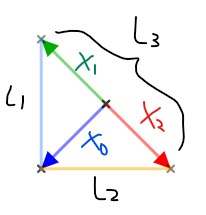

# Functions and linear transformations

## formal understanding of functions

* [https://youtu.be/BQMyeQOLvpg](https://youtu.be/BQMyeQOLvpg)

我們都知道 function 的表示如下

$$
f:X\to Y
$$

我們可以帶入更多的術語進到 function 裡面，這裡用一個 x 變成 x^2 的 function 來示範

$$
f(x) = x^2 \mid f:\mathbb{R} \to\mathbb{R}
$$

這個 function 從 R map 到還是 R，而且可以表示成另一個方式

$$
f: x \mapsto x^2
$$

我們稱還沒轉換的前一個物件為 domain ，而轉換過後的物件為 co-domain

因為 x 轉換成 x^2 還是在 real number 裡面，所以 f 的 domain & co-domain 都是 real number

> 那什麼是 Range 呢？
>
> Range 是 co-domain 的 subset ，這個 subset 為 function 真正 map 到的地方
>
> 例如有個 function 讓任何 R2 都會 maps 到 2
>
> $$
> g: \mathbb{R}^2 \to \mathbb{R} \mid g(x_1, x_2) =2
> $$
>
> 所以他的 domain 為 R2，co-domain 為 R，range 為 { 2 }

另外，若是 function map 到的 co-domain 為 R，那我們稱之為 **scalar \(real\) valued function**

而 co-domain 為 R2, R3, R100, Rn，那我們稱之為 **vector valued function**

## Vector Transformation

* [https://youtu.be/gAbadNuQEjI](https://youtu.be/gAbadNuQEjI)

我們可以將 function apply 到 vector 上面，這時候雖然做的事情一樣，不過我們稱為 transformations

$$
f: \mathbb{R}^n \to \mathbb{R}^m
$$

例如我們可以將 R3 的 vector 轉換到 R2 的 vector

$$
f\left(\begin{bmatrix} x_1\\x_2\\x_3\end{bmatrix}\right) = \begin{bmatrix} x_1+2x_2\\3x_3\end{bmatrix}
$$

若 domain 為 \(1, 1, 1\) 就會有對應的 co-domain \(3, 3\)

$$
f\left(\begin{bmatrix} 1\\1\\1\end{bmatrix}\right) = \begin{bmatrix} 3\\3\end{bmatrix}
$$

## Linear transformations

* [https://youtu.be/4PCktDZJH8E](https://youtu.be/4PCktDZJH8E)

我們將給予 vector transformation 一個新名詞，叫作 **linear transformation**

只要 transformation 能夠符合兩項條件，那這個 transformation 就是 linear transformation

1. 兩個向量相加後再 transform 等於兩個向量先 transform 再相加
2. 任一向量先做 scalar multiplication 再 transform 等於先 transform 再做 scalar multiplication

$$
T: \mathbb{R}^n \to \mathbb{R}^m \\
\begin{aligned}
\text{Linear transformation } \iff &\vec{a}, \vec{b} \in\mathbb{R}^n\\
&T(\vec{a}+\vec{b}) = T(\vec{a})+T(\vec{b})\\
&T(c\vec{a}) = cT(\vec{a}) \mid c\in \mathbb{R}

\end{aligned}
$$

舉個符合 linear transformation 的 T function

$$
\begin{aligned}
&T: \mathbb{R}^2 \to \mathbb{R}^2\\
&T(x_1, x_2) = (x_1+x_2, 3x_1) \\\\
&\vec{a} = (a_1, a_2)\\
&\vec{b} = (b_1, b_2)\\
\end{aligned}
$$

1. T\(a + b\) = T\(a\) + T\(b\)

$$
\begin{aligned}
&\vec{a} + \vec{b} = (a_1+b_1, a_2+b_2)\\
&\color{red}{T(\vec{a}+\vec{b})} = ((a_1+b_1)+(a_2+b_2), 3a_1+3b_1)\\\\

&T(\vec{a}) = (a_1+a_2, 3a_1)\\
&T(\vec{b}) = (b_1+b_2, 3b_1)\\
&\color{red}{T(\vec{a})+T(\vec{b})} = ((a_1+b_1)+(a_2+b_2), 3a_1+3b_1) \\\\

&T(\vec{a}+\vec{b}) = T(\vec{a})+T(\vec{b})

\end{aligned}
$$

1. T\(ca\) = cT\(a\)

$$
T(c\vec{a}) = T((ca_1,ca_2)) = (ca_1+ca_2, 3ca_1)=c(a_1+a_2,3a_1)=cT(\vec{a})
$$

另外舉例一個不符合 linear transformation 的 T function

$$
\begin{aligned}
&T: \mathbb{R}^n \to \mathbb{R}^n\\
&T\left(\begin{bmatrix}x_1\\x_2\end{bmatrix}\right) = \begin{bmatrix} x_1^2\\0\end{bmatrix}\\\\

&\vec{a} = \begin{bmatrix}a_1\\a_2\end{bmatrix} \in \mathbb{R}^n
\end{aligned}
$$

這時我們試著 apply linear transformation 的第二個條件，很明顯他不符合第二項條件

$$
T(c\vec{a}) = T\left(\begin{bmatrix} ca_1\\ca_2\end{bmatrix}\right)=
\begin{bmatrix} c^2a_1^2\\0\end{bmatrix} = 
c^2\begin{bmatrix} a_1^2\\0\end{bmatrix} =
c^2T(\vec{a})
$$

所以這個 transformation **不是 Linear transformation**

## Visualizing linear transformations

知道 Linear transformation 的定義之後，先來看幾個不是 linear 的 transformation

1. [Lines do not remain straight & origin does not remain fixed](https://youtu.be/x1dGfxBdDlM)
2. [Look like linear but diagonal lines get curved](https://youtu.be/MgWkNwczVb0)

然後來看看 linear transformation with indicator

* [https://youtu.be/XUw95PFP1RE](https://youtu.be/XUw95PFP1RE)

我們可以看到 i hat 從 \(1, 0\) 變到了 \(1, -2\)，而 j hat 從 \(0, 1\) 變到了 \(3, 0\)

也就是說，平面上任何一個 x 座標向量，他會跟 \(1, 0\) 一樣轉換了 \(1, -2\)

$$
\begin{bmatrix}x\\0\end{bmatrix} = 
x\begin{bmatrix}1\\0\end{bmatrix} \to
x\begin{bmatrix}1\\-2\end{bmatrix} =
\begin{bmatrix}x\\-2x\end{bmatrix}
$$

而平面上任何一個 y 座標向量，則會跟 \(0, 1\) 一樣轉換了 \(3, 0\)

$$
\begin{bmatrix}0\\y\end{bmatrix} = 
y\begin{bmatrix}0\\1\end{bmatrix} \to
y\begin{bmatrix}3\\0\end{bmatrix} =
\begin{bmatrix}3y\\0\end{bmatrix}
$$

這下我們就可以知道為什麼 \(1, 1\) 會變到 \(4, -2\) 了，因為

$$
\begin{bmatrix}1\\1\end{bmatrix} = 
\begin{bmatrix}1\\0\end{bmatrix} + 
\begin{bmatrix}0\\1\end{bmatrix}
\to
\begin{bmatrix}1\\-2\end{bmatrix} +
\begin{bmatrix}3\\0\end{bmatrix} =
\begin{bmatrix}4\\-2\end{bmatrix}
$$

> 我們可以從[這個影片](https://youtu.be/gNMGlQ62MBY)看到上面座標向量改變的動畫

最後，我們可以利用 matrices 來表達 linear transformation

$$
\begin{bmatrix}x\\y\end{bmatrix} = 
x\begin{bmatrix}1\\0\end{bmatrix} +
y\begin{bmatrix}0\\1\end{bmatrix}
$$

我們知道任意 x 可以表示成 x 乘 i hat，任意 y 可以乘 j hat

而 i, j hat 的 transformation 可以 apply 到其他 x, y 上面

$$
x\begin{bmatrix}\color{green}a\\\color{green}c\end{bmatrix} +
y\begin{bmatrix}\color{red}b\\\color{red}d\end{bmatrix} =
\begin{bmatrix}\color{green}{a}x+\color{red}{b}y\\\color{green}{c}x+\color{red}{d}y\end{bmatrix}
$$

如此一來，代表 transformation 的 matrix A 和要被我們轉換的 vector v

Av 即為轉換後的結果：

$$
\mathbf{A} = \begin{bmatrix}a&b\\c&d\end{bmatrix}, 
\vec{v} = \begin{bmatrix}x\\y\end{bmatrix}\\
\mathbf{A}\vec{v} = 
\begin{bmatrix}a&b\\c&d\end{bmatrix}
\begin{bmatrix}x\\y\end{bmatrix} =
\begin{bmatrix}ax+by\\cx+dy\end{bmatrix}
$$

## Matrix vector products as linear transformations

* [https://youtu.be/ondmopWLiEg](https://youtu.be/ondmopWLiEg)

Transformation 可以化為矩陣 A 乘以被轉換的 vector x

$$
T: \mathbb{R}^n\to\mathbb{R}^m\\
T(\vec{x}) = \mathbf{A\vec{x}}\mid \mathbf{A}\vec{x} \in \mathbb{R}^m
$$

舉個例子

$$
\mathbf{B} = \begin{bmatrix}2&-1\\3&4\end{bmatrix}, T: \mathbb{R}^2 \to \mathbb{R}^2\\
T(\vec{x}) = \mathbf{B}\vec{x} = 
\begin{bmatrix}2&-1\\3&4\end{bmatrix}
\begin{bmatrix}x_1\\x_2\end{bmatrix}=
\begin{bmatrix}2x_1-x_2\\3x_1+4x_2\end{bmatrix}
$$

這個結果等同於

$$
T\left( x_1, x_2\right) = \left(2x_1-x_2, 3x_1+4x_2\right)
$$

接著我們來測試一下，化為 matrix product 的 linear transformation 還有沒有符合兩大條件呢

* 加法成立

$$
\begin{aligned}
\mathbf{A}(\vec{a}+\vec{b}) &= 
\begin{bmatrix}\vec{v_1}&\vec{v_2}&\cdots&\vec{v_n}\end{bmatrix}
\begin{bmatrix}a_1+b_1\\a_2+b_2\\\vdots\\a_n+b_2\end{bmatrix}\\

&=(a_1+b_1)\vec{v_1}+(a_2+b_2)\vec{v_2}+\cdots+(a_n+b_n)\vec{v_n}\\
&=a_1\vec{v_1}+b_1\vec{v_1}+a_2\vec{v_2}+b_2\vec{v_2}+\cdots+a_n\vec{v_n}+b_n\vec{v_n}\\
&=(a_1\vec{v_1}+a_2\vec{v_2}+\cdots+a_n\vec{v_n})+(b_1\vec{v_1}+b_2\vec{v_2}+\cdots+b_n\vec{v_n})\\
&=\mathbf{A}\vec{a} + \mathbf{A}\vec{b}
\end{aligned}
$$

* 乘法成立

$$
\begin{aligned}
\mathbf{A}(c\vec{a}) &=
\begin{bmatrix}\vec{v_1}&\vec{v_2}&\cdots&\vec{v_n}\end{bmatrix}
\begin{bmatrix}ca_1\\ca_2\\\vdots\\ca_n\end{bmatrix} \\&=
ca_1\vec{v_1}+ ca_2\vec{v_2}+ \cdots + ca_n\vec{v_n} \\&=
c(a_1\vec{v_1}+ a_2\vec{v_2}+ \cdots + a_n\vec{v_n}) \\&=
c\mathbf{A}\vec{a}
\end{aligned}
$$

這證明，Matrix 和 vector 相乘所代表的 transformation 永遠是 **linear transformation**

## Linear transformations as matrix vector products

* [https://youtu.be/PErhLkQcpZ8](https://youtu.be/PErhLkQcpZ8)

上面我們讓矩陣和 linear transformation 連結在一起

現在我們嘗試來讓 linear transformation 轉換為 matrix 和 vector 的 product

首先要先認識何為 Identity Matrix

Identity matrix 用 In 來表示，是一個 n × n 的矩陣，並且只有在對角線上有 1

$$
\mathbf{I_n} = \begin{bmatrix} 
1&0&0&\cdots&0 \\ 0&1&0&\cdots&0 \\ 0&0&1&\cdots&0\\\vdots&\vdots&\vdots&\ddots&\vdots\\0&0&0&0&1\end{bmatrix},
\mathbf{I_2}=\begin{bmatrix} 1&0\\0&1\end{bmatrix},
\mathbf{I_3}=\begin{bmatrix} 1&0&0\\0&1&0\\0&0&1\end{bmatrix}, \cdots
$$

Identity matrix 乘以任何 vector 都會維持 vector 本身

$$
\mathbf{I_n} \vec{x} = \vec{x} \mid \mathbf{I_2}\vec{x} =
\begin{bmatrix} 1&0\\0&1\end{bmatrix}
\begin{bmatrix} x_1\\x_2\end{bmatrix}=
\begin{bmatrix} x_1\\x_2\end{bmatrix}
$$

並且我們會給予 Identity matrix 每一 column vector 一個 e 的代號

而這些 column vector 不只 span Rn 空間，而且為 linear independence，還是 unit vectors

所以又稱為 stardard basis for Rn

$$
\mathbf{I_n} = 
\begin{bmatrix}\vec{e_1}&\vec{e_2}&\cdots&\vec{e_n}\end{bmatrix}\\
\begin{Bmatrix}\vec{e_1}&\vec{e_2}&\cdots&\vec{e_n} \end{Bmatrix} 
\to \text{ standard basis for } \mathbb{R}^n
$$

好了！現在幾乎所有 vector 都可以用 e 來表達

$$
\vec{x}=\begin{bmatrix}x_1\\x_2\\\vdots\\x_n\end{bmatrix}=
x_1\vec{e_1} + x_2\vec{e_2} + \cdots + x_n\vec{e_n} = \mathbf{I_n}\vec{x} = 
\begin{bmatrix}x_1\\0\\\vdots\\0\end{bmatrix}+
\begin{bmatrix}0\\x_2\\\vdots\\0\end{bmatrix}+ \cdots +
\begin{bmatrix}0\\0\\\vdots\\x_n\end{bmatrix}
$$

接下來我們將 x 代入 transformation，

$$
\begin{aligned}
T(\vec{x}) &= T(x_1\vec{e_1} + x_2\vec{e_2} + \cdots + x_n\vec{e_n})\\
&= T(x_1\vec{e_1}) + T(x_2\vec{e_2}) + \cdots + T(x_n\vec{e_n}) \\
&= x_1T(\vec{e_1}) + x_2T(\vec{e_2}) + \cdots + x_nT(\vec{e_n}) \\
&= \begin{bmatrix}T(\vec{e_1})&T(\vec{e_2})& \cdots&T(\vec{e_n})\end{bmatrix}
\begin{bmatrix} x_1\\x_2\\\vdots\\x_n\end{bmatrix}
\end{aligned}
$$

上面證明，**所有的 linear transformation 都可以用 matrix vector product 表示**

舉一個例子

$$
T:\mathbb{R}^2 \to \mathbb{R}^3\mid T(x_1,x_2) = (x_1+3x_2, 5x_2-x_1,4x_1+x_2)
$$

可以表示成等式

$$
T\left(\begin{bmatrix}x_1\\x_2\end{bmatrix}\right) = 
\begin{bmatrix}x_1+3x_2\\ 5x_2-x_1\\ 4x_1+x_2\end{bmatrix}
$$

我們可以先用 Identity matrix 表達 vector 並且進行 transform

$$
\begin{aligned}
T(\mathbf{I_2}) &= 
\begin{bmatrix}T\left(\begin{bmatrix}1\\0\end{bmatrix}\right) & T\left(\begin{bmatrix}0\\1\end{bmatrix}\right)\end{bmatrix}\\
&=\begin{bmatrix}1&3\\-1&5\\4&1\end{bmatrix}
\end{aligned}
$$

而 x 的 transformation 就可以表達成 matrix vector product

$$
T\left(\begin{bmatrix}x_1\\x_2\end{bmatrix}\right) =
\begin{bmatrix}1&3\\-1&5\\4&1\end{bmatrix}
\begin{bmatrix}x_1\\x_2\end{bmatrix}
$$

## Image of a subset under a transformation

* [https://youtu.be/MIAmN5kgp3k](https://youtu.be/MIAmN5kgp3k)

我們來將 3 個向量所圍起來的三角形，進行 linear transformation，這三個向量分別為

$$
x_0 = \begin{bmatrix}-2\\-2\end{bmatrix}, 
x_1 = \begin{bmatrix}-2\\2\end{bmatrix}, 
x_2 = \begin{bmatrix}2\\-2\end{bmatrix}
$$

而三角形 S = {L1, L2, L3} 分別為

$$
\begin{aligned}
L_1 &= \begin{Bmatrix} \vec{x_0} + t(x_1-x_0) \mid 0 \le t \le 1\end{Bmatrix}\\
L_2 &= \begin{Bmatrix} \vec{x_2} + t(x_0-x_2) \mid 0 \le t \le 1\end{Bmatrix}\\
L_3 &= \begin{Bmatrix} \vec{x_1} + t(x_2-x_1) \mid 0 \le t \le 1\end{Bmatrix}\\
\mathbf{S} &= \begin{Bmatrix} L_1, L_2, L_3 \end{Bmatrix} 
\end{aligned}
$$

我們現在使用 matrix 來定義 transformation 為

$$
T(\vec{x}) = \begin{bmatrix}1&-1\\2&0\end{bmatrix}\begin{bmatrix}x_1\\x_2\end{bmatrix}
$$

那對這些 L1, L2, L3 進行 transformation 會怎麼樣呢

$$
\begin{aligned}
T(L_1) &= \begin{Bmatrix} T(\vec{x_0}+t(\vec{x_1}-\vec{x_0})) \mid 0 \le t \le 1\end{Bmatrix} \\
&= \begin{Bmatrix} T(\vec{x_0})+T(t(\vec{x_1}-\vec{x_0})) \mid 0 \le t \le 1\end{Bmatrix}\\
&= \begin{Bmatrix} T(\vec{x_0})+tT(\vec{x_1}-\vec{x_0}) \mid 0 \le t \le 1\end{Bmatrix} \\
&= \begin{Bmatrix} T(\vec{x_0})+t(T(\vec{x_1})-T(\vec{x_0})) \mid 0 \le t \le 1\end{Bmatrix}
\end{aligned}
$$

我們成功的將 L 直線的 transformation 轉為每個 vector 的 transformation

所以我們可以把每個 vector 的 transformation 算出來，再放回我們拆好的式子裡

$$
T(\vec{x_0})=
\begin{bmatrix}1&-1\\2&0\end{bmatrix}
\begin{bmatrix}-2\\-2\end{bmatrix}=
\begin{bmatrix}0\\-4\end{bmatrix}\\

T(\vec{x_1})=
\begin{bmatrix}1&-1\\2&0\end{bmatrix}
\begin{bmatrix}-2\\2\end{bmatrix}=
\begin{bmatrix}-4\\-4\end{bmatrix}\\

T(\vec{x_2})=
\begin{bmatrix}1&-1\\2&0\end{bmatrix}
\begin{bmatrix}2\\-2\end{bmatrix}=
\begin{bmatrix}4\\4\end{bmatrix}
$$

接著再把這些已經 transform 的 vector 代回 T\(L\) 的式子中，即可得到 L1, L2, L3

我們稱這些經過 transformation 的直線或三角形為 **Image of XXX under T**

$$
T(L_0) \text{ is the image of } L_0 \text{ under } T \\
T(S) \text{ is the image of } S \text{ under } T
$$

## Image of a transformation

* [https://youtu.be/hZ827mfh1Jo](https://youtu.be/hZ827mfh1Jo)

上面我們將 subset of vectors 轉換成另一個 subset 很成功，

那麼將 subspace 轉換成另一個 subspace 得到的 image 還能符合 subspace 的條件嗎？

$$
\mathbf{V} \text{ subspace in } \mathbb{R}^n \\
\begin{aligned}
\vec{a}, \vec{b} \in \mathbf{V} &\Rightarrow \vec{a} +\vec{b} \in \mathbf{V} \\
&\Rightarrow c\vec{a} \in \mathbf{V} \\
&\Rightarrow \vec{0} \in \mathbf{V}
\end{aligned}
$$

我們定義好 Transformation 和代表他的 matrix ，並把 a, b vector 帶進來看看

$$
T: \mathbb{R}^n \to \mathbb{R}^m\\
T(\mathbf{V}): \text{ image of }\mathbf{V} \text{ under } T \\

\begin{aligned}
&T(\vec{a}), T(\vec{b}) \in T(\mathbf{V})\\
\text{OK! }\,\,&T(\vec{a})+T(\vec{b}) = T(\color{red}{\vec{a}+\vec{b}}) \in T(\mathbf{V})\\
\text{OK! }\,\,&cT(\vec{a}) = T(\color{red}{c\vec{a}}) \in T(\mathbf{V})
\end{aligned}
$$

因為 a+b 和 ca 都已經屬於 subspace V 了，所以在轉換後依然為合理的 subspace

那如果將整個 Rn 轉換到 Rm 呢？

$$
\begin{aligned}
&T:\mathbb{R}^n \to \mathbb{R}^m \\
&T(\mathbb{R}^n): \text{ image of } \mathbb{R}^n \text{ under }T =
\color{blue}{
\begin{Bmatrix}
T(\vec{x}) \mid \vec{x} \in \mathbb{R}^n
\end{Bmatrix}
}= \text{Range of } T
\end{aligned}
$$

我們把整個轉換過去的 T\(Rn\) 稱為 **range of T** 或者是 **Image of T** 然後標記為 **Im\(T\)**

所以我們可以把 transformation 如此表示

$$
\begin{aligned}
T(\vec{x}) &= \mathbf{A}\vec{x} = 
\begin{Bmatrix} \mathbf{A}\vec{x} \mid \vec{x} \in \mathbb{R}^n \end{Bmatrix}\\
&= \begin{bmatrix} \vec{a_1} &\vec{a_2}&\cdots&\vec{a_n}\end{bmatrix}
\begin{bmatrix} x_1 \\x_2\\ \vdots \\x_n\end{bmatrix} =
x_1\vec{a_1}+x_2\vec{a_2}+\cdots+x_n\vec{a_n} \\
&= span(\vec{a_1}, \vec{a_2}, \cdots,\vec{a_n}) \\
&= \text{Column space of } \mathbf{A}\\
&= C(\mathbf{A})
\end{aligned}
$$

原來 transformation 可以表示為 matrix A 和 vector x 的乘積，而且還是 matrix A 的 column space

## Preimage of a set

* [https://youtu.be/zVsGtU8lIWs](https://youtu.be/zVsGtU8lIWs)

我們已經知道整個 Rn 轉換過去的 subset 叫作 Image of Rn under T

那我們現在想要從 co-domain 來得知有哪些 domain 轉換過去，要怎麼表示？

我們想知道 X 底下有哪些 subset 可以 transform 到 Y 底下的 S subset，我們可以這樣表示

$$
T^{-1}(\mathbf{S}) =
\begin{Bmatrix} \vec{x} \in \mathbf{X} \mid T(\vec{x}) \in \mathbf{S}\end{Bmatrix} \\
T^{-1}(\mathbf{S}) : \text{ Preimage of }\mathbf{S} \text{ under } T
$$

> 問個有趣問題，那麼 preimage 經過 transformation 會變為什麼呢
>
> $$
> T(T^{-1}(\mathbf{S})) \subseteq S
> $$
>
> =&gt; 會屬於 S 的 subset ，不一定要對到所有 S

## Preimage and kernel

* [https://youtu.be/6yrPU8rYOhs](https://youtu.be/6yrPU8rYOhs)

我們來舉個例子從 image subset 以及 transformation matrix 來找出 preimage x

$$
T(\vec{x}) = \mathbf{A}\vec{x} =
\begin{bmatrix} 1&3\\2&6 \end{bmatrix}
\begin{bmatrix} x_1\\x_2 \end{bmatrix},
\mathbf{S} =  
\begin{Bmatrix} \begin{bmatrix} 0\\0 \end{bmatrix}, \begin{bmatrix} 1\\2 \end{bmatrix} \end{Bmatrix}
$$

白話來說就是，在二維空間中，有哪些東西經過 transform 會變成 \[0, 0\] 或者是 \[1, 2\]

$$
\begin{aligned}
T^{-1}(\mathbf{S}) 
&= \text{preimage of }\mathbf{S} \text{ under } T\\
&= \begin{Bmatrix} \vec{x} \in \mathbb{R^2}\mid T(\vec{x}) \in \mathbf{S} \end{Bmatrix}\\
&= \begin{Bmatrix} \vec{x} \in \mathbb{R^2}\mid 
\mathbf{A}\vec{x} = \begin{bmatrix}0\\0\end{bmatrix} \text{ or } 
\mathbf{A}\vec{x} = \begin{bmatrix}1\\2\end{bmatrix}
\end{Bmatrix}

\end{aligned}
$$

等於要解出以下方程式，我們以找出 \[0, 0\] 的 preimage 為例

$$
\begin{aligned}
&\begin{bmatrix} 1&3\\2&6 \end{bmatrix}
\begin{bmatrix} x_1\\x_2 \end{bmatrix} =
\begin{bmatrix} 0\\0 \end{bmatrix}\\
\Rightarrow \,\,\,&
\begin{bmatrix}\begin{array}{cc|c}  1&3&0\\2&6&0 \end{array}\end{bmatrix}\\
\Rightarrow \,\,\,&
\begin{bmatrix}\begin{array}{cc|c}  1&3&0\\0&0&0 \end{array}\end{bmatrix}\\
\Rightarrow \,\,\,&
x_1 +3x_2 = 0\\
\Rightarrow \,\,\,&
x_1 = -3x_2\\
\Rightarrow \,\,\,&
\begin{bmatrix} x_1\\x_2 \end{bmatrix} =
\begin{bmatrix} -3x_2\\x_2 \end{bmatrix} =
\begin{Bmatrix} t\begin{bmatrix} -3\\1 \end{bmatrix} \mid x_2=t, t\in \mathbb{R}\end{Bmatrix}
\end{aligned}
$$

也就是 t\(-3, 1\) 的這條直線 \(subset\) 上任何一點，經過 transformation 就會回到原點

像這樣有 subset 經過 transformation 後回到原點的現象，我們稱這個 subset 為 **kernel of T**

$$
ker(T) = \begin{Bmatrix} \vec{x} \in \mathbb{R}^2 \mid T(\vec{x}) = 
\begin{Bmatrix}\vec{0}\end{Bmatrix}
\end{Bmatrix} \\
$$

而有趣的是，他跟 A 的 null space 是一樣的

$$
T(\vec{x}) = \mathbf{A}\vec{x}\\
ker(T) = N(\mathbf{A})
$$

## Sums and scalar multiples of linear transformations

* [https://youtu.be/wHuY97vss18](https://youtu.be/wHuY97vss18)

Linear transformation 利用 matrix 表達也能夠使用相同的 properties

$$
\begin{aligned}
S&: \mathbb{R}^n \to \mathbb{R}^m, T: \mathbb{R}^n \to \mathbb{R}^m\\

Def&: (S+T)(\vec{x}) = S(\vec{x})+T(\vec{x})\\
&:(S+T) \text{ still is } \mathbb{R}^n \to \mathbb{R}^m\\\\
Def&: (cS)(\vec{x}) = c(S(\vec{x}))\\
&: (cS) \text{ still is } \mathbb{R}^n \to \mathbb{R}^m

\end{aligned}
$$

這些 properties 在改變成 matrix 表示時也可以使用

* 加法

$$
\begin{aligned}
(S+T)(\vec{x}) &= S(\vec{x})+T(\vec{x})\\
&=\mathbf{A}\vec{x} + \mathbf{B}\vec{x}\\
&= (\mathbf{A}+\mathbf{B})\vec{x}\\
&= \begin{bmatrix}\vec{a_1}+\vec{b_1}&\vec{a_2}+\vec{b_2}&\cdots&\vec{a_n}+\vec{b_n}\end{bmatrix}
\begin{bmatrix}x_1\\x_2\\\vdots\\x_n\end{bmatrix}
\end{aligned}
$$

* 乘法

$$
\begin{aligned}
(cS)(\vec{x}) &= c(S(\vec{x}))\\
&= c\mathbf{A}\vec{x}\\
&= c(x_1\vec{a_1}+x_2\vec{a_2}+\cdots+x_n\vec{a_n}) \\
&= x_1c\vec{a_1} + x_2c\vec{a_2} + \cdots + x_nc\vec{a_n} \\
&= \begin{bmatrix}c\vec{a_1} & c\vec{a_2} &\cdots&c\vec{a_n}\end{bmatrix}
\begin{bmatrix}x_1\\x_2\\\vdots\\x_n\end{bmatrix}
\end{aligned}
$$

