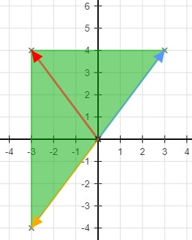

# Linear transformation examples

## Scaling and reflections

* [https://youtu.be/qkfODKmZ-x4](https://youtu.be/qkfODKmZ-x4)

我們學到 transformation 可以使用 matrix vector product 來表達

matrix 可以更進一步化為 identity matrix 和 transformation 的結合

$$
T:\mathbb{R}^n \to \mathbb{R}^m \mid 
T(\vec{x}) = \mathbf{A}\vec{x} \mid
\mathbf{A} = \begin{bmatrix} T(e_1)&T(e_2) & \cdots& T(e_n)\end{bmatrix}
$$

現在來試著 custom 一個自己的 transformation

假設有三個向量在 R2 上繪製出一個三角形

$$
\vec{a} = \begin{bmatrix}3\\2\end{bmatrix},
\vec{b} = \begin{bmatrix}-3\\2\end{bmatrix},
\vec{c} = \begin{bmatrix}3\\-2\end{bmatrix}
$$

我們想讓他以 y 軸為主軸，翻轉過來，並且不改變底的情況下，讓高拉長兩倍

所以每個向量的 x 應該要乘以負號，然後 y 應該要乘以 2

$$
T\left( \begin{bmatrix} x\\y \end{bmatrix} \right) = 
\begin{bmatrix} -x\\2y \end{bmatrix}
$$

接著我們要怎麼表示 transformation 的 matrix 呢，我們可以拿 identity matrix 當作白紙

寫下每個 e vector 進行 transformation 的結果

$$
\mathbf{I_2} = \begin{bmatrix} 1&0\\0&1 \end{bmatrix} \\
\mathbf{A} = 
\begin{bmatrix} T\left(\begin{bmatrix} 1\\0 \end{bmatrix}\right) \end{bmatrix},
\begin{bmatrix} T\left(\begin{bmatrix} 0\\1 \end{bmatrix}\right) \end{bmatrix}\\
\mathbf{A} = 
\begin{bmatrix} -1&0\\0&2 \end{bmatrix}
$$

也就是說

$$
T\left( \begin{bmatrix} x\\y \end{bmatrix} \right) = 
\begin{bmatrix} -x\\2y \end{bmatrix} =
\begin{bmatrix} -1&0\\0&2 \end{bmatrix}
\begin{bmatrix} x\\y \end{bmatrix} =
\mathbf{A}\begin{bmatrix} x\\y \end{bmatrix}
$$

回到原本三個向量，我們將算好的 transformation apply 到他們三個上面

$$
\mathbf{A}\vec{a} = \begin{bmatrix} -1&0\\0&2 \end{bmatrix}
\begin{bmatrix} 3\\2 \end{bmatrix} =
\begin{bmatrix} -3\\4 \end{bmatrix}\\

\mathbf{A}\vec{b} = \begin{bmatrix} -1&0\\0&2 \end{bmatrix}
\begin{bmatrix} -3\\2 \end{bmatrix} =
\begin{bmatrix} 3\\4 \end{bmatrix}\\

\mathbf{A}\vec{c} = \begin{bmatrix} -1&0\\0&2 \end{bmatrix}
\begin{bmatrix} 3\\-2 \end{bmatrix} =
\begin{bmatrix} -3\\-4 \end{bmatrix}\\
$$

我們成功將他翻面並且拉長了！

我們學到要自製 transformation 可以先定義好 transformation 再 apply 到 identity matrix

或者，我們可以直接針對 identity matrix 在 diagonal 的第一項 \(x\) 或第二項 \(y\)，

甚至第三項 \(三維的 z\)，第四項 \(四維空間\) 來做修改。

## Rotation in R2

* [https://youtu.be/lPWfIq5DzqI](https://youtu.be/lPWfIq5DzqI)

上面我們學到了 **reflection** 以及 **scaling**，現在我們來學 **rotation**

我們要怎麼找到 T 或者是 matrix A ，讓 vector x 往逆時針方向轉 ɵ 度

首先要先確認這個 rotation 運算是否為 linear transformation 才可以繼續下去

$$
\text{Rot}_\theta(\vec{x}+\vec{y}) = \text{Rot}_\theta(\vec{x})+\theta(\vec{y}) \\
\text{Rot}_\theta(c\vec{x}) = c\cdot\text{Rot}_\theta(\vec{x})
$$

影片中有畫圖證明，這兩項都是通過的，所以所有的 rotation 皆為 linear transformation

接著我們來找出 rotation 所表達的 transformation matrix 為何

$$
\mathbf{A} = 
\begin{bmatrix} 
\text{Rot}_\theta\left(\begin{bmatrix}1\\0\end{bmatrix}\right),
\text{Rot}_\theta\left(\begin{bmatrix}0\\1\end{bmatrix}\right)
\end{bmatrix}
$$

先從 \[1, 0\] 轉換成 \[a, b\] 開始看起

可以發現 a 為這個正三角形的鄰邊，剛好 cos 等於鄰邊除以斜邊

而 b 等於新 vector 投影到舊 vector 的高，為這個三角形的對邊，剛好 sin 等於對邊除以斜邊

$$
\cos(\theta) = \frac{a}{1} \Rightarrow \color{red}{a = \cos(\theta)}\\
\sin(\theta) = \frac{b}{1} \Rightarrow \color{red}{b = \sin(\theta)}\\
\text{Rot}_\theta\left(\begin{bmatrix}1\\0\end{bmatrix}\right) =
\begin{bmatrix}\cos(\theta)\\\sin(\theta)\end{bmatrix}
$$

再來我們看 \[0, 1\] 轉換成 \[c, d\]

此時 c 可以為正三角形的對邊， 用 sin 等於對邊除以斜邊得到 c 值，而且因為是在第二象限，所以要加上負值

d 為鄰邊，用 cos 等於鄰邊除以斜邊得到 d 值

$$
\sin(\theta) = \frac{c}{1} \Rightarrow \color{red}{c = \sin(\theta)} \Rightarrow -\sin(\theta) \\
\cos(\theta) = \frac{d}{1} \Rightarrow \color{red}{d = \cos(\theta)}\\
\text{Rot}_\theta\left(\begin{bmatrix}0\\1\end{bmatrix}\right) =
\begin{bmatrix}-\sin(\theta)\\\cos(\theta)\end{bmatrix}
$$

於是我們得到了 rotation matrix A 為

$$
\mathbf{A} = \begin{bmatrix} \cos\theta & -\sin\theta\\ \sin\theta& \cos\theta\end{bmatrix}
$$

以後任何向量，想要 rotate ɵ 度時，只要把角度帶入 ɵ 即可

例如我想讓 vector 逆時針旋轉 45 度角：

$$
\begin{bmatrix} \cos45^\circ & -\sin45^\circ\\ \sin45^\circ& \cos45^\circ\end{bmatrix}
\begin{bmatrix} x\\y\end{bmatrix} =
\begin{bmatrix} \frac{\sqrt{2}}{2}&-\frac{\sqrt{2}}{2}\\\frac{\sqrt{2}}{2}&\frac{\sqrt{2}}{2}\end{bmatrix}
\begin{bmatrix} x\\y\end{bmatrix}
$$

## Rotation in R3 around the x-axis

* [https://youtu.be/gkyuLPzfDV0](https://youtu.be/gkyuLPzfDV0)

接下來我們試著將 rotation 擴充到 R3 空間，但是只以 x-axis 為主軸逆時針旋轉

我們知道要找出 rotation matrix 就是把 rotation apply 到 identity matrix 上

$$
\mathbf{A} = \left( 
3^{rd}\text{Rot}_\theta\begin{bmatrix} 1\\0\\0 \end{bmatrix},
3^{rd}\text{Rot}_\theta\begin{bmatrix} 0\\1\\0 \end{bmatrix},
3^{rd}\text{Rot}_\theta\begin{bmatrix} 0\\0\\1 \end{bmatrix}
\right)
$$

可以觀察到，因為是圍著 x-axis 旋轉，所以代表在 x 軸的第一個 vector 是不會變的

$$
3^{rd}\text{Rot}_\theta\begin{bmatrix} 1\\0\\0 \end{bmatrix} = 
\begin{bmatrix} 1\\0\\0 \end{bmatrix}
$$

而第二個代表在 y 軸的 vector 則會除了 x 不變以外，\(y, z\) 會像 R2 的 \(1, 0\) 一樣旋轉

$$
3^{rd}\text{Rot}_\theta\begin{bmatrix} 0\\1\\0 \end{bmatrix} = 
\begin{bmatrix} 0\\\cos\theta\\\sin\theta \end{bmatrix}
$$

第三個代表在 z 軸的 vector ，就是像 R2 的 \(0, 1\) 一樣旋轉

$$
3^{rd}\text{Rot}_\theta\begin{bmatrix} 0\\0\\1 \end{bmatrix} = 
\begin{bmatrix} 0\\-\sin\theta\\\cos\theta \end{bmatrix}
$$

所以我們可以得到 matrix A 為

$$
\mathbf{A} =
\begin{bmatrix} 1&0&0\\0&\cos\theta&-\sin\theta\\0&\sin\theta&\cos\theta \end{bmatrix}
$$

## Unit Vectors

* [https://youtu.be/lQn7fksaDq0](https://youtu.be/lQn7fksaDq0)

我們都知道 vector 的 length 怎麼算，像是擴充版的 pythagorean theorem

$$
\vec{v} = \begin{bmatrix}v_1\\v_2\\\vdots\\v_n \end{bmatrix} \in \mathbb{R}^n,
\lVert \vec{v} \rVert = \sqrt{\vec{v_1}^2+\vec{v_2}^2+\cdots+\vec{v_n}^2}
$$

而 unit vector 其實就是指 length 等於 1 的 vector

$$
\lVert \vec{u} \rVert = 1
$$

今天我們有辦法把一個不為 unit vector 的 vector 變為 unit vector

只要將他的 length 求出，並且讓每一個 element 除以 length 即可

$$
\vec{u} = \frac{1}{\lVert \vec{v} \rVert} \cdot \vec{v}
$$

這時可以驗證得到新的 unit vector u 的 length 等於 1

$$
\begin{aligned}
\lVert\vec{u}\rVert &= \lVert\frac{1}{\lVert \vec{v} \rVert} \cdot \vec{v}\rVert\\
&= \lVert \vec{v} \rVert\cdot\frac{1}{\lVert \vec{v} \rVert}\\
&= 1
\end{aligned}
$$

> 因為 1/length 為 constant 所以可以 apply
>
> $$
> \lVert c\cdot \vec{v} \rVert = \lvert c\rvert \cdot \lVert \vec{v}\rVert
> $$

而且我們通常會將 unit vector 頭上的 vector sign 轉為 hat sign

$$
\text{if } \lVert \vec{u} \rVert = 1 \\
\text{then we can write it as } \hat{u}
$$

舉個例子

$$
\vec{v} = \begin{bmatrix} 1\\2\\-1 \end{bmatrix},
\lVert \vec{v} \rVert = \sqrt{1^2+2^2+(-1)^2}= \sqrt{6}
$$

現在求對應 v 的 unit vector u

$$
\hat{u} = \frac{1}{\sqrt{6}}\cdot 
\begin{bmatrix} 1\\2\\-1 \end{bmatrix} =
\begin{bmatrix} \frac{1}{\sqrt{6}}\\\frac{2}{\sqrt{6}}\\\frac{-1}{\sqrt{6}} \end{bmatrix}
$$

## Projections Introduction

現在我們要討論的是，任一個 vector 他投影到任一個由 vector 所 span 而成的直線時，他的 _**影子**_ 的長度為何

我們用這個寫法表示 vector x 投影到 line L 的**影子長度 \(projection\)**

$$
Proj_L(\vec{x})
$$

而從 vector x 垂直射下到 L 的垂直線我們表示為

$$
\vec{x}-Proj_L(\vec{x})
$$

也就是上圖淺藍色的直線！

那要怎麼找出 projection 呢？我們發現， projection 其實只是 **c 在特定數字**時的表現而已

我們只要找出這個 c 就可以找出 projection 的公式

$$
Proj_L(\vec{x}) = c\vec{v}
$$

而我們發現不管是 cv 還是 v 都會跟淺藍色的直線 \(x - cv\) 垂直，也就是 Dot product 為 0

$$
\begin{aligned}
&\vec{v} \cdot (\vec{x}-c\vec{v}) = 0\\
&\vec{v}\cdot\vec{x}-c\vec{v}\cdot\vec{v}=0\\
&\vec{v}\cdot\vec{x}=c\vec{v}\cdot\vec{v}\\
&c = \frac{\vec{v}\cdot\vec{x}}{\vec{v}\cdot\vec{v}}
\end{aligned}
$$

所以我們的 projection 公式為

$$
Proj_L(\vec{x}) = c\vec{v} = \frac{\vec{x}\cdot\vec{v}}{\vec{v}\cdot\vec{v}} \vec{v}
$$

這邊來舉個例子，我們有 line L 為 v = \(2, 1\) span 而成，還有 vector x = \(2, 3\)

$$
\mathbf{L} = 
\begin{Bmatrix}c\begin{bmatrix}2\\1\end{bmatrix} \mid c\in \mathbb{R}\end{Bmatrix}\\
\vec{x} = \begin{bmatrix}2\\3\end{bmatrix}\\
$$

我們想知道 x 在 L 的投影向量為何，只要帶入剛剛算出來的公式即可

$$
Proj_L(\vec{x})=
\frac{\begin{bmatrix}2\\3\end{bmatrix}\cdot
\begin{bmatrix}2\\1\end{bmatrix}}
{\begin{bmatrix}2\\1\end{bmatrix}\cdot
\begin{bmatrix}2\\1\end{bmatrix}}
\cdot
\begin{bmatrix}2\\1\end{bmatrix}
= \frac{7}{5}
\begin{bmatrix}2\\1\end{bmatrix} =
\begin{bmatrix}14/5\\7/5\end{bmatrix} =
\begin{bmatrix}2.8\\1.4\end{bmatrix}
$$

其實就是上圖的例子！

## Projections as matrix vector product

我們有辦法把 projection 的公式更加簡化嗎？

有的，我們發現分母的 dot product 跟 v 的 length 有關

$$
Proj_L(\vec{x}) = 
c\vec{v} = 
\frac{\vec{x}\cdot\vec{v}}{\vec{v}\cdot\vec{v}} \vec{v} =
\frac{\vec{x}\cdot\vec{v}}{\lVert \vec{v} \rVert^2} \vec{v}
$$

所以今天若 v 為 unit vector，分母就會變成 1，projection 就會簡化為

$$
Proj_L(\vec{x}) = (\vec{x}\cdot\vec{v})\vec{v}
$$

這就是我們學習過把 vector 變為 unit vector 的好處

接著，我們可以把 projection 變為 matrix 嗎？

我們先檢查 projection 是否為 **Linear transformation**

* 第一個條件成立

$$
\begin{aligned}
Proj_L(\vec{a}+\vec{b}) &= 
((\vec{a}+\vec{b})\cdot\hat{u})\hat{u} \\
&=
(\vec{a}\cdot\hat{u}+\vec{b}\cdot\hat{u})\hat{u}\\
&=
(\vec{a}\cdot\hat{u})\hat{u} + (\vec{b}\cdot\hat{u})\hat{u}\\
&=
Proj_L(\vec{a})+Proj_L(\vec{b})
\end{aligned}
$$

* 第二個條件成立

$$
\begin{aligned}
Proj_L(c\vec{a}) &= 
((c\vec{a})\cdot\hat{u})\hat{u} \\
&=
c(\vec{a}\cdot\hat{u})\hat{u}\\
&=
cProj_L(\vec{a})
\end{aligned}
$$

我們可以開始嘗試將 projection 寫成 matrix

我們以 R2 projection 為例，材料有這些，我們用 u1, u2 代表 unit vector

$$
Proj_L(\vec{x}) = (\vec{x}\cdot\hat{u})\hat{u} = (\mathbf{A}_{2\times2})\vec{x}\\
Proj_L: \mathbb{R}^2 \to \mathbb{R}^2\\
\hat{u} = \begin{bmatrix} u_1\\u_2\end{bmatrix}, 
\mathbf{I_2} = \begin{bmatrix} 1&0\\0&1\end{bmatrix}
$$

現在將 projection 的 transformation apply 到 I2 裡面

$$
\begin{aligned}
\mathbf{A} &= 
\begin{bmatrix} 
\left(
\begin{bmatrix}1\\0\end{bmatrix}\cdot
\begin{bmatrix}u_1\\u_2\end{bmatrix}
\right) 
\begin{bmatrix}u_1\\u_2\end{bmatrix}
&
\left(
\begin{bmatrix}0\\1\end{bmatrix}\cdot
\begin{bmatrix}u_1\\u_2\end{bmatrix}
\right) 
\begin{bmatrix}u_1\\u_2\end{bmatrix}
\end{bmatrix}\\
&=
\begin{bmatrix} 
u_1\begin{bmatrix}u_1\\u_2\end{bmatrix}&
u_2\begin{bmatrix}u_1\\u_2\end{bmatrix}
\end{bmatrix}\\ 
&=
\begin{bmatrix}u_1^2&u_1u_2\\u_1u_2&u_2^2\end{bmatrix}
\end{aligned}
$$

太棒了，現在只要有任何 projection，就可以套用 A 和 vector 的 product 來解決

舉個例子吧

$$
\mathbf{L} = \begin{Bmatrix} c\begin{bmatrix}2\\1\end{bmatrix}\mid c\in \mathbb{R}\end{Bmatrix} \Rightarrow 
\vec{v} = \begin{bmatrix}2\\1\end{bmatrix} \Rightarrow
\color{red}{\hat{u} = \begin{bmatrix}\frac{2}{\sqrt{5}}\\\frac{1}{\sqrt{5}}\end{bmatrix}}
$$

得到 u 我們就可以 apply 到 transformation matrix A 裡面了

$$
\mathbf{A} =
\begin{bmatrix}\frac{4}{5}&\frac{2}{5}\\\frac{2}{5}&\frac{1}{5} \end{bmatrix}
$$

這樣一來，我們可以求出 R2 平面上，"所有" vector 在 L 的 projection

$$
Proj_L(\vec{x}) = \mathbf{A}\vec{x} = 
\begin{bmatrix}\frac{4}{5}&\frac{2}{5}\\\frac{2}{5}&\frac{1}{5} \end{bmatrix}
\vec{x}
$$

我們用上一回 \(2, 3\) 的例子試看看，It works !

$$
Proj_L\left(\begin{bmatrix}2\\3\end{bmatrix}\right) =
\begin{bmatrix}\frac{4}{5}&\frac{2}{5}\\\frac{2}{5}&\frac{1}{5} \end{bmatrix}
\begin{bmatrix}2\\3\end{bmatrix} =
\begin{bmatrix}2.8\\1.4\end{bmatrix}
$$

