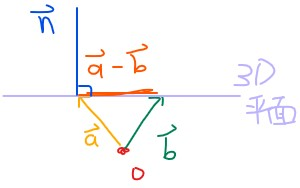

# Vector dot and cross products

## Vector dot product

**Dot product** 有別於 addition 和 scalar multiplication，他將 output 出一個 scalar value

$$
\vec{a} \cdot \vec{b} = \begin{bmatrix} a_1\\a_2\\\vdots\\a_n \end{bmatrix} \cdot 
\begin{bmatrix} b_1\\b_2\\\vdots\\b_n \end{bmatrix} = a_1b_1 + a_2b_2 + \cdots + a_nb_n \text{ (A scalar value)}
$$

例如

$$
\begin{bmatrix} 2\\5\end{bmatrix} \cdot \begin{bmatrix} 2\\5\end{bmatrix} = 
4+25=29
$$

而向量的 **Length** 可以計算為

$$
\lVert \vec{a} \rVert = \sqrt{\vec{a_1}^2 + \vec{a_2}^2 + \cdots + \vec{a_n}^2}
$$

在二維向量的情況下，計算其 Length 就像 _**Pythagorean Theorem**_ 一樣

$$
\vec{a} = \begin{bmatrix} 2\\5\end{bmatrix},
\lVert \vec{a} \rVert = \sqrt{2^2 + 5^2} = \sqrt{29}
$$

但這個方法卻可以很有效的計算超過二、三維以上的長度，並且我們可以定義為

$$
\begin{aligned}
\lVert \vec{a} \rVert &= \sqrt{\begin{bmatrix} a_1\\a_2\\\vdots\\a_n\end{bmatrix} \cdot \begin{bmatrix} a_1\\a_2\\\vdots\\a_n\end{bmatrix}} = \sqrt{\vec{a} \cdot \vec{a}}\\\\

\lVert \vec{a} \rVert^2 &= \vec{a} \cdot \vec{a}
\end{aligned}
$$

## Dot Product Properties

* [https://youtu.be/rVQ3G9epCjw](https://youtu.be/rVQ3G9epCjw)
* Commutative, Distributive, Associative

$$
\begin{aligned}
&\text{1. } \vec{v} \cdot \vec{w} = \vec{w} \cdot \vec{v} \\

&\text{2. } \left( \vec{v} + \vec{w} \right) \cdot \vec{x} = \left( \vec{v} \cdot \vec{x}+ \vec{w}\cdot \vec{x} \right) \\

&\text{3. } (c \cdot\vec{v} )\cdot \vec{w} = c \cdot (\vec{v} \cdot \vec{w})
\end{aligned}
$$

* Cauchy-Schwarz inequality: [https://youtu.be/r2PogGDl8\_U](https://youtu.be/r2PogGDl8_U)

$$
\lvert \vec{x}\cdot\vec{y}\rvert \le \lVert x\rVert \cdot\lVert y\rVert\\\\
\lvert \vec{x}\cdot\vec{y}\rvert = \lVert x\rVert \cdot\lVert y\rVert \iff \vec{x} = c\vec{y} \text{ (co-linear)}
$$

* Triangle inequality: [https://youtu.be/PsNidCBr5II](https://youtu.be/PsNidCBr5II)

$$
\lVert \vec{x} + \vec{y} \rVert \le \lVert \vec{x} \rVert + \lVert \vec{y}  \rVert\\
\lVert \vec{x} + \vec{y} \rVert = \lVert \vec{x} \rVert + \lVert \vec{y}  \rVert \iff \vec{x} = c\vec{y} \mid c>0
$$

我們可以用二維空間來展示，而且好處是可以套用至更高維的空間

* Angle between two vectors: [https://youtu.be/5AWob\_z74Ks](https://youtu.be/5AWob_z74Ks)

$$
\begin{aligned}
\vec{a} \cdot \vec{b} &= \lVert \vec{a} \rVert \cdot \lVert \vec{b} \rVert \cdot cos\theta\\
\vec{a} &= c\cdot\vec{b} \mid c > 0 \Rightarrow \theta = 0\\
\vec{a} &= c\cdot\vec{b} \mid c < 0 \Rightarrow \theta = 180^\circ \\
\end{aligned}
$$

套用這個公式，我們可以得出當 cos 為 90 度的時候，兩個向量的 dot product 必須為零

$$
\begin{aligned}
\vec{a} \cdot \vec{b} &= \lVert \vec{a} \rVert \cdot \lVert \vec{b} \rVert \cdot \cos(90^\circ)\\
&= \lVert \vec{a} \rVert \cdot \lVert \vec{b} \rVert \cdot 0\\
&= 0
\end{aligned}
$$

所以得出了 **Perpendicular** 的結論，但這個結論不是雙向的，因為 0 vector 不算在裡面

$$
\begin{aligned}
\vec{a}, \vec{b} \text{ are perpendicular} &\Rightarrow \vec{a} \cdot \vec{b} = 0\\
&\Leftarrow \vec{a}, \vec{b} \neq  \mathbf{0}, \vec{a} \cdot \vec{b} = 0
\end{aligned}
$$

那如果只有給予兩個向量的 dot product 為零，這個情況稱作為 **orthogonal**

同時也可以知道， 0 vector 可以和任何的向量 **orthogonal**

$$
\vec{a} \cdot \vec{b} = 0 \iff \vec{a}, \vec{b}\text{ are orthogonal}
$$

## Defining a plane in R3

接下來，將可以透過上面的 properties 以及 **一個點** 和 **一個 normal vector** 來定義出一個平面的 equation

[平面的 equation](https://youtu.be/UJxgcVaNTqY) 可以表示成這樣，也就是給定 \(x, y, z\) 可以滿足以下等式

$$
Ax + By +Cz = D
$$

我們可以從兩個向量 \(a, b\) 得到 **躺在平面** 的向量 \(a - b\)，並且他會與 **normal vector** \(n\) 相互垂直

$$
\begin{aligned}
&\vec{n} \cdot (\vec{a}-\vec{b}) = 0 \\
&\begin{bmatrix} n_1\\n_2\\n_3 \end{bmatrix} \cdot 
\begin{bmatrix} a_1-b_1\\a_2-b_2\\a_3-b_3 \end{bmatrix} = \mathbf{0}\\\\
&n_1(a_1-b_1) + n_2(a_2-b_2) + n_3(a_3-b_3) = 0 \\
&(Ax+By+Cz = D)
\end{aligned}
$$

舉個例子，假設我們有一個 normal vector 和兩個指到平面的向量

$$
\begin{aligned}
\vec{n} &= (1, 3, -2)\\ \vec{x_0} &= (1,2,3)\\ \vec{x} &= (x,y,z)
\end{aligned}
$$

1. 先求出躺在該平面的向量 \(x-x0\)
2. 再用 dot product 來帶入 n 和 \(x-x0\) 會等於 0 的結果，就可以得到平面方程式

$$
\vec{n} \cdot \left( \vec{x} - \vec{x_0}\right) = \mathbf{0}\\
\begin{bmatrix} 1\\3\\-2\end{bmatrix} \cdot \begin{bmatrix} x-1\\y-2\\z-3\end{bmatrix} = \mathbf{0}\\
1(x-1)+3(y-2)-2(z-3) =0\\
x-1+3y-6-2z+6=0\\
x+3y-2z=1
$$

1. 其實我們也可以直接帶入剛剛上面的公式

$$
\begin{aligned}
& n_1(a_1-b_1) + n_2(a_2-b_2) + n_3(a_3-b_3)
\\=\,&1(x-1)+3(y-2)-2(z-3)\\=\,&0
\end{aligned}
$$

## Cross Product

[Cross Product](https://youtu.be/pJzmiywagfY) 只使用於三維空間中， a × b 將會與 a 和 b 互相垂直 \(dot product = 0\)

> 要注意的是第二列是顛倒的 !

$$
\vec{a} = \begin{bmatrix} a_1\\a_2\\a_3\end{bmatrix},
\vec{b} = \begin{bmatrix} b_1\\b_2\\b_3\end{bmatrix},
\vec{a} \times \vec{b} = \begin{bmatrix} a_2b_3-a_3b_2 \\ \color{red}{a_3b_1-a_1b_3} \\ a_1b_2-a_2b_1 \end{bmatrix}
$$

舉個例子

$$
\begin{bmatrix} 1 \\-7 \\1 \end{bmatrix} \times \begin{bmatrix} 5 \\2 \\4 \end{bmatrix}= 
\begin{bmatrix} -7\times4-1\times2 \\ \color{red}{1\times5-1\times4} \\ 1\times2-(-7)\times5 \end{bmatrix} = \begin{bmatrix} -30 \\1 \\37 \end{bmatrix}
$$

我們可以利用右手定則看到 cross product 的結果

> Relationship between cross product and sin of angle: [https://youtu.be/7MKA2QlKvHc](https://youtu.be/7MKA2QlKvHc)

$$
\begin{aligned}
\vec{a} \cdot \vec{b} &= \lVert \vec{a} \rVert\lVert \vec{b} \rVert \cos(\theta)
\\
\lVert \vec{a} \times \vec{b} \rVert &= \lVert \vec{a} \rVert\lVert \vec{b} \rVert \sin(\theta)
\end{aligned}
$$

## Dot and cross product comparison

* [https://youtu.be/tdwFdzVqito](https://youtu.be/tdwFdzVqito)
* Dot Product

$$
\vec{a} \cdot \vec{b} = \lVert\vec{a}\rVert\lVert\vec{b}\rVert\cos\theta\\
\cos\theta = \frac{adj}{\lVert\vec{a}\rVert}, adj = \lVert\vec{a}\rVert\cos\theta
$$

這個鄰邊 \(adj.\) 可以說是 a 向量的投影

所以 dot product 可以象徵是 a 向量的**投影**和 b向量在同方向的 **magnitude**

$$
\vec{a}\cdot\vec{b} = \lVert\vec{b}\rVert \times adj
$$

> 所以在 theta 等於 90 度 \(垂直\) 時，投影便會不見，dot product 也會等於 0
>
> 而 theta 等於 0 \(平行\) 時，則可以得到 dot product 的最大值

$$
\begin{aligned}
&\text{when } \theta = 90^\circ, \vec{a} \cdot \vec{b} =
\lVert\vec{a}\rVert\lVert\vec{b}\rVert\cos 90^\circ = \lVert\vec{a}\rVert\lVert\vec{b}\rVert\times 0 = 0 \\

&\text{when } \theta = 0^\circ, \vec{a} \cdot \vec{b} =
\lVert\vec{a}\rVert\lVert\vec{b}\rVert\cos 0^\circ = \lVert\vec{a}\rVert\lVert\vec{b}\rVert\times 1 = 0 = \lVert\vec{a}\rVert\lVert\vec{b}\rVert
\end{aligned}
$$

* Cross Product

$$
\vec{a} \times \vec{b} = \lVert\vec{a}\rVert\lVert\vec{b}\rVert\sin\theta\\
\sin\theta = \frac{opt}{\lVert\vec{a}\rVert}, opt = \lVert\vec{a}\rVert\sin\theta
$$

這個對邊 \(opt.\) 可以說是 a 向量垂直於 b 向量的那條線

$$
\vec{a} \times \vec{b} = \lVert\vec{b}\rVert \times opt
$$

> 當 theta 等於 90 度 \(垂直\) 時，opt 就會變為 a 向量本身，所以得到 cross product 最大值
>
> 當 theta 等於 0 \(平行\) 時，opt 便會消失，cross product 也會等於 0

$$
\begin{aligned}
&\text{when } \theta = 90^\circ, \vec{a} \cdot \vec{b} =
\lVert\vec{a}\rVert\lVert\vec{b}\rVert\sin 90^\circ = \lVert\vec{a}\rVert\lVert\vec{b}\rVert\times 1 = \lVert\vec{a}\rVert\lVert\vec{b}\rVert \\

&\text{when } \theta = 0^\circ, \vec{a} \cdot \vec{b} =
\lVert\vec{a}\rVert\lVert\vec{b}\rVert\sin 0^\circ = \lVert\vec{a}\rVert\lVert\vec{b}\rVert\times 0 = 0 
\end{aligned}
$$

## Normal vector from plane equation

* [https://youtu.be/gw-4wltP5tY](https://youtu.be/gw-4wltP5tY)

我們可以從平面方程式直接得到 **Normal Vector** 的方程式

$$
\begin{aligned}
\text{Plane } \mathbf{U} &= Ax + By +Cz = D \\
\text{normal vector } \vec{n} &= \begin{bmatrix} A\\B\\C\end{bmatrix}
\end{aligned}
$$

## Point distance to plane

* [https://youtu.be/7rIFO8hct9g](https://youtu.be/7rIFO8hct9g)

要找出某一個不在平面 U 的點 a 和 U 之間的最短距離 d 時

先找到原點指向該平面的向量 b，再和原點到點 a 的向量 a 相減得到 f

$$
\vec{n} = \begin{bmatrix}A\\B\\C \end{bmatrix},
f = \begin{bmatrix}a_0-b_0 \\a_1-b_1\\a_2-b_2 \end{bmatrix}
$$

透過計算 cos 的公式可以得到 d 的結果，但我們不知道 theta 是多少啊

$$
\cos\theta = \frac{d}{\lvert\vec{f}\rvert}, d = \lvert\vec{f}\rvert\cos\theta
$$

沒關係， f 跟 d 的角度會跟 U 的法向量 n 一模一樣，我們帶入 n 向量發現分子變成 n 和 f 的 dot product

$$
\begin{aligned}
d &= \frac{\lvert\vec{n}\rvert\lvert\vec{f}\rvert\cos\theta}{\lvert\vec{n}\rvert} = 
\frac{\vec{n}\cdot\vec{f}}{\lvert\vec{n}\rvert} \\
&= \frac{\begin{bmatrix}Aa_0-Ab_0 \\Ba_1-Bb_1\\Ca_2-Cb_2 \end{bmatrix}}{\sqrt{A^2+B^2+C^2}} = \frac{Aa_0+Ba_1+Ca_2-D}{\sqrt{A^2+B^2+C^2}}
\end{aligned}
$$

舉個例子 `Find the distance between (2, 3, 1) and plane (x - 2y + 3z = 5)`

$$
d = \frac{1\cdot2-2\cdot3+3\cdot1-5}{\sqrt{1^2+(-2)^2+3^2}}
=\frac{2-6+3-5}{\sqrt{1+4+9}}=\frac{-6}{\sqrt{14}}
$$

## Distance between plane

* [https://youtu.be/v8plb6V8BQo](https://youtu.be/v8plb6V8BQo)

$$
\text{現在有一平面方程式為 } Ax - 2y + z = d \\

\text{還有另一平面包含兩條線 } \frac{x-1}{2}=\frac{y-2}{3}=\frac{z-3}{4} \text{ 和 } 
\frac{x-2}{3}=\frac{y-3}{4}=\frac{z-4}{5}\\

\text{並且兩個平面為平行的，且距離為} \sqrt{6} \\
\text{請求出 } \lvert d \rvert
$$

我們先找出第二個平面的方程式，因為是平行的，所以他會跟第一個平面的方程式幾乎一樣，只有 d 不同

首先先找出該平面上兩條線的 cross product 得出該平面的 normal vector

$$
\begin{aligned}
&a= (1,2,3) \text{ and } \\&b=(3,5,7)  \text{ from the first line} \\
&c= (2,3,4) \text{ from the second line} \\\\

&\vec{a} = b-a = 2i+3j+4k\\
&\vec{b} = c-a = i+j+k\\\\

&\vec{a} \times \vec{b} = \begin{vmatrix} i &\color{red}{j}&k\\2&3&4\\1&1&1 \end{vmatrix} = 
-i+2j-k =\vec{n}

\end{aligned}
$$

接著找出平面上任何一點的和 abc 隨便一點所生成的向量，根據 normal vector 來找出該平面的方程式

$$
\begin{aligned}\vec{c} &= (x-1)i+(y-2)j+(z-3)k \\
\vec{n}\ &= -i+2j-k\\
\vec{n} \times \vec{c} &= \mathbf{0} \\\\

-x+&1+2y-4-z+3=0\\
-x+&2y-z=0\\
x-&2y+z=0
\end{aligned}
$$

由此可知，A 得值為 1，所以第一個平面的方程式應該為

$$
\begin{aligned}
&Ax-2y+z=d \\
\Rightarrow &\,\,\,x-2y+z=d
\end{aligned}
$$

最後帶入 **point to plane** 的公式即可，point 我們帶 \(2, 3, 4\)，以及題目給的 distance

$$
\begin{aligned}
\text{distance} &= \frac{2\cdot1-3\cdot2+4\cdot1-d}{\sqrt{1^2+(-2)^2+1^2}} \\

\sqrt{6} &= \frac{-d}{\sqrt{6}}\\
d & =-6 \\
\lvert d \rvert &= 6
\end{aligned}
$$

算出 d 的絕對值為 6

