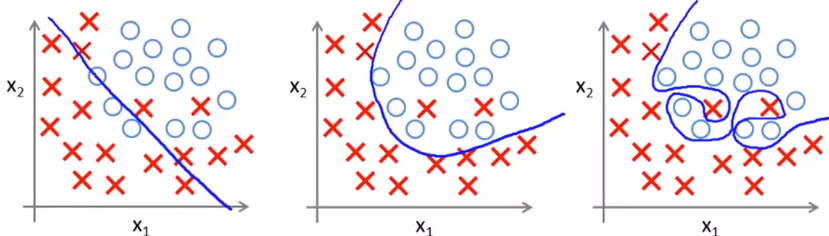

# The Problem of Overfitting

當我們要尋找 Hypothesis 來 fit 我們的 training set 時

可以遇到三種情況

1. **Underfit (High bias)** 
   * Hypothesis 不是很好的 fit 這些 example data
2. **Just right** 
   * Hypothesis 很好的 fit 這些 example data
3. **Overfit (High variance)** 
   * Hypothesis 太過 "鑽牛角尖" 於每一個 training set

我們為 Overfitting 下一個定義 :

太多的 features，讓求得的 Hypothesis 在 training data 得到不錯分數 (cost function J 接近 0)

但完全沒辦法讓 test set 或是真實資料套入使用

---

同樣的事情可以發生在 logistic regression :

會造成 overfitting 的原因就是因為 features 使用太多了

但又不知道哪些 features 可以完全消除掉 (可能對 training 有益)

有兩種方法可以解決 :

1. 減少 features 數量
   * 手動選擇不要的 features
   * 使用 **model selection algorithm** (later in other course)

2. Regularization
   * 留下全部 features，但降低 theta's 的 magnitude
   * 這方法就可以不用擔心會不會刪掉對 training 有益的 features 

