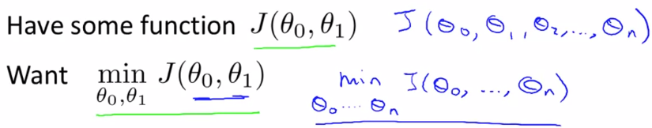
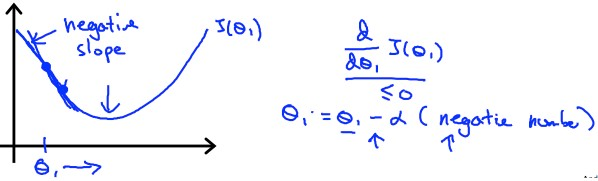

# Gradient Descent
梯度下降 (Gradient descent) 是一種可以把 cost function 最小化的算法

甚至可以拿來解決 Linear Regression 以外的機器學習問題

我們首先定義 cost function 問題為 :

> Gradient descent 可以解決超過 2 個以上的 theta 值

而 gradient descent 是這樣解決問題的 :

所以假設我們在一個 theta 0 和 theta 1 所生成的 cost function 圖表上

我們將他看成地形圖，而最高點的就是山頂

若一開始起始點設在在山頂上

那我們就環繞四周，看哪個方向可以通往最低點

然後我們就往那個方向走幾步路下山

重複這個步驟，直到到達最低點

所以根據我們起始點的不同，會造成下山方向的不同，然後找到不同的最低點

---

要達成上面這個方法，需要使用到微分技巧

而 gradient descent 的 algorithm 是這樣的 :

$$
\begin{aligned}
\text{repeat } &\text{until convergence } :\\
&\theta_j := \theta_j - \alpha \frac{d}{d\theta_j}J(\theta_0, \theta_1, ..., \theta_n)
\end{aligned}
$$

我們將公式拆解開來 :
$$
\begin{aligned}
:= &: 代表的是 \text{ assignment operator 例如 } a := a+1\\
\theta_j&: \text{代表的是第 j 個 } \theta \text{ 值}  \\
\alpha&: \text{代表的是下山的步伐大小} \\
\frac{d}{d\theta_j}J(\theta_0,\theta_1,...\theta_n)&: \text{是一個微分方程，用第 j 個 }\theta \\&\,\,\,\text{ 來微分每個回合的 cost function}
\end{aligned}
$$
---

要注意的是，在 gradient descent algorithm 中

所有的 theta 值必須被同時更新

如果先把某一個 theta 算完更新，就會造成其他項的微分發生些微偏差 !

# Gradient Descent Intuiton
我們用單個 theta 模型來簡化並解釋 gradient descent 的運作

我們可以很清楚的觀察到，微分項的
$$
\frac{d}{d\theta_1}J(\theta_1) = \text{ 與 } J(\theta_1) \text{ 的 tangent line 斜率}
$$

而此時的斜率是一個正整數

我們將他和 learning rate **(Alpha)** 相乘，整個式子其實就是

$$
\theta_1 := \theta_1 - \alpha \times \text{ positive number}
$$

所以 theta 1 會越來越往 minimum 移動

---

若 theta 在另外一邊也可以成功

因為斜率變為負的，所以式子變為

$$
\begin{aligned}
\theta_1 &:= \theta_1 - \alpha \times \text{ negative number}\\
&:=\theta_1 + \text{ positive number}
\end{aligned}
$$

theta 一樣往 minimum 移動

---

我們也要定義一個合理的 learning rate **(Alpha)**

來保證 gradient descent algorithm 能夠在合理時間收斂到 minimum

過小的 alpha 會讓算法變得很慢

而過大的 alpha 可能 overshoot the minimum，甚至變成發散

---

而當 theta 抵達 minimum 時

我們知道 tangent line 的斜率會變為 0

$$
\theta_1 := \theta_1 - \alpha \times 0
$$

也就是 theta 將會保持不變

---

另外，我們並不需要隨著 theta 的移動次數來改變 alpha 的大小

因為隨著 theta 下降，斜率將會越變越小

所以就算 alpha 固定，也會自動用越來越小的步伐下山

# Gradient Descent For Linear Regression
現在我們可以利用 Gradient descent 來解決 Linear regression 的問題了 !

### Gradient descent algorithm
$$
\begin{aligned}
\text{repeat } &\text{until convergence } :\\
&\theta_j := \theta_j - \alpha \frac{d}{d\theta_j}J(\theta_0, \theta_1)
\end{aligned}
$$

### Linear Regression Model
* Hypothesis
$$
h_\theta(x) = \theta_0 + \theta_1x
$$
* Squared error cost function
$$
J(\theta_0, \theta_1) = \frac{1}{2m} \sum_{i=1}^{m}(h_\theta(x^i)-y^i)^2
$$
---

我們要做的就是利用 gradient descent algorithm 

來找出 linear regression 中 cost function 的最小值

首先我們將 squared error cost function 套入 gradient descent 最重要的微分部分

$$
\begin{aligned}
\frac{d}{d\theta_j}J(\theta_0, \theta_1) &= 
\frac{d}{d\theta_j} ( \frac{1}{2m} \sum_{i=1}^{m}(h_\theta(x^i)-y^i)^2)\\
&=\frac{d}{d\theta_j} ( \frac{1}{2m} \sum_{i=1}^{m}(\theta_0+\theta_1x^i-y^i)^2)
\end{aligned}
$$

這邊要解開需要用到 multivariate calculus 的技術，如 :

我們將 theta 0 和 theta 1 各自解開後

Gradient descent algorithm 將會變成這樣 :

$$
\begin{aligned}
\text{repeat } &\text{until convergence } :\\
&\theta_0 := \theta_0 - \alpha \frac{1}{m}\sum_{i=1}^m(h_\theta(x^i)-y^i) \\
&\theta_1 := \theta_1 - \alpha \frac{1}{m}\sum_{i=1}^m((h_\theta(x^i)-y^i)x^i)
\end{aligned}
$$

---

現在我們來看 gradient descent 在 linear regression cost function 的運作

我們知道 gradient descent 會因為 local optima 影響，而有不同的最小值

但其實 **linear regression** 的 cost function 將會是 **bow shaped function (Convex function)**

所以只會有一個 **global optimum** ，也就是永遠都會收斂至最低點

---

假設我們起始點定在

$$
\theta_0 = 900, \theta_1 = -0.1, h(x) = 900 - 0.1x
$$

隨著 Gradient descent algorithm 的運行

theta 越來越接近最低點

我們的 **Hypothesis** 也越來越 Fit 所有的 training examples

---

因為在每個迴圈中，Gradient descent 要微分的 **cost function J** 都要用到所有的 training sets

$$
\begin{aligned}
\text{repeat } &\text{until convergence } :\\
&\theta_0 := \theta_0 - \alpha \frac{1}{m}\sum_{i=1}^{\color{red}{m}}(h_\theta(x^i)-y^i)
\end{aligned}
$$

所以這種方法又稱為 **Batch Gradient Descent**

這就是我們學到的第一個 learning algorithm

> 在 Linear algebra 中有一種數學算法叫作 **Normal equation method**
>
> 他可以不用像 Gradient descent 用 iteration 的方法解決問題
> 
> 但事實上，Gradient descent 在處理較大資料時是比較好用的

---

### True
* Gradient descent can converge even if \alphaα is kept fixed. (But \alphaα cannot be too large, or else it may fail to converge.)
* For the specific choice of cost function J used in linear regression, there are no local optima (other than the global optimum).

### False
* To make gradient descent converge, we must slowly decrease \alphaα over time.
* Gradient descent is guaranteed to find the global minimum for any function J.

> [Slide](https://d3c33hcgiwev3.cloudfront.net/_ec21cea314b2ac7d9e627706501b5baa_Lecture2.pdf?Expires=1568505600&Signature=T7~8PhKIF~e7WBuvP9YXPUURWc15suxUPSLfYlsq5XIqrTAK25jLTBMz5zlxVyl4Yx9Bd8EVQVUPi3CekELRbHQnPWtS7gW9HiKKAar3hyBinE-3RrbhX73GuoLup66ng72HXQxkXjjg2-6QuJLMm9g3dYpUMqdQa51VIYzfiHY_&Key-Pair-Id=APKAJLTNE6QMUY6HBC5A)