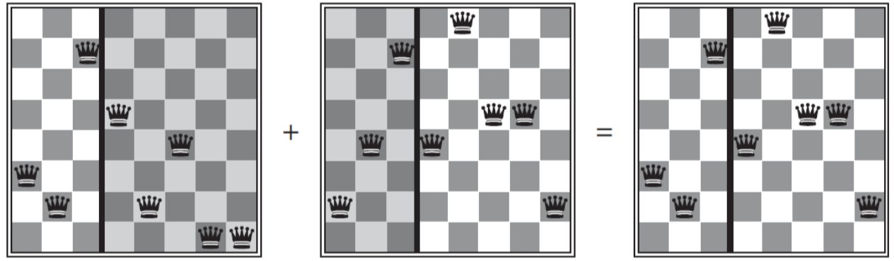

# Local Search Algorithms and Optimization Algorithms
前幾章的 Search algorithm 在找解答時

順便把經過也找了出來 (e.g., path to goal)

但其實很多問題只要求解答而已 (e.g., 8-queens problem)

---
* 這種直接求解的算法稱作 **Local Search** Algorithm
  * 每個 operation 只將 single current node 移動到鄰居
  * low memory
  * 可以在 infinite state spaces 找到 reasonable solutions
  * 他適合利用 **objective function** 來解決 **optimization problems**

* Local Search 的目標是找到 Global maximum (也就是 best solution)
* 下面介紹第一個 local search algorithm : hill climbing 

## Hill Climbing Search
* 會在 loop 中不斷找尋可以往上走的方向
  * 直到找到 **peak (no neighbor has a higher value)** 才停止
* 因為只觀察 current state 的鄰居，不會觀察全局
  * 所以只需保存 current node 的 objective function value
    * 不需要用到 search tree structure
* 又稱作 **Greedy local search** (效能還不錯)
* 但演算法會因為一些原因而卡住 :
  * Local maxima
  * Ridges
  * Plateaux or shoulder

### Example : 8-queens problem
* Successors of a state : 放下 queen 之後的所有的可能性
* Heuristic cost function (h) : 有幾對 queens 會互相攻擊
* 當 best h 有數個時，會隨機選取

* 8-queens 共有 8^8 states (17 millions)
* 若很 greedy 每次皆選最陡的路往上走
  * 有 86% 會卡住
    * 但只需花 3 步就會卡住
  * 只有 14% 會找到解
    * 但只需花 4 步找到解

* 若是繼續走，希望走到的只是一個 plateau
  * 有 94% 可以找到解
    * 但要花 21 步
  * 而失誤的話要等到 64 步才會知道

### Mutation
* **Stocastic hill climbing**
  * 在選擇 uphill move 時，會 random select 一個做為下一個 move
* **First-choice hill climbing**
  * 從 random 裡面開始找，找到第一個比 current state 好的 move 就移動
* **Random-restart hill climbing**
  * 失敗了就自動重來，直到到達 goal state 為止

## Simulated Annealing
* Annealing (冶金退火)
  * 是把金屬加熱至最高點後，慢慢降溫的手法
* Simulated Annealing
  * 一樣 random 選擇
    * 只要比 current state 好就永遠 accept
    * 就算比 current state 差也會有**一定機率** accept
      * 但是**機率**會隨著步數的增加而 decrease (就像退火)
      * With teperature T goes down
        * It becomes unlikely to accept badness

## Local Beam Search
* 會一次 track **k** 個 states (別的算法只有一個)
* initialize : k ramdom states
* Every step : all k states generate k^2 states
* 如果某一個 state 為 goal state 就中止算法

---

* Local beam search 看起來就只是 k 個 states 被平行操作
* 但其實這 k 個 states 是會互相影響, 互相傳送資料的
* 變形為 **Stochastic beam search**
  * 是 random 產生 k successors

## Genetic Algorithm
* 是 Stochastic beam search 的變形
* 會找到兩個 parent states 來產生新的 state

* Population : k ramdomly begin states
* Individual : each state
  * 用 strings 或是 0/1 來表達

* 產生 successor 方法 :
  1. 會對每個 states 打分數 (**fitness** score)
  2. 從分數給定每一個 states 被挑選的機率
  3. 從機率選擇兩個 states 作為 parent pair
  4. 每個 pair 進行 **crossover** 融合
  5. 最後再將組合好的 state 進行 **mutation**

* 下面是 crossover in 8-queens problem

