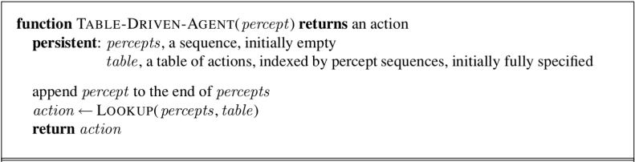
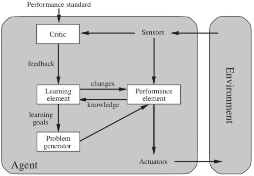

# Intelligent Agents

## Agents and Environments

**Agent** 可以是任何一種東西，用 **censor** 來感測環境，並且透過 **actuators** 來動作

* An agent’s behavior is described by the **agent function** that maps any given **percept** sequence to an action.
  * e.g., vacuum-cleaner 
    * if the current square is dirty, then suck
    * otherwise, move to the other square

## Rational agent

* Rational agent 指的是可以做出正確事情的 agent
* 正確事情 : Agent 所做的事情會讓 enviroment 歷經一系列的 **desirable states**
* desirability : performance measure 來量測
* Definition : Rational agent 會在 percept 的每個步驟都需要 maximize performance measure，從而 action
* Example : vacuum-cleaner agent
  * Performance measurement : the amount of dirt being cleaned up
  * Performance measure: a clean floor

## Omniscience, Learning, and Autonomy

> Rationality maximizes **expected** performance, while perfection maximizes **actual** performance.

* 針對 Agent 的 rationality 不需要達到 omniscience
* 但 Agent 需要能夠從 perceive 的 data 中**學習 \(learn\)**
* 另外 Agent 最好能夠 **Autonomous**
  * learn and compensate for incorrect

## Task Environments

我們透過以下幾點，來定義一個 **Task environment** :

* Performance measure
* The environment
* Agent's actuators 
* Agent's sensors
* 合稱為 **PEAS \(Performance, Environment, Actuators, Sensors\)**

例如 :

| Agent | Performance | Environment | Actuators | Sensors |
| :--- | :--- | :--- | :--- | :--- |
| Taxi driver | Safety, fast | Traffics, Customers | Brake, Accelerator | GPS, Engines |

### Properties of Task Environments

#### Fully observable vs. partially observable

* Agent 的每個 action 是否會跟 sensors 偵測所有的東西有關

#### Single agent vs. multiagent

* 如果有多個 Agents，那他們之間是否會互相影響對方
* Chess 就是 multiagent

#### Deterministic vs. stochastic

* 若 environment 的下一個 state 會受前一個 state 影響，那就是 deterministic
* stochastic 則相反，通常代表 outcomes 是 uncertainty 的
* Taxi driving 就是 stochastic

#### Episodic vs. sequential

* 情節之間是否是連貫的
* Chess & Taxi driving 都是 sequential

#### Static vs. dynamic \(taxi\)

* Environment 會因為 Agent 的**思考**而改變，則說 environment 是 dynamic 的
* Taxi driving 是 dynamic 的

#### Discrete vs. continuous

* Chess 的 environment 有 finite 的 discrete states & actions
* Taxi driving 則是有 continuous state

#### **Known vs. unknown**

* The agent's state of knowledge about the “laws of physics” of the environment.

## The Structure of Agents

* **Agent = Architecture + Program**
* **Program** : 設計來 implement agent function \(用於 map percepts to action\)
* **Architecture** : 指的是 Devices \(sensor, actuator\)

### Agent Programs

* A trivial agent program turns percept into action each time :

### Simple Reflex Agents

* 下一個 action 只建立在 current percept, 而會無視以前的 percept history
* 只建立在 environment 是 full-observable

### Model-based Reflex Agents

* Agent 會持續追蹤外部世界的變化
* 並更新內部的 **internal state**

> Rule 跟 Simple Reflex agents 的是一樣的

### Goal-based Reflex Agents

* 因為只有 current state of environment 沒辦法每次都能產出好的 action
* 所以基於 model 再新增 goal information
* Behavior 可以因 Goal 改變而被簡單改變
* Decision making 多了考慮未來的部分 "What/will"

### Utility-based Reflex Agents

* 有 Goal 不見得能有 High quality behavior
* Utility-based agent 會挑選能夠 maximize expected utility 的 action

### Learning Agents

* 使用 **critic** 的 feedback 來決定 performance element 要如何修改來加強 action
  * learning element =&gt; making improvements
  * performance element =&gt; selecting actions
* learn and improve in short run =&gt; better actions in long run
  * problem generator suggest new actions

