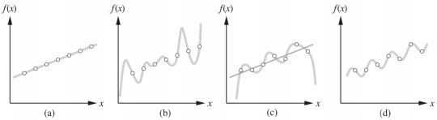
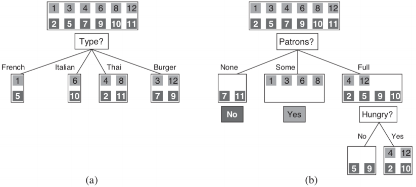
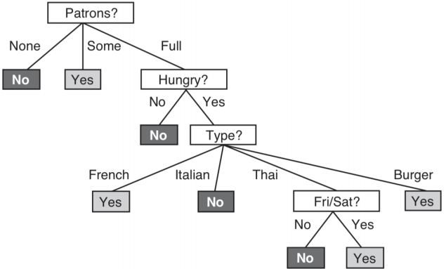
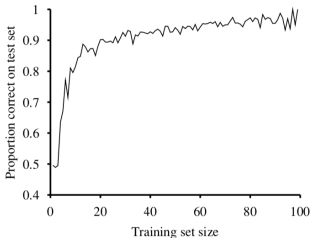

# Learning from Examples

## Introduction

* Learning : agent 透過 observation 來加強對未來 tasks 的 performance
  * 從 input-output pairs 找出一個 function，能夠從新 input 預測 output
* Why learning
  * 一般程式設計無法掌握所有狀況
  * 一般程式設計無法隨時間改變
  * 有時候 programmer 甚至不知道該如何設計程式來解決問題

## Supervised Learning

* **training set**
  * input-output pairs $$(x_1, y_1), (x_2, y_2), \cdots, (x_N, y_N)$$
  * 每個 $$y$$ 都是被一個不知道的 function $$f(x) = y$$ 所產出
  * 我們目標是找到一個 function $$h(x)$$ 他可以非常接近 $$f(x)$$
* **hypothesis**
  * hypothesis 就是我們要找到那個 function
  * learning 就是在一群 hypothesis 中找到最好的那一個
  * 即使在之後帶入新的 data 也可以很好的 perform
* **test set**
  * 跟 training set 格式一樣
  * 是用來檢驗 hypothesis 的精準度有多高
* **classification**
  * 若 y 是一個 finite set 裡面的某個 value
  * 那這種 learning 稱為 classification
* **regression**
  * 若 y 是一個可以任意變動的 number
  * 那該 learning 就稱為 regression

### Ockham's razor

* 一樣的 training sets 可以找出多種不一樣維度的 hypothesis
* 例如圖 \(c\) 當 x 越大，反而 y 卻掉了下來，可能不是一個好的 hypothesis
* Ockham's razor 告訴我們要優先選擇 **the simplest one**
* 所以在求取 hypothesis 時
* 不只單看 possible/impossible，而是要觀察是否 probable
* 我們可以定義一個 $$h^\star$$ 來表示達成 probable 的 hypothesis

  $$
  \begin{aligned}
  h^\star &= argmax_{h\in\mathcal{H}}P(h\mid data)\\
  &= argmax_{h\in\mathcal{H}}P(data\mid h)P(h) && \text{(Bayes' rule)}
  \end{aligned}
  $$

  * 其中的 P\(h\) 機率會在 polynomial 為 1-2 時較高，變成如圖 \(b\) 這類 7-8 時變低

* 每個 hypothesis 的表現和複雜度都是一個 tradeoff
* 但大多的 learning 都是 focus 在 simple representation

## Learning Decision Trees

* Input 一個 attributes vector 要 return 一個 "Decision"
* 目前只針對 true/false 的 boolean classification
* Decision tree 會經由一連串的 test 才走到 decision
* 下面舉例一棵 decision tree 來決定要不要等待餐廳的排隊

* Decision tree 會藉由一系列的 attributes (下圖中間部分)
  * 來產生一個個 $$(x, y)$$ pairs
    * x 是 input examples
    * y 是 output decisions

### Create Decision Trees

要從一堆 training sets 來建立一個 Decision Tree 其實很困難

我們會使用 **Decision-Tree-Learning algorithm** 來建立 decision tree

Decision-Tree-Learning algorithm 是一個 Greedy 和 Divide-and-conquer 的算法

每次都尋找最重要的 attribute 做為分支點

最重要的 attribute 代表可以將 Decision 拆分的最乾淨

例如圖 A 的 `Type` 就是較差的 attribute，他將 decision 拆成四項，但 yes/no 在每項還是很平均

而圖 B 的 `Patrons` 就是一個不錯的 attribute，很好的分散了 yes/no decision

在每次的分支後，新的 outcomes 代表的又是逼個新問題，可以再次進行分支

### Performance

我們會使用 **learning curve** 來評估 decision tree 的 accuracy

將 data 拆分為 training sets 和 test sets

假設有 100 筆資料

將 training set 設定為 1, 2, ... 99 個，每次剩下的作為 test set

**每回合**進行 20 次左右測試

重複操作就可以得到 learning curve

* X 軸為該回合的 training set size
* Y 軸為 test set 的 accuracy

### Choosing Attribute tests

要怎麼從 attributes 中找到 best attribute 

也就是將 data 拆分成 "good" 和 "useless" 的測量方法

也就是 **Entropy** 的概念

#### 何謂 Entropy
* Entropy 可以用來表達資料量的多寡
* 當我們對資訊掌握越高，代表不確定性越低
  $$
  100 \%\,\, \text{Certainty } \rightarrow (\text{Entropy } = 0)
  $$
* 所以當 entropy = 0 時，代表無法從事情中得到任何 information
* 而一個 fair coin 為 1 bit of entropy
* fair 4-sided die 則有 2 bit of entropy


越確定 => entropy 越低

越不確定 => entropy 越高

很少發生但發生了 => entropy 很高

可以將 entropy 記為不確定性 **(0 => centainty, 1 => uncertainty)**


#### 計算 Entropy
當我們有 random variable $$V$$ 以及他的值 $$v_k$$

然後他出現的機率為 $$P(v_k)$$

那 entropy 就是

$$
H(V) = \sum_kP(v_k)\log_2\frac{1}{P(v_k)} = -\sum P(v_k)\log_2P(v_k)
$$


若 P 很小取 log 就會變很大的負數

乘上原本的 P 得到加權平均

最後加上負號，就會變成很大的正數 (機率很小，資訊量很大)


舉個例子 :

* Fair coin flip is really 1-bit entropy
  $$
  H(\text{Fair}) = -(0.5\log_2 0.5 + 0.5\log_2 0.5) = 1
  $$
* coin with 99% heads
  $$
  H(\text{Loaded}) = -(0.99\log_2 0.99 + 0.01\log_2 0.01) \approx 0.08 \text{ bits}
  $$

Entropy 還可以用來計算 boolean random variable

當 q = true 的 probability 時，Entropy 可以計算為

$$
B(q) = -(q\log_2q + (1-q)\log_2(1-q))
$$

### Using Entropy in Decision-Tree Learning
如果有 p 個 positive examples 和 n 個 negative examples 時

我們計算 Goal 的 entropy 為

$$
H(\text{Goal}) = B(\frac{p}{p+n})
$$

例如餐廳的例子中 $$p = n = 6$$，所以 entropy = B(0.5) = 1 bit

但是單求這個 goal 的 entropy 是不夠的

我們將利用原本的 entropy 來減去 attribute test 後的 entropy

看誰造成 entropy 下降最多，讓 data 區分成更有確定性，那他就是最重要的 attribute

#### Remainder
* Attribute $$A$$ 可以將 data 切成 $$E$$ subsets 分別為 $$E_1, ..., E_d$$
* 每個 subset $$E_k$$ 都有 $$p_k$$ 個 positive 和 $$n_k$$ 個 negative examples
* 每個 subset 的 entropy 我們記為 $$B(\frac{p_k}{p_k+n_k})$$
* 隨機選到第 k 個 subset 的機率為 $$\frac{p_k+n_k}{p_n}$$
* 所以我們用以下式子計算經過 attribute A 之後，剩餘的 entropy 為

$$
\text{Remainder}(A) = \sum_{k=1}^d\frac{p_k+n_k}{p+n}B(\frac{p_k}{p_k+n_k})
$$

#### Information Gain

我們用 **Information gain** 來表達經過 attribute A 銷掉的 entropy 有多少

銷掉越多，$$Gain(A)$$ 越大，代表 data 從不確定變得更加確定

$$
\text{Gain}(A) = B(\frac{p}{p+n}) - \text{Remainder}(A)
$$

同樣舉餐廳例子 :

$$
\begin{aligned}
\text{Gain(Type)} &= 1 - \begin{bmatrix}
\frac{2}{12}B(\frac{1}{2}) + \frac{2}{12}B(\frac{1}{2}) + \frac{4}{12}B(\frac{2}{4})+ \frac{4}{12}B(\frac{2}{4})
\end{bmatrix} = 0 \text{ bits}\\

\text{Gain(Patrons)} &= 1 - \begin{bmatrix}
\frac{2}{12}B(\frac{0}{2}) + \frac{4}{12}B(\frac{4}{4}) + \frac{6}{12}B(\frac{2}{6})
\end{bmatrix} \approx 0.541 \text{ bits}
\end{aligned}
$$

可以看見，Attribute Type 沒有減少任何的 entropy

而 Attribute Patrons 則幫忙減少了 0.541 的 entropy

所以 Patrons 很合理是 best attribute

### Generalization and overfitting

#### Overfitting
Overfitting 通常會發生於 hypothesis space 跟 input attributes 增加

Training examples 的增加則不會造成 Overfitting

在之前舉例的 regression 中，下圖 b 和 c 就有明顯的 overfitting 現象

而 Decision Tree 也會有 Overfitting 的問題

#### Decision Tree Pruning

我們可以使用 decision tree pruning 的技巧來解決 overfitting

* 把 irrelevant 的 attribute test node 剪掉
* 通常為 branch 只剩下 leaf nodes 的 test node
* 刪除之後再用 leaf 來 replace 該 node

* 要怎麼抓出這些 irrelevant attribute ?
  * 通常是 positive ratio 和整體的 positive ratio 差不多的 attribute test
  * 這些 attribute 的 information gain 又會接近 0
    * 雖然跟建樹時一樣可以用 gain 來剪樹
    * 但這邊指的是 entropy 非常小的下降可以視為 irrelevant
    * 所以我們需要定義 entropy 下降多少稱作「**非常小的下降**」
    * 也就是需要定義一個 threshold

#### Pruning Threshold

我們可以利用統計學裡的 significant test

定義 **Null hypothesis** = "attribute test 做的結果跟沒做一樣"

接著測量 deviation :

$$
\Delta = \sum_{k=1}^d\frac{(p_k-\hat{p_k})^2}{\hat{p_k}}+\frac{(n_k-\hat{n_k})^2}{\hat{n_k}}
$$

我們可以使用 [$$\chi^2$$ table](http://homepage.ntu.edu.tw/~clhsieh/biostatistic/8/8-1.htm) 來檢驗 deviation 是否 reject null hypothesis

所以這個方法又叫作 $$\chi^2 \text{Pruning}$$

#### Early Stopping

因為 $$\chi^2 \text{Pruning}$$ 跟 information gain 看起來很像

我們何不把他們結合在一起，稱作 early stopping

在建樹時，就可以防止新建不必要的 attribute nodes 和分支

### Broadening the applicability of decision trees
Decision tree 還有很多問題需要被解決

* Missing data : 在資料缺失下，要怎麼計算 information gain ?
* Multivalued attributes : 單一 attribute 有多個值時怎麼計算 information gain ?
* Continuous-valued input attributes : 若 input 是 real number (e.g., height) 要怎麼分支
  * 通常會定義一個中間值來進行分支
* Continuous-valued output attributes : decision 是要找出 real number 要怎麼找
  * 可以使用 **Regression tree**

雖然有一些問題

但 decision tree 還是最簡單又最好理解的 learning method

現在的一些 learning 雖然很強大，但是產出的結果是不好解釋的 (e.g., deep learning)

## Evaluating and Choosing the Best Hypothesis

* 我們想要定義一下 hypothesis 是否能夠 **fits the future data best**
  * 首先要定義 future data 跟 best fit

### Future Data

每個未來的 example data point 是一個 random variable $$E_j$$

並且每一個 $$E_j$$ 會跟前面的 point 完全無關

且每一個都有 identical prior probability distribution

$$
P(E_j \mid E_{j-1}, E_{j-2}, \cdots) = P(E_j)
$$

符合該條件的 examples 稱為 **Independent and identically distributed (i.i.d.)**

### Best Fit

首先定義 hypothesis 的 **error rate** : 代表 $$h(x) \neq y$$ 的機率

但 low error rate 不一定代表產出的 hypothesis 是很好的

通常我們會將所有 dataset 拆成 training set 和 test set

training set 用於生成 hypothesis 而 test set 用於測試 hypothesis accuracy

#### k-fold cross-validation

這個想法將每個 example 都能夠當作 train 和 test data

* 將 data 拆成 k-subset
* 進行 k 回合的 learning
* 每回合 1/k 的 data 將作為 test set
* 取 k 回合產生的 accuracy score 平均值

通常 k-fold 會產生比 single test 更準確的 score 

當 k = n 時，又稱作 **leave-one-out cross validation (LOOCV)**

