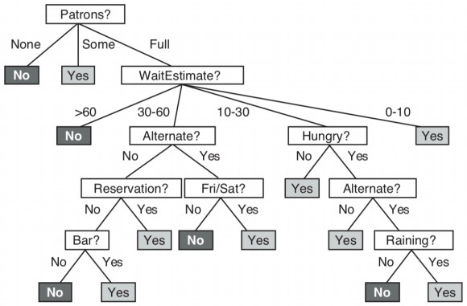
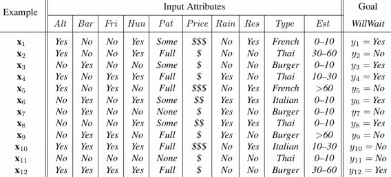

# Introduction
* Learning : agent 透過 observation 來加強對未來 tasks 的 performance
  * 從 input-output pairs 找出一個 function，能夠從新 input 預測 output

* Why learning
  * 一般程式設計無法掌握所有狀況
  * 一般程式設計無法隨時間改變
  * 有時候 programmer 甚至不知道該如何設計程式來解決問題

# Supervised Learning
* **training set**
  * input-output pairs $$(x_1, y_1), (x_2, y_2), \cdots, (x_N, y_N)$$
  * 每個 $$y$$ 都是被一個不知道的 function $$f(x) = y$$ 所產出
  * 我們目標是找到一個 function $$h(x)$$ 他可以非常接近 $$f(x)$$

* **hypothesis**
  * hypothesis 就是我們要找到那個 function
  * learning 就是在一群 hypothesis 中找到最好的那一個
  * 即使在之後帶入新的 data 也可以很好的 perform

* **test set**
  * 跟 training set 格式一樣
  * 是用來檢驗 hypothesis 的精準度有多高

* **classification**
  * 若 y 是一個 finite set 裡面的某個 value
  * 那這種 learning 稱為 classification

* **regression**
  * 若 y 是一個可以任意變動的 number
  * 那該 learning 就稱為 regression

## Ockham's razor

* 一樣的 training sets 可以找出多種不一樣維度的 hypothesis
* 例如圖 (c) 當 x 越大，反而 y 卻掉了下來，可能不是一個好的 hypothesis
* Ockham's razor 告訴我們要優先選擇 **the simplest one**

---

* 所以在求取 hypothesis 時
* 不只單看 possible/impossible，而是要觀察是否 probable
* 我們可以定義一個 $$h^\star$$ 來表示達成 probable 的 hypothesis
  $$
  \begin{aligned}
  h^\star &= \argmax_{h\in\mathcal{H}}P(h\mid data)\\
  &= \argmax_{h\in\mathcal{H}}P(data\mid h)P(h) && \text{(Bayes' rule)}
  \end{aligned}
  $$
  * 其中的 P(h) 機率會在 polynomial 為 1-2 時較高，變成如圖 (b) 這類 7-8 時變低
* 每個 hypothesis 的表現和複雜度都是一個 tradeoff
* 但大多的 learning 都是 focus 在 simple representation

# Learning Decision Trees
* Input 一個 attributes vector 要 return 一個 "Decision"
* 目前只針對 true/false 的 boolean classification
* Decision tree 會經由一連串的 test 才走到 decision
* 下面舉例一棵 decision tree 來決定要不要等待餐廳的排隊

* Decision tree 產生的圖表告訴我們
  * tree 會藉由一系列的 attributes (中間部分)
  * 來產生一個個 $$(x, y)$$ pairs
    * x 是 input examples
    * y 是 output decisions

