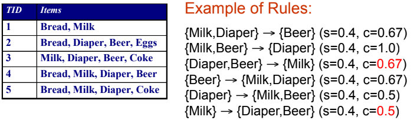
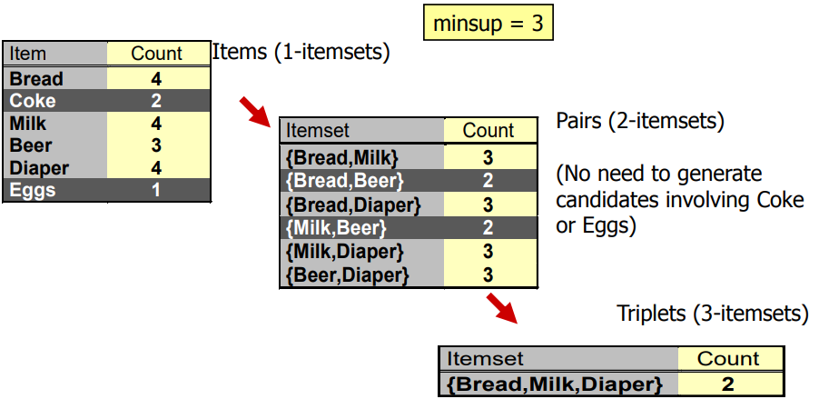

關聯法則雖然在 2019 已經不是最熱門的技術

但其實他是開啟整個 Data mining 的第一把火

# Association Rule Mining
Association Rule 就是在一堆 transaction 中

利用其他 items **occurrence** 的頻率

來預測我們想知道的 item 的 **occurrence** 機率


例如買尿布就會買啤酒, 買牛奶就會買雞蛋 ...

每次預測可以包含多個 items 合在一起
```
{Diaper} -> {Beer}
{Milk, Bread} -> {Eggs, Coke}
{Beer, Bread} -> {Milk}
```

Association Rule 重視的是 **co-occurence**，而非 **causality** !


## Definition
接下來講解一些 association rule 實作中會遇到的專有名詞 :

* Itemset
  * 一或多個 item 的組合
  * k-Itemset 表示一個組合有 k 個 items

* Support count $(\sigma)$
  * 這一個 Itemset 在整個 transaction 中出現幾次
  * e.g., $\sigma(\begin{Bmatrix} \text{Milk, Bread, Diaper} \end{Bmatrix}) = 2$

* Support $(s)$
  * 該 Support count 在 transaction 的比例是多少 (ratio from 0 - 1)
  * e.g., $s(\begin{Bmatrix} \text{Milk, Bread, Diaper} \end{Bmatrix}) = 2/5$

* Frequent Itemset
  * 我們會定義一個 **minsup** (minimum-support)
  * 只要某個 Itemset 的 support 超過 minsup 他就是 **Frequent Itemset**

* Association Rule
  * 就是一個關聯的表達格式
  * $X \rightarrow Y \mid X, Y \text{ are itemsets}$
  * e.g., $\begin{Bmatrix} \text{Milk, Diaper} \end{Bmatrix} \rightarrow \begin{Bmatrix} \text{Beer} \end{Bmatrix}$

* Rule Evaluation Metrics
  * 要探討該 Itemset 的關聯法則準確度，我們使用 s 和 c 來表達
  * Support (s)
    * 跟上面一樣，就是 itemset 在 transaction 出現的百分比
    * $s = \frac{\sigma(X, Y)}{\lvert T \rvert}$
  * Confidence (c)
    * 信心度，指的是 $Y$ 有多常跟著 $X$ 一起出現
    * $c = \frac{\sigma(X, Y)}{X}$

  * 舉個例子，一樣是用上面出現過的 transaction

    
    
    我們想要探討 $\begin{Bmatrix} \text{Milk, Diaper} \end{Bmatrix} \rightarrow \begin{Bmatrix} \text{Beer} \end{Bmatrix}$ 的關聯度如何
    $$
    \begin{aligned}
    s = \frac{\sigma(\text{Milk, Diaper, Beer})}{\lvert T \rvert} = \frac{2}{5} = 0.4\\
    c = \frac{\sigma(\text{Milk, Diaper, Beer})}{\sigma(\text{Milk, Diaper})} = \frac{2}{3} = 0.6
    \end{aligned}
    $$

## Full Example
| TID | Items      |
|-----|------------|
| 100 | A, C, D    |
| 200 | B, C, E    |
| 300 | A, B, C, E |
| 400 | B, E       |

* Minimum support = 2
* Minimum confidence = 2/3

Frequent Itemset 有 (他們都是 support 大於等於 2 的 Itemset)
```
{A}, {B}, {C}, {E}, {A, C}, {B, C}, {B, E}, {C, E}, {B, C, E}
```

而 Strong rule 為 (他們都是 confidence 大於等於 2/3 的 Itemset)
```
{B, E} -> {C}  (2/3)
{C} -> {A}  (2/3)
{A} -> {C}  (2/2)
```

# Association Rule Mining Task
接著要想出一個方法在 transaction $T$, **minsup**, **minconf** 的情況下

試著找到 association rule 並滿足以下兩個條件
* $\text{support} \ge \text{minsup}$
* $\text{confidence} \ge \text{minconf}$

## Brute Force approach
1. 先列出所有的 Association rules
2. 把所有 rules 的 s 和 c 都算出來
3. 再刪除所有不滿足兩條件的 rules
4. 不可能 (**Computationally prohibitive**)



上面只考慮三個物件的 rules 就可以產生好幾種 (考慮賣場有上萬種商品，有幾種 Rules ?)

他們會有**一樣的 support**，但會有**不一樣的 confidence**


## Find other approach
1. 先找出所有 Frequent itemsets
2. 從這些 Frequent itemsets 再產生 strong association rules
* 但光是找出 Frequent itemsets 又是 **Computationally prohibitive**

> 通常演算法找出的 frequent itemsets 不會超過五組


想像有 d 個 items，要將他們組成所有可能的 itemset 再從中去刪除不為 frequent 的 itemset

d 個 items 就會產生 $2^d$ 個 itemsets

---

* 我們將 Brute force 套回來看看
  * 所以共要先產生 $M = 2^d$ 個 **Candidate rules**
  * 在 database 掃描並更新每個 candidate rules 的 **support**
  * 再將所有 transactions 比對所有 candidate rules
  * 複雜度將會是 $O(NMw) \mid N = \text{transactions}, w = \text{itemset length}$

## Strategies
* 想辦法減少 candidate $M = 2^d$ ?
  * pruning techniques
* 想辦法減少 transactions $N$ ?
  * DHP, vertical-based mining algorithms
* 想辦法減少 comparisons $NM$ ?
  * efficient data strucutres


# Apriori Algorithm
## Principle
若 itemset 本身為 frequent itemset

那他的 subset 一定也可以是 frequent subset

$$
\forall X, Y : (X \subseteq Y) \Rightarrow s(X) \ge s(Y)
$$

意思就是任意 itemset 的 support 一定不會超過他的 subset 的 support

---

這個方法可以反推回我們在產生所有 itemset 的圖表中


因為 itemset 的 support 一定不會超過 subset

所以若是 subset 已經確定不為 frequent itemset 的話

那底下所有包含該 subset 的 itemset 都一定不會是 frequent itemset

$$
\begin{aligned}
&\begin{Bmatrix}A, B\end{Bmatrix} \neq \text{Frequent itemset} \\
\Rightarrow
&\text{Any itemset contains } \begin{Bmatrix}A, B\end{Bmatrix} \neq \text{Frequent itemset}
\end{aligned}
$$

## Notation and Algorithm
* $C_k$ : candidate k-itemsets : 代表所有可能為 frequent 的 itemsets
* $L_k$ : frequent k-itemsets : 所有已滿足 minsup 的 frequent itemsets

* Algorithm
  ```
  k = 1, C_1 = all items
  
  While C_k not empty :
      從 C_k 找出所有符合 minsup 的放入 L_k

      從 L_k 產生出下一階段的 C_k+1
      
      k = k + 1
  ```

## Example


* 先從 $C_1$ 刪除不合 minsup 的 itemsets 產生 $L_1$
* $L_1$ 生成下一階段的 $C_2$
* $C_2$ 刪除不合 minsup 產生 $L_2$
* $L_2$ 生成下一階段的 $C_3$
* $C_3$ 刪除不合 minsup 的 itemsets 產生 $L_3$
* $L_3$ 無法再產生 $C_4$

注意在 $L_2$ 生成 $C_3$ 的時候

{Milk, Beer} 已經不是 frequent itemset

所以包含他的 {Milk, Beer, Diaper} 也不會出現在 $C_3$

---


17
從 1-itemsets 刪
得到新的 2-itemsets 再刪
最後得到 3-itemsets

因為 milk beer 被砍掉 => beer milk diaper 也不會出現

41 => 13 次

第二層可能還是非常多


18
notation
frequent k-itemset (lk)
candidate k-itemset (ck)

k-1 to explore k
subset test to k
ck = lk-1 x lk-1
generate frequent k-itemset (lk)

19
example of apriori

20 - 22
apriori algorithm

23
challenge
multiple scans
C2 very large

24
use hash to store candidate itemset

25 - 34
generate hash tree

35
產生完 freqeunt itemset 後
計算每種 subset 的 confidence 的方法


===

FP close