# Clustering

* process of grouping a set of physical or abstract objects into classes of **similar objects**
* **unsupervised classification**
* Quality factors 
  * similarity measure
  * representation of cluster chosen
  * clustering algorithm
* Similarity
  * Distance Measures
    * Peter and Piotr : 3
    * Two fingerprint : 342.7
* Typical Applications of Clustering Analysis
  * Pattern Recognition
  * market segmentation
  * Biology
  * Geography
  * Insurance
* Requirements of Clustering
  * Scalability
  * Multiple classes
  * Deal with noisy data
  * High dimensionality
  * Interpretability and usability
* Issues
  * Outlier handling
    * Outlier 可以徹底改變 cluster 圈的範圍
  * Dynamic Data
  * Interpreting results (centroid meaning)
  * Number of clusters (k)

# Type of Clusters

## Well-Seperated

* A cluster is a set of points
* point in a cluster is closer (or more similar) to every other point

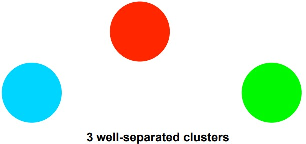

## Center-based 

* A cluster is a set of objects
* an object in a cluster is closer (more similar) to the **“center”** of a cluster
* calculate center first, and compare distance from centroid to each group

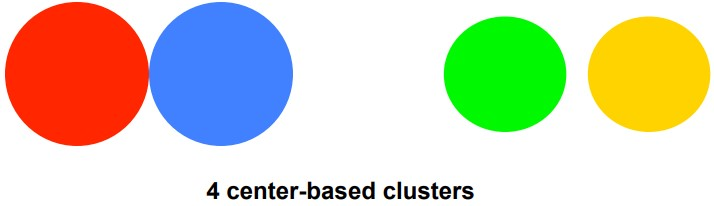

## Contiguity-Based

* Nearest neighbor or Transitive
* A cluster is a set of points
* a point in a cluster is closer (or more similar) to one or more other points

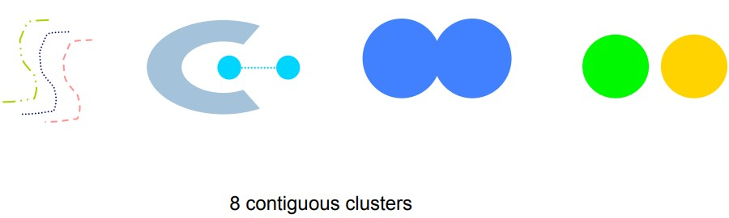

## Conceptual

* Finds clusters that share some common property

## Density-based

* A cluster is a dense region of points
* Separated by low-density regions
* Used when the clusters are irregular or intertwined
  * and when noise and outliers are present

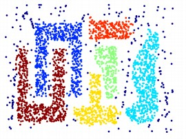


# Clustering Algorithms

* Partitioning algorithms
  * Construct various **partitions** and then **evaluate** them by some criterion.
* Hierarchy algorithms
  * Create a hierarchical **decomposition** of the set of data (or objects) using some criterion.
* Density-based
  * based on **connectivity** and **density** functions
* Grid-based
  * based on a **multiple-level** granularity structure
* Model-based
  * A model is **hypothesized** for each of the clusters
  * the idea is to find the **best fit** of that model to each other. 

# Partition-based Clustering

* Construct a partition of a **database D of n objects** into a set of **k clusters**
  * Given a k, find a partition of k clusters
  * **optimizes** the chosen partitioning criterion
    * Global optimal : Iterate all partitions (NP-Hard)
    * Heuristic methods
      * **k-means**
        * each cluster is represented by the **center** of the cluster
      * **k-medoids** (Partition Around Medoids, PAM)
        * each cluster is represented by one of the objects in the cluster.
        * Used when full of outliers

## K-means

* partition objects into **k** nonempty subsets
* compute the centroids (mean) of each partitions
* relocate all objects to the nearest clusters
* Repeat compute centroids and relocate until no more relocation

```
Select K points as the initial centroids

repeat
    Form K clusters by assigning all points to the closest centroid
    Recompute the centroid of each cluster

until The centroids don't change
```

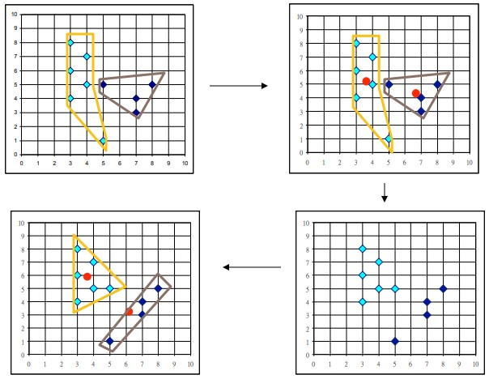

### Details

* Initial centroids are often **chosen randomly** 
* centroid is typically the mean of the points in the cluster
* closeness or similarity is measured by :
  * Euclidean distance
  * Cosine similarity
  * Correlation
  * etc.
* K-means will converge eventually
  * Most of the convergence happens in the first few iterations
  * Very fast
  * stopping condition is often changed to **特定的幾個點變動為止**

### Comments

* Pros
  * Efficient, $$O(nKId)$$
    * n = # points
    * K = # clusters
    * I = # iterations
    * d = # attributes
  * terminates at a local optimum (useful local optimum)
* Cons
  * **Applicable** only when mean is defined
  * Need to specify **k**
  * Unable to handle **noisy data** and **outliers**
* Variations
  * k-modes : Handling categorical data
    * Replacing means of clusters with modes (distance = 0/1)

### Problem with selecting initial points

* Given Large **K** clusters, and clusters are the same size **n** 
* The probability of one specific initial points 
  $$
  \begin{aligned}
  P &= \frac{K!}{K^K} \\
  \text{If K is } 10 &= \frac{10!}{10^{10}} = 0.00036  
  \end{aligned}
  $$

### Problem with clusters different size

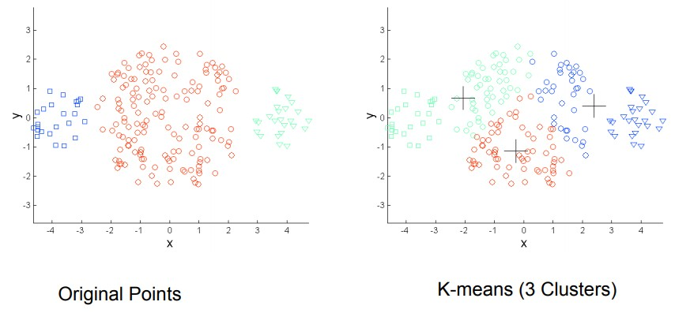

### Problem with clusters densities

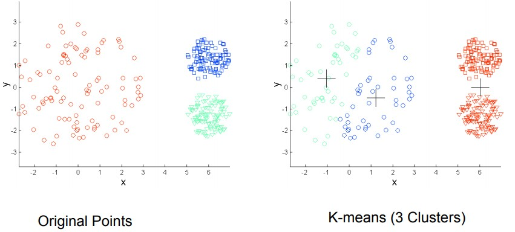

### Problem with clusters non-globular

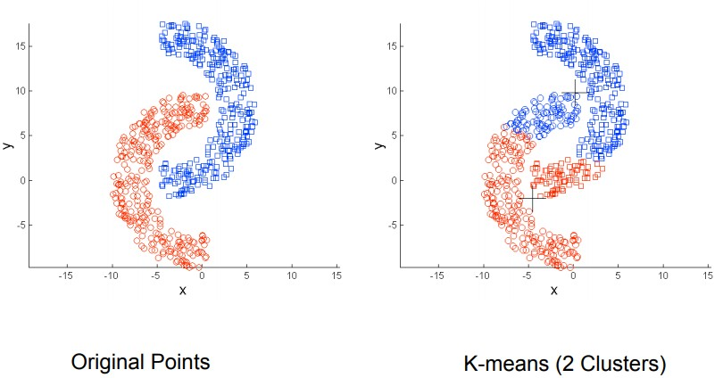

### Solution

* One solution is to use many clusters
  * Find parts of clusters, but need to put together
  * Use many k and merge

## K-medoid

* The k-means algorithm is sensitive to outliers
* Instead of taking the mean value, we find the actual point closest to mean
* Then we can get out of outliers (maybe)

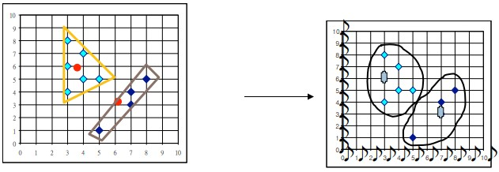

### Methods

* PAM (Partitioning Around Medoids, 1987)
* CLARA (Kaufmann & Rousseeuw, 1990)
* CLARANS (Ng & Han, 1994): Randomized sampling
* Focusing + spatial data structure (Ester et al., 1995)

### PAM

* Robust than k-means in the presence of noise and outliers
  * A medoid is less influenced by outliers
* Works efficiently for small data sets 
* But does not **scale well** for large data sets
  * => Sampling based method (CLARA)

### CLARA (Clustering Large Applications)

* Partition for large database
* Steps
  * draws multiple samples of the data set
  * applies PAM on each sample
  * gives the best clustering as the output
* Pros
  * deal with larger data sets than PAM
* Cons
  * efficiency depends on the sample size
  * good clustering on samples means good on whole dataset ?


# Hierchical clustering

* Produces a set of nested clusters organized as a **hierarchical tree**
* Can be visualized as a dendrogram (樹枝狀圖)
  * Can record the sequences of merges or splits
* No need to assume number k of clusters
* Hierarchy may correspond to meaningful taxonomies
* Two main types of hierarchical clustering
  * **Agglomerative**
    * Start with the points as individual clusters
    *  At each step, merge the closest pair of clusters until only k cluster left
  * **Divisive**
    * Start with one, all-inclusive cluster
    * At each step, split a cluster until each cluster contains a point

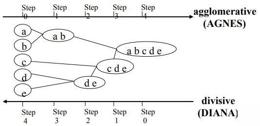

## Agglomerative Clustering Algorithm

* More popular
* Key operation is the computation of the proximity of two clusters 

```
Compute the proximity matrix
Let each data point be a cluster

Repeat
    Merge the two closest clusters
    Update the proximity matrix

Until only a single cluster remains
```

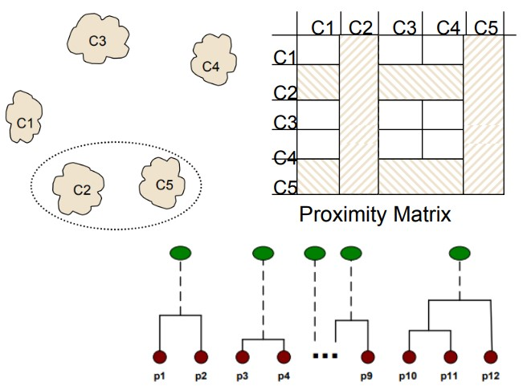

* How to define similarity to merge ?
  * MIN
    * Can handle non-elliptical shapes
    * But sensitive to noise and outliers
  * MAX
    * Less susceptible to noise and outliers
    * But tends to break large clusters and biased to globular
  * Group Average
  * Distance Between Centroids
  * Ward’s Method
    * Based on the increase in squared error

### Requirements and Limitations

* Requirements
  * space : $$O(N^2)$$
  * time : $$O(N^3)$$
* Limitations
  * merges cannot be undone
  * no objective function
  * different schemes have different problems
    * sensitivity to noises
    * difficulty to cluster shapes
    * breaking large clusters


## Divisive Clustering Algorithm

* Build MST (Minimum Spanning Tree)
  * build minimum spanning tree
  * cut the longest edges

```
Compute the MST for the proximity graph

Repeat
    Create a new cluster by breaking the link corresponding to the largest disance

Until Only singleton clusters remain
```

# Integration of hierarchical clustering & distance-based

* Clustering algorithms have been designed to handle **very large datasets**
  * BIRCH (1996)
  * CURE (1998)

## BIRCH

* Main idea
  * use an in-memory R-tree to store points that are being clustered
  * Insert points one at a time into the R-tree
    * merging a new point with an existing cluster if is less than some distance
  * If there are more leaf nodes than fit in memory, merge existing clusters that are close to each other
  * At the end of first pass we get a large number of clusters at the leaves of the R-tree
    * Merge clusters to reduce the number of clusters
* Balanced Iterative Reducing and Clustering using Hierarchies
* Incrementally construct a **CF (Clustering Feature) tree**
  * a hierarchical data structure for multiphase clustering

```
1. scan DB to build an initial in-memory CF tree

2. use any clustering algorithm to cluster the leaf nodes of the CF-tree
```

## CURE

* Clustering Using Representatives
* Stops the creation of a cluster hierarchy if a level consists of k clusters
* Use **many points** to represent a cluster instead of only one
  * Call **multiple representative points**
* Points will be well scattered

```
1.Create Clusters with Representative Points

2.Merge Clusters with Closest Points

3.Shrink Representative Points
```

# DBSCAN

* Density-based Algorithm
  * Density = number of points within a specified radius (Eps)
  * **core point** 
    * it has more than a specified number of points (MinPts) within Eps
    * These are points that are at the interior of a cluster
  * **border point**
    * has fewer than MinPts within Eps
    * but is in the neighborhood of a core point
  * **noise point**
    * any point that is not a core point or a border point

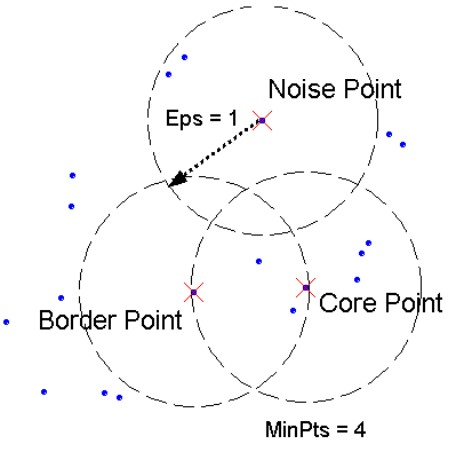

* DBSCAN can eliminate noise points

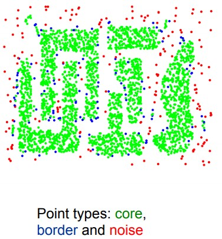

* Works well
  * Resistant to Noise
  * Can handle clusters of different shapes and sizes
* Works fail
  * Varying densities
  * High-dimensional data
* Determining Eps and MinPts
  * Consider k nearest neighbors are at roughly the same distance