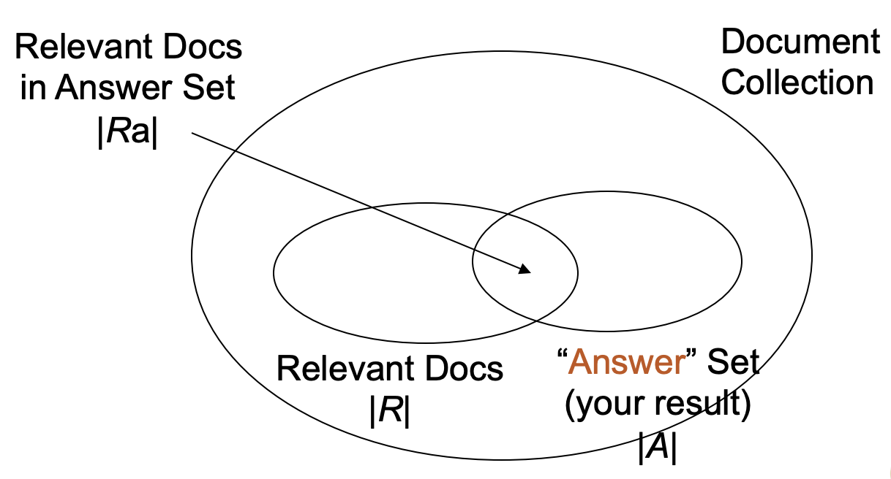
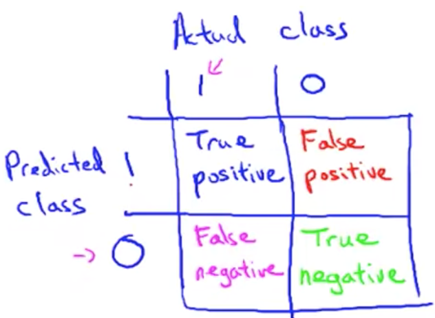

# Recall and Precision

* Recall
  * The fraction of the relevant documents (R) which has been retrieved
* Precision
  * The fraction of the retrieved documents (A) which is relevant

$$
\begin{aligned}
\text{Recall} = \frac{R_a}{R} \\
\text{Precision} = \frac{R_a}{A} \\
\end{aligned}
$$

* 通常 Recall 越高，會使 Precision 越低

# Top-K Precision (Precision at k)

* The precision value of the top-k results
* Top-1 = P@1
* Top-3 = P@3
* ...
* 前 5 筆有 2 筆中
* P@5 = 2/5 = 40%

# Average Over Multiple Queries
# Interpolated precision

# Single Value Summaries

## MAP: mean average precision

## R-Precision

find recall = precision

### Comparison

* RNRNN NNNRR
  * MAP = (1 + 2/3 + 3/9 + 4/10) / 4
  * RP(4) = 2/4

* NRNNR RRNNN
  * MAP = (1/2 + 2/5 + 3/6 + 4/7) / 4
  * RP(4) = 1/4

# MRR: Mean Reciprocal Rank

* Rank of the first correct answer

# Precision-Recall

* Microaveraging
  * 重視數量的差距
* Macroaveraging
  * 每個 rank 都一樣重要

* 平時不太可能得到標準答案
  * Recall 不好算

# F-score

Formula

Examples

Harmonic

# User-Oriented Measure

修改 recall / precision

coverage / novelty

need to label

# Alternative Measures (confusion matrix)

* Recall
* Precision
* Accuracy
* Specificity

# Limitation of Accuracy

## Cost Matrix

set false negative's weight larger

# ROC Curve
multiple cost matrix

true positive rate vs. false positive rate

with bias data => ROC curve can get a smoother curve

# Question

# Estimation Methods

* Hold-out
* Random subsampling
* Cross validation
  * LOOCV
* Stratified sampling
* Bootstrap

# Evaluate Ranked list

## DCG : Discounted cumulative gain

* CG : Cumulative gain

第二筆之後都會做處理

dependent with order

### Example

## Kendall-tau

## Cohen's Kappa

raters agreement PR(a)

background noise PR(e)
隨便猜跟認真算一樣的值

