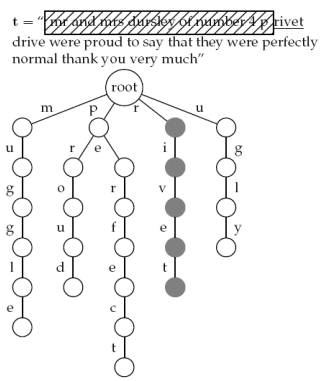
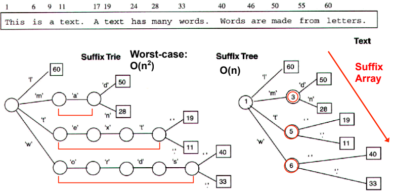
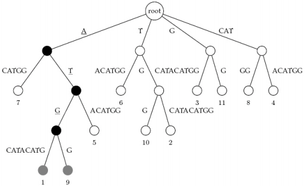
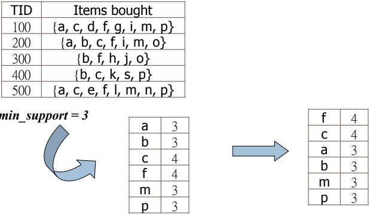
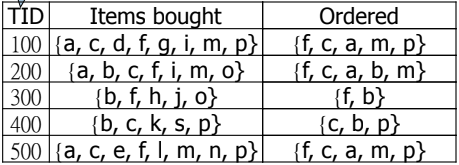
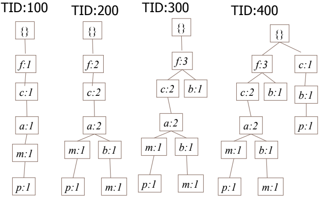
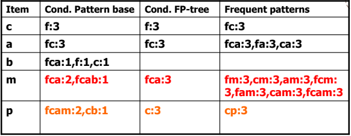

# FP-Growth

FP-growth 的主要目的是破解 candidate generation 所引起的 bottleneck

所以 FP-growth 將不會用到任何 candidate generation

並且在 main memory 實作，進而減少對 database 的 scans

FP-growth 主要的概念是 divide-and-conquer

並且利用了 suffix tree 的概念

## Suffix Tree

### Keyword Trees

* 將 keywords 儲存在 rooted labeled tree
* 每個從 root 到 leaf 的 path 都會對應一個 keyword

* 利用 "threading" 技巧 traverse 文章找出 keywords
* 每當我們 reach 到 leaf node 時代表找到 keyword

### Suffix Tree

* 運用 keyword tree 的概念
* 利用 text 的 suffixes 來建立一種 trie data structure
* Suffix tree 的 leaves 會是每個 suffix 在文章的 start position

* Suffix tree 可以掌握所有 text 的 suffixes
* 並且在 $$O(\text{length})$$ 的時間就可以建好 tree
* 例如底下是一個將基因序列 index 成 suffix tree 的例子

## FP-Growth Algorithm

1. Construct FP-Tree (Frequent pattern tree)
2. FP-Growth (Frequent pattern growth)
   1. 根據不同 frequent item 將 FP-tree 分裂成 Conditional FP-Tree
   2. 針對每一個 conditional FP-Tree 進行 mining

### FP-Trees Construction

1. 一樣先 scan 所有 1-itemset 的 support ，但要 sort 成 descending order
   * Descend 可以改變 transaction 結構，幫助我們用更少 nodes 來建樹

1. 將 ordered 的 itemset 建立成 FP-tree，建立方法如下
   * 從第一筆開始建樹
   * 一樣的 character 就 + 1
   * 不一樣的 character 就建立分支

3. 最後將 tree 中相同 character 從 header table 串連起來

### FP-Growth

接續上面產生的 FP-Tree

1. 先從每一個 1-item 來建立 **Conditional Pattern Base** (由下往上)
   * p 可以從 fcam (2次) 接過來
   * p 也可從 cb (1次) 接過來
2. 接著從 conditional pattern base 建立出 **Conditional FP-Tree**
   * 找出在 conditional pattern base 有相同 prefix 的 items
   * 並且可以符合 minsup
   * 例如 p 的 fcam 跟 cb 代表 $$c \rightarrow p$$ 共有出現 3 次
3. 最後我們將 conditional FP-Tree 找到的 items 各自拆開與原本的 item 結合
   * 例如 $$c \implies (c \rightarrow p)$$


[Here is a complete FP-Growth Example](https://drive.google.com/file/d/18XxvzPmSFWpnDQ-Mfd_ekEsw64fUTJ5z/view)


### FP-Growth Adventages
* Divide-and-Conquer
  * Decompose mining and DB
* No candidate required
* Compressed DB (FP-Tree)
* No repeated scan of DB
* No pattern searching and matching