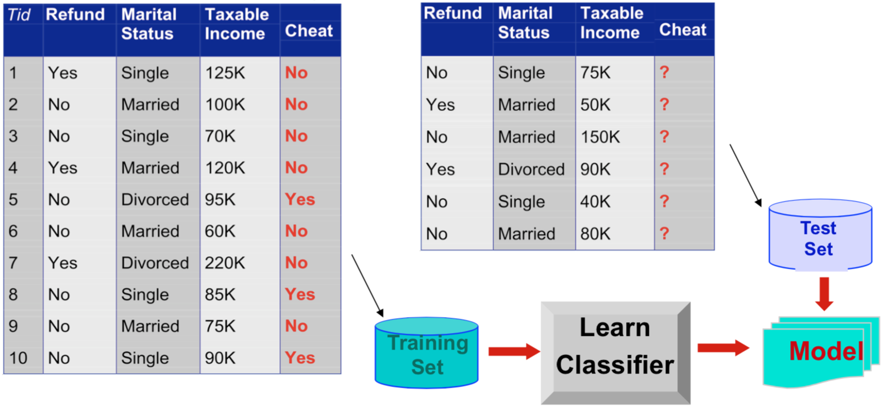
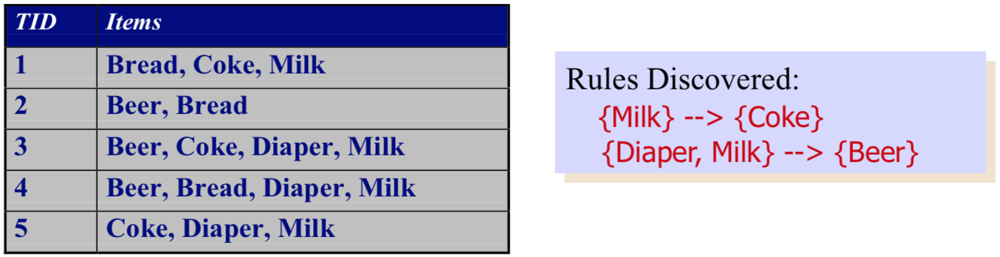
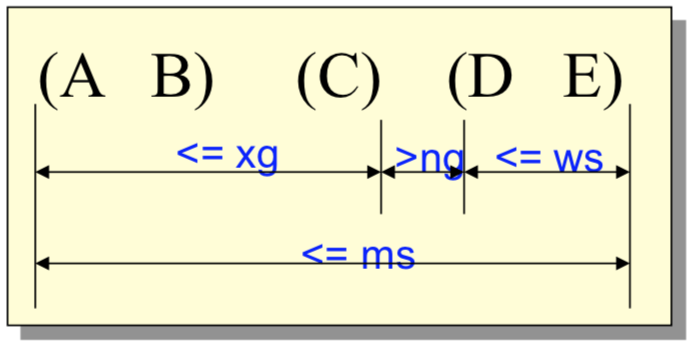

# Introduction

## Examples
1. Data-Result : Titanic@Kaggle (預測船員存活率)
2. Data-only : Google maps (預測路徑, 塞車警告, 結合各種應用)
3. IoT makes data increasing (Surveillance, healthcare, ...)

## Definition of data mining
* 跨學科的 computer science
* 從 **AI, ML, statistics, DB** 結合出的 large data sets 找出 unknown patterns
* 如何有效的從資料之間找出關聯
* Auto/Semi-automatic
* **Knowledge discovery in databases (KDD)**
  * Data record => Cluster analysis
  * Unusual record => Anomaly detection
  * Dependencies => Association rule mining
* 不只是 retrive 而是 detect/find association

## Applications
* **Market** analysis and management
  * 透過客戶行為找到與公司的關係, 銀行判斷信用
* **Risk** analysis and management
* **Fraud** detection and detection of **unusual** patterns (**outliers**)
  * Whoscall

# Knowledge Discovery from Databases (KDD)
* Nontrivial process of extraction
  * valid (可以用)
  * novel (別人有興趣, 沒有人知道)
  * potential useful
  * understandable (講得出原因)
    * linear regression hypothesis 難以解釋
  * patterns from big data (助於未來分析)

* Pattern
  * expression in languages
  * model applicable

* Example : Uber control drivers

## KDD process

### Databases to work on
* Relational
* Transactional (交易)
* Spatial (空間)
* Time series data (Sensor 等 sequential data)
* Multimedia (照片, 影片)
* Unstructured data (語音)
* Graph (點跟邊資料 => 方便 implement algorithms)

### Knowledge to be mined
* Association rules (買什麼就會順便買什麼)
* Classification
* Clustering
* Time series data analysis
* Semantics

# Data mining tasks
* Predict methods : 用已有變數來 predict 未知變數
  * Classification
  * Regression
  * Deviation detection
* Description methods : 把資料 label 起來, 解釋 data
  * Clustering
  * Association rule discovery
  * Sequential pattern discovery

# Classification
用已經**分類**過的 data 來學習分類，再丟進從未看過的 data 來**測試**是哪一種分類
* Training sets (each class has features/attributes)
* Find a model for class attribute
* test previously unseen records (test set)

$$
\text{Training set} \rightarrow \text{learn classifier} \rightarrow \text{model} \leftarrow \text{test set}
$$

* Supervised classification
* 建立符合邏輯的模型 (例如樹) 來解釋 data
* Relate to machine learning

## Application
1. Direct marketing (廣告投放)
   * Buy / Don't Buy
2. Fraud detection (避免詐騙)
   * Fair / Fraud
3. Customer Attrition/Churn (使用者忠誠度預測)
   * Loyal / Disloyal
   * feature engineering
4. Sky suvery cataloging (預測銀河狀態)

# Clustering
有點像 unsupervised classification，
把相似度高的 data points (has some attributes) 分類在一起
* 目標是 data 在同一群都很像，跟別群都不像 (maybe tradeoffs)
* 並且該怎麼表示及定義每一群的名字
* Clutering 不像 Classification 能夠最佳化 (主觀)

## Application
1. Market Segmentation (客戶分群)
   * 高, 中, 低消費群
2. Document Clustering (新聞分類)
   * 蔡英文, 柯文哲, 韓國瑜
   * [記者快抄](http://news.ptt.cc/)
3. Stock Clustering
   * 與熱門公司的關聯度, 蘋果關聯股等等

> Classification 跟 Clustering 是可以合作使用的

# Association Rule Discovery
* 從其他 item 的 **occurrence** 來預測該 item 的 **dependency rules**

## Application
* Marketing and Sales Promotion
* Supermarket shelf management
  * 有關聯的兩件物品，一件庫存較少就可以先進貨
* Inventory management
  * 找出零件關係，是否某件壞了就會有另一件跟著壞掉

# Sequential Pattern Discovery
* 在 data 中加上時序，再從中找出他們的 **sequential dependencies**
  * 可以比 association rule 還要更有因果關係

## Application
* In telecommunications alarm logs
* In point-of-sale transaction sequences
  * Computer Bookstore
  * Athletic Apparel Store

# Regression
* 利用多個 features 來找出最佳的解 y
* 可能利用 linear 或是 non-linear 的 dependency model 來解 

## Application
* 利用 temperature, humidity, pressure 等來預測風速
* 利用過去銷售經驗，來預測新產品的銷量

# Deviation / Anomaly Detection
* 從 Normal behavior 中找出 significant deviations

## Application
* 信用卡詐騙
* 網路入侵

# Graph mining
* 從複雜的圖表中找出關鍵點或關鍵的 subgraph
  * Degree
  * Power
  * Closeness
  * Betweeness

# Summary
* Performance Measurement
  * Efficiency (Time, Accuracy)
  * Effectiveness (Interestingness)
* Interestingness
  * understandable
  * valid on new one
  * potentially useful
* Challenge of data mining
  * Scalability
  * Dimensionality
  * 不同領域資料結合
  * Data quality
  * Privacy (只遮住 id 一樣能被暴力破解)
  * Streaming data (Sensor input 持續性不足)
* Feature & Challenge of KDD
  * Big data, Feature engineering, deep learning
  * more data from human behavior and knowledge
  * Utimate goal : build brain for robots