# Link Analysis

* Human knowledge is real, convincing and trustable information
* Hyperlinks contain information about the human judgment
* Social sciences
  * Nodes (persons, organizations)
  * Edges (social interaction)
* e.g. Impact factor in scientific literature

## Early Approach

* Basic Assumptions
  * Hyperlinks contain information about the human judgment of a site
  * The **more incoming** links to a site, the more it is **important**
* **Bray (1996)**
  * **visibility** : number of other sites pointing to it (in-degree)
  * **luminosity** : number of other sites to which it points (out-degree) 
  * Limitation
    * failure to capture the relative importance of different parents (children) sites
* **Mark**
  * To calculate the score S of a document at vertex v
  * Limitation
    * require DAG, Unreasonable
* **Marchiori**
  * **Hyper information** should complement textual information to obtain the overall information 
  * Limitation
    * Can’t handle real world cases

# HITS

* Hypertext Induced Topic Selection
* For each vertex v in a subgraph of interest
  $$
  \begin{aligned}
  a(v) &= \text{the authority of } v \\
  h(v) &= \text{the hubness of } v 
  \end{aligned}
  $$
  * A site is very **authoritative** if it **receives** many citations
    * citation from important sites weight more.
  * **Hubness** shows the importance of a site
    * good hub **links** to many authoritative sites.

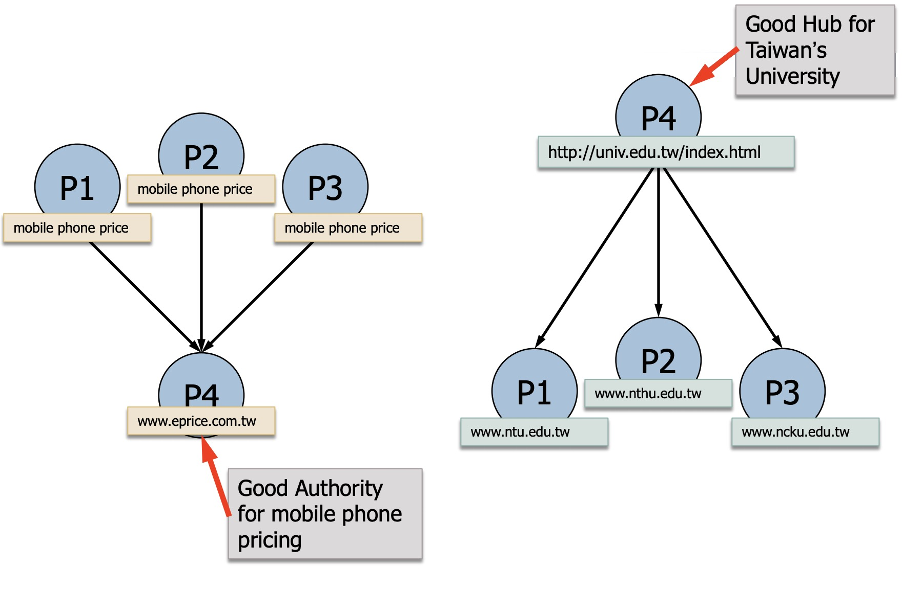

## Approach

```
1. rank pages authority according to their in-degree
2. extend the root set to base set
```

* Authority and Hubness will converge
  * mutually reinforcing relationship
  $$
  a(v) := \sum_{w \in pa[v]} h(w) \\
  h(v) := \sum_{w \in ch[v]} a(w)
  $$

* Let A denote the adjacency matrix of graph
  $$
  \begin{aligned}
  a_t &:= A^t h_{t-1} \\
  h_t &:= A a_{t-1}
  \end{aligned}
  $$

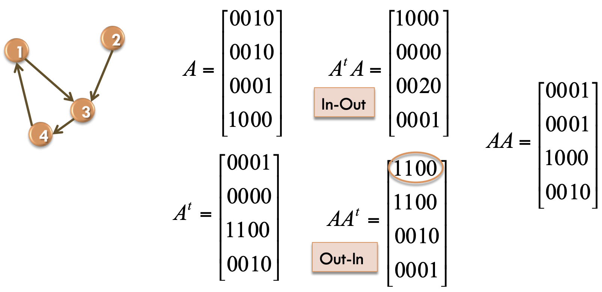

## Examples

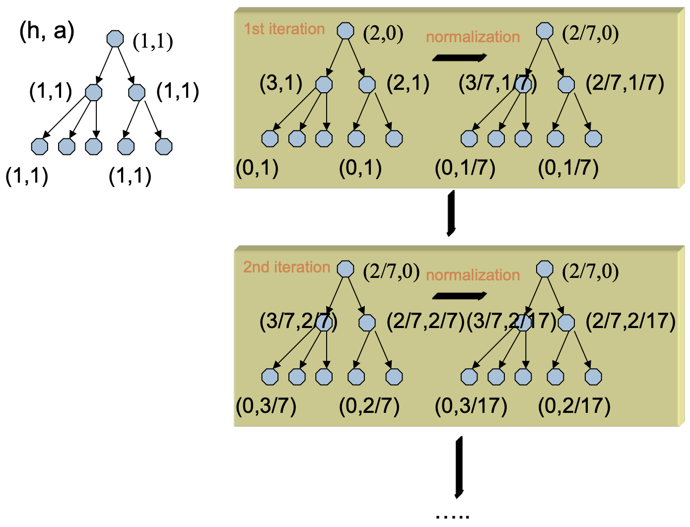

```
initial all hubness and authority (h, a) to (1, 1)
loop:
    calculate hubness by children counts
    calculate authority by parent counts
    normalization:
        new h = node's hub / all hub
        new a = node's authority / all authorities
```

* The sites come from high hubness sites will have high authority
* The sites have high hubness will point to many high authority sites

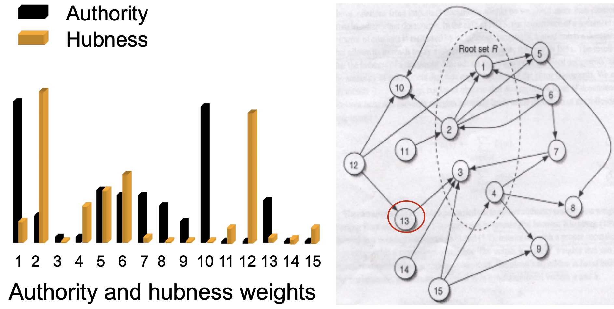

## Issues

* Mutually reinforcing relationships between hosts
  * Nepotistic links : 互相幫忙 cite
  * Link normalization
* Will be **solved** by improvements
  * The document can contain many identical links to the same document in another host
  * Links are generated automatically
  * Non-relevant Nodes

## Observation

* The process of link analysis
  * Convergence of values of hubs and authorities 
  * Two (hub, authority) pairs

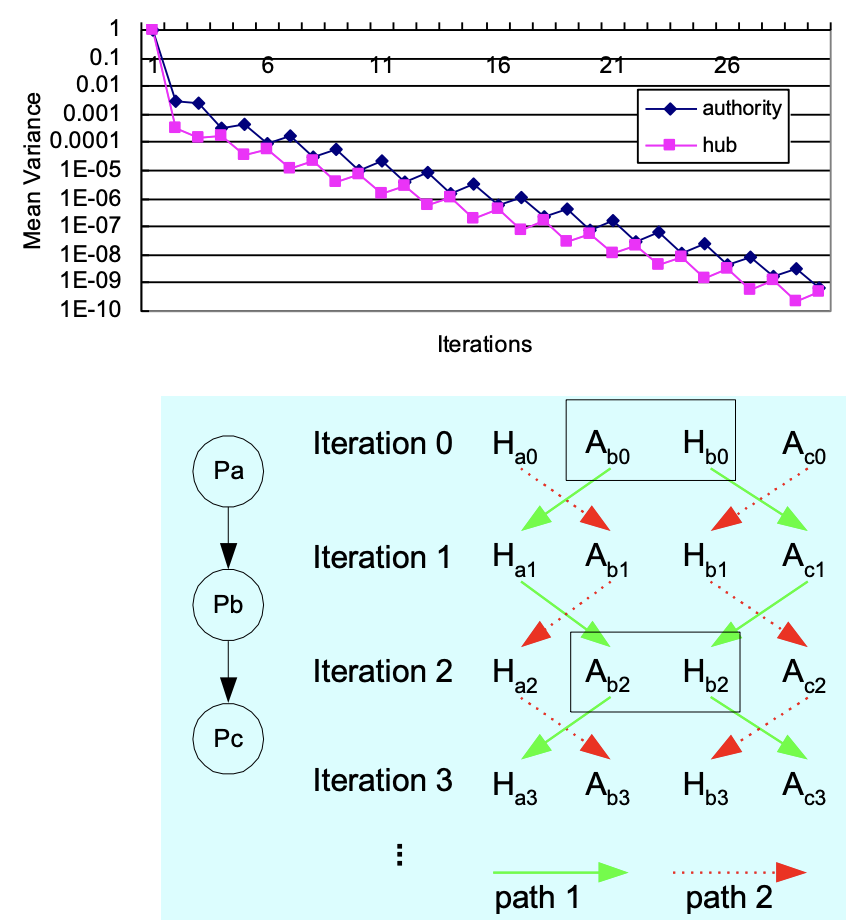

## Improvements

* Bharat and Henzinger : Combining Connectivity and Content Analysis
  * Assign weight to identical multiple edges
    * which are inversely proportional to their multiplicity
  * Prune irrelevant nodes or regulating the influence of a node with a relevance weight

# PageRank

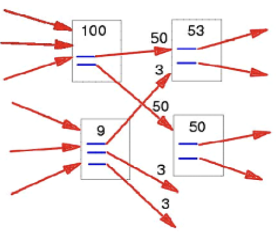

* The weight is assigned by the rank of **parents**
  * like pipe
  $$
  r(v) = \alpha \sum_{w \in pa[v]} \frac{r(w)}{\lvert ch[w]\rvert}
  $$
* No more hubness & authority weights, only parent rank
* Page rank is propotional to its parent's rank
  * Inversely propotional to its parent's out-degree
* Query Independent

## Examples

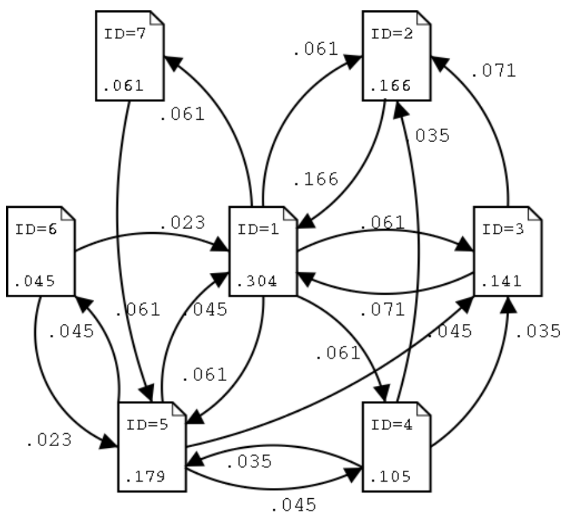

| PR    | ID  | OutLink   | InLink  |
| ----- | --- | --------- | ------- |
| 0.304 | 1   | 2,3,4,5,7 | 2,3,5,6 |
| 0.179 | 5   | 1,3,4,6   | 1,4,6,7 |
| 0.166 | 2   | 1         | 1,3,4   |
| 0.141 | 3   | 1,2       | 1,4,5   |
| 0.105 | 4   | 2,3,5     | 1,5     |
| 0.061 | 7   | 5         | 1       |
| 0.045 | 6   | 1,5       | 5       |

* PR value may proportional to in-degrees
* High PR value from high parent's PR value (2, 3, 4, 5, 7 from 1)
* Quick reference
  $$
  \begin{aligned}
  PR(P_i) &= \frac{d}{n} + (1-d) \times \sum_{l_{j,i}\in E} PR(P_j) / \text{Outdegree}(P_j) \\
  \text{D(damping factor)} &= 0.1 - 0.15 \\
  n &= \lvert \text{page set}\rvert
  \end{aligned}
  $$

## Stability

* Whether the link analysis algorithms based on eigenvectors are stable in the sense that results don’t change significantly?
  * The **connectivity** of a portion of the graph is **changed** arbitrary
  * How will it affect the results of algorithms?

# SALSA

* Probabilistic extension of the HITS algorithm
  * You can view it as **HITS with normalization**
* Random walk both in the forward and backward direction
* Two separate random walks
  * **Hub** walk
    * a forward link from $$u_h$$ to $$w_a$$
    * immediately a backward link from $$w_a$$ to $$v_h$$
      $$
      (u, w) \text{ and } (v, w) \in E
      $$
  * **Authority** walk
    * a backward link from $$w_a$$ to $$u_h$$
    * immediately a forward link from $$u_h$$ to $$x_a$$
      $$
      (u, w) \text{ and } (u, x) \in E
      $$

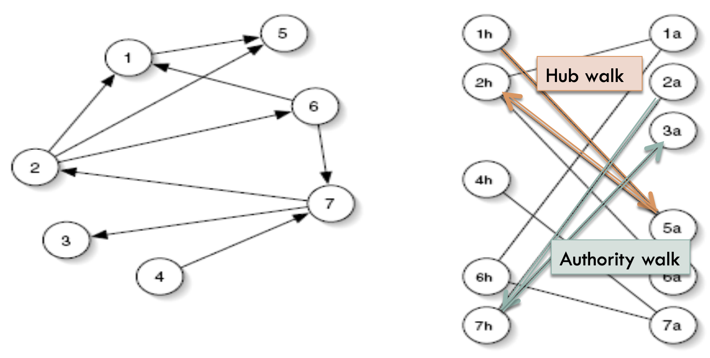

# Limit of Link Analysis

* META tags/ invisible text
  * Search engines relying on meta tags
  * often misled (intentionally) by web developers
* Pay-for-place
  * organizations pay search engines and page rank
  * organizations pay high ranking pages for advertising space 
* **Stability**
  * **Adding even a small number of nodes/edges to the graph has a significant impact**
* Topic drift
  * A top authority may be a hub of pages on a different topic
  * resulting in increased rank of the authority page
* Content evolution
  * Adding/removing links/content 
  * affect the intuitive authority rank of a page requiring recalculation of page ranks
  * Incremental link analysis

# Similarity measurement by links

* How similar two objects are within a network
  * How to measure the similarity between two objects based on links relationship
* Based on **linked-structure**
  * object-to-object relations 
* Based on **textual content**
  * keywords co-currency 
* **Linked-based** produce systematically better correlation with human judgements compared to the text-based one

# SimRank

* Idea : **Random Surfer model**
* Two objects are similar
  * If they are linked with the same or similar objects
  * Consider : Inlink relationship
* Defined by **recursively** and computed by **iteratively**

$$
S(a,b) = \frac{C}{\lvert I(a) \rvert \lvert I(b)\rvert}
\sum_{i=1}^{\lvert I(a)\rvert}\sum_{j=1}^{\lvert I(b)\rvert}
S(I_i(a), I_j(b))
$$

* I(a), I(b) : all in-neighbors
* C : decay factor, between 0, 1
* S(a, b) between 0, 1
* S(a, a) = 1

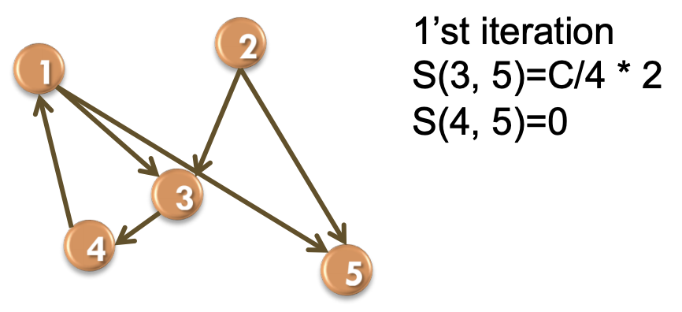

# Link analysis in a social network

* Node : entity 
* Edge : relationship
* We want to know in this social network
  * which nodes/edges are influential/important
  * which node is an outlier

## Centrality

* Degree centrality
  * In-degree, out-degree
* Closeness centrality
  * Geodesic distance between the entity and all other entities
* Betweeness centrality
  * Geodesic path
* Eigenvector centrality
  * Central entity receiving many communications from other wellconnected entities
* Power centrality

$$
NET_\text{degree} = 
\frac{\sum_{v\in V}\text{Max}_{v\in V}\text{Degree}(v) - \text{Degree}(v)}{(n-1)\times (n-2)}
$$

## Conductance and NCPP

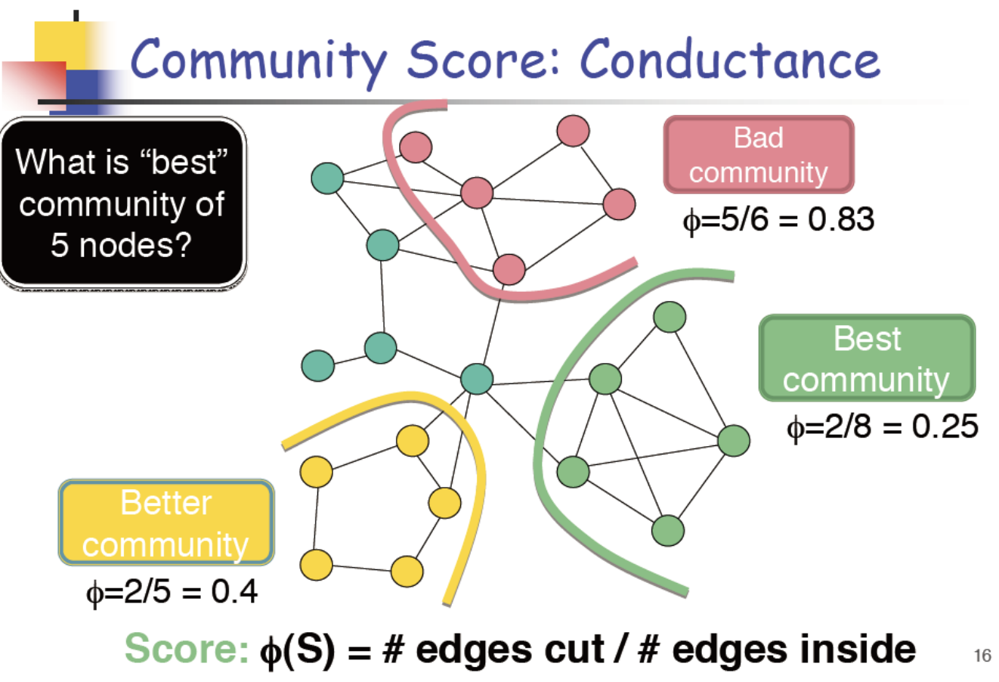

* Look at best community (2/8)
* Numerator means the community has 2 out-degree
* Denominator means the community's inner degree is 8

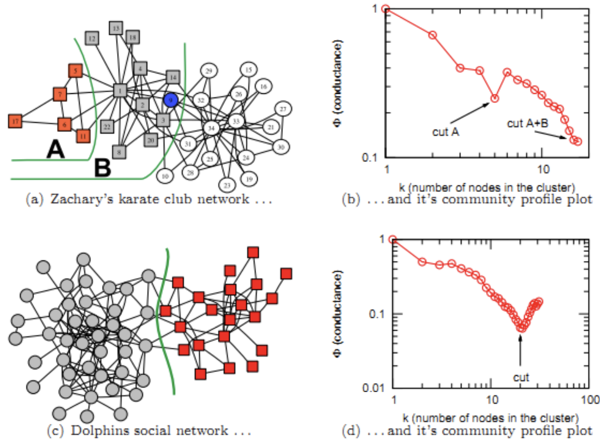

* NCPP uses conductance to find the best divide of communities