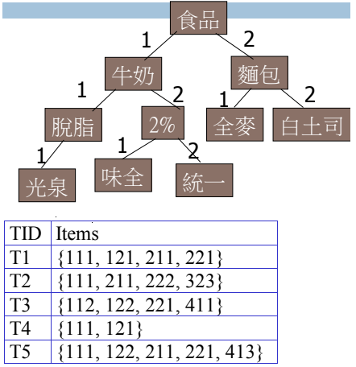
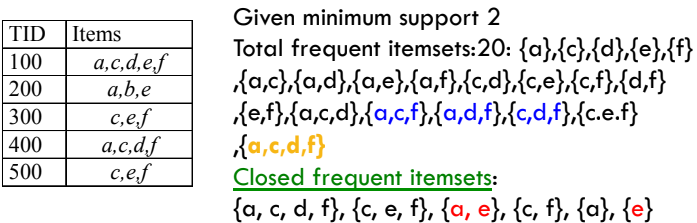
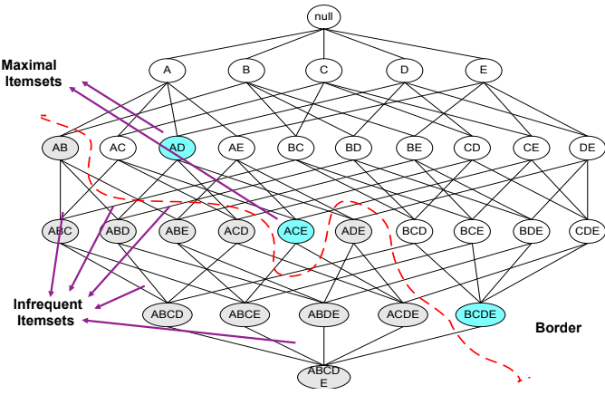

## Multilevel Association Rules

* Items 之間有 hierarchy
* lower level = lower support
* transaction 可以經由 level 來 encoded

### Uniform Support
* The same minimum support for all levels
* 不會因為 ancestor 沒通過 minsup 就不檢查他的子樹
* 如果 uniform support 設定太高
  * miss low level association
* 如果 uniform support 設定太低
  * generate too many high level association

### Reduced Support
* 動態決定 low level 的 minimum support
  * 4 strategies
    * Level-by-level independent
    * Level-cross filtering by single item
    * Level-cross filtering by k-itemset
    * Controlled level-cross filtering by single item
* 跟現實生活較接近 (商品單價改變可能影響 support)

### Closed Association Rules

* max pattern : 一個 frequent itemset 沒有比他更大的 frequent itemset
* **Closed Frequent itemset** : itemset X 要符合兩件事才是 closed itemset 
  * 找不到任何 proper superset Y
  * 找不到任何 superset Y 出現在所有 X 也出現的 transaction

* 例如 {e} 找不到其他的 item 在每個 transaction 都有一起出現
  * a 在 100 跟 200 都有，但 300 就沒有一起出現
  * 所以 {e} 就可以獨立是一個 closed frequent itemset

### Maximal Frequent Itemset
* 一個 itemset 沒有任何的 superset 是 frequent
* 這個 itemset 就是 maximal frequent itemset

=== Next Week ===
## Quantitative Association Rules

## From Association Mining to Correlation Analysis

## Association Rules with Constraints

