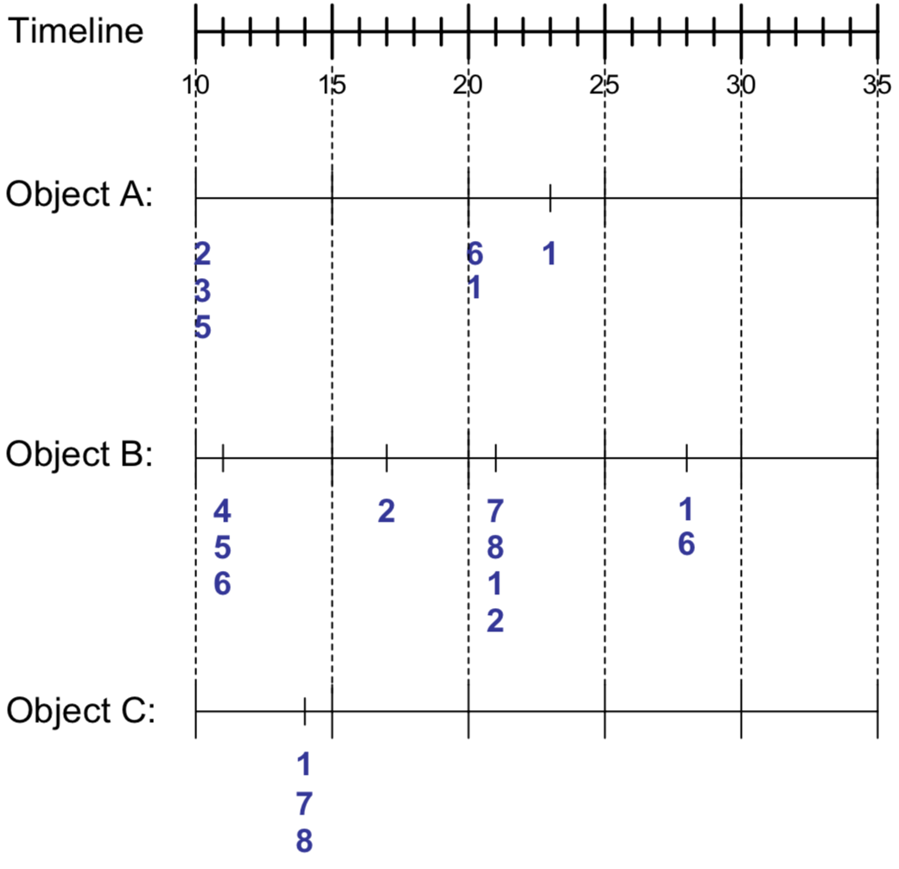
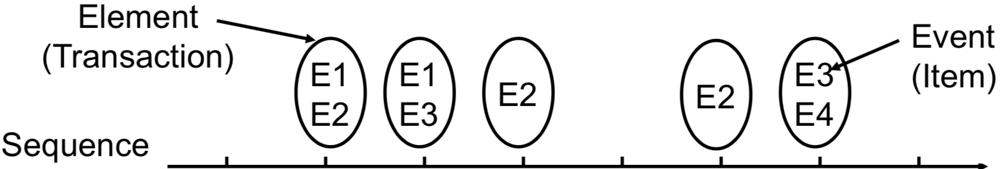
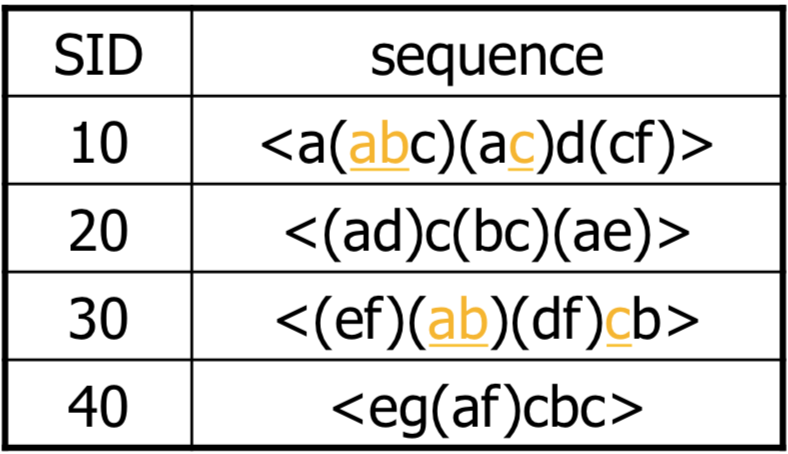
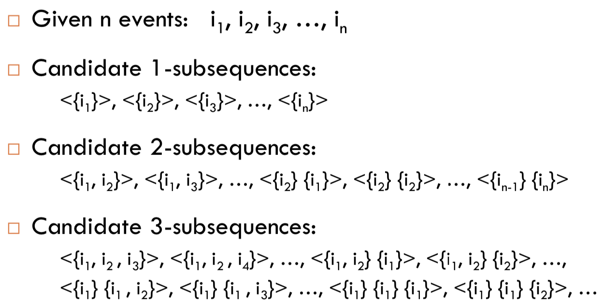

# Sequence Pattern

在前一章節的 Association Analysis 中， itemset 都是固定一筆一筆所出現

若我們想要更了解 Item 之間的 association rule

勢必要加上時間軸，得到順序與因果關係

## Sequence Data

我們將一般 Dataset 加上 Timeline 取得 sequence data table



| Object | Timestamp | Events  |
| ------ | --------- | ------- |
| A      | 10        | 2,3,5   |
| A      | 20        | 6,1     |
| A      | 23        | 1       |
| B      | 11        | 4,5,6   |
| B      | 17        | 2       |
| B      | 21        | 7,8,1,2 |
| B      | 28        | 1,6     |
| C      | 14        | 1,8,7   |

## Definition

* **Sequence** : 我們的時間軸，時間軸上有許多 elements
* **Element** : 即 transaction，一個 transaction 有許多 events
* **Event** : 每個 events 代表一個 item
* **Length of sequence** : 用 $$\lvert s\rvert$$ 表達 sequence 上的 elements 有幾個
  * k-sequence 代表該 sequence 上共有 k 個 events
* 例如下圖是一個 **8-sequence with length 5** 的 sequence data



* 還有許多的例子
  * web sequence `<{Homepage} {Electronics} {Cameras} {Shopping Cart} ... >`
  * library checkout books `<{Fellowship of the Ring} {The Two Towers} {Return of the King}>`

## Subsequence

若 sequence A 的每個 elements 的 events 

都是另一個 sequence B 對應的 elements 的 subset 

那 sequence A 就是 B 的 subsequence


* 一個 subsequence 的 support = data sequences 包含該 subsequence 的 fraction
* **Sequential pattern** : Frequent subsequence
  * 該 subsequence 的 support $$\ge$$ minsup

## Sequential Pattern Mining

從一群 sequences 中找出所有的 frequent subsequences

我們這邊使用 `<a(bc)dc>` 來表示有四個 elements 分別為 a, bc, d, c

而他是 `<a(abc)(ac)d(cf)>` 的 subsequence，原因如下

```
<a( bc)    d c>
<a(abc)(ac)d(cf)>
```

現在我們要從這個 sequence database 找出 sequential pattern



假設 minsup = 2，那我們可以找到 `<(ab)c>` 是一個 sequential pattern

因為 (ab) 跟 c 都有出現過兩次

### Definition of Sequential Pattern Mining

正式的來定義一下 **Sequential Pattern Mining**

```
Given :
    1. a database of sequences
    2. a minsup

Task :
    1. find all subsequences with support >= minsup
```

#### Extracting sequential patterns method

我們首先可以想到用 candidates + apriori 的方法來找出 subsequences



* 這類的算法有
  * Apriori* (Apriori All, Apriori Some)
  * Apriori-based SP algorithm (GSP)

* 但想也知道有非常多的問題
  * 會產生過多的 candidate sequences
  * database scans 次數過多
  * 要找的 sequential patterns 長度越大越困難


## Sequential Pattern Mining Algorithm

1. 首先將 data 進行 sorting
2. 計算 large itemset 也就是 support 值
3. 進行 transformation
4. sequence phase
5. maximal phase

=== 這邊沒教完 下禮拜 ===