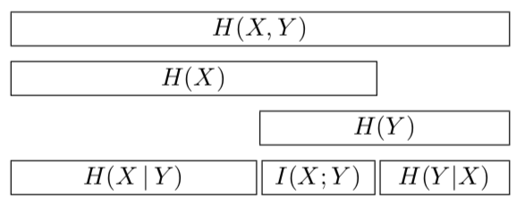

$$
\forall k Prob[k success] = \frac{1}{n+1}
$$

# Introduction

## Mean $$\mu$$

https://www.khanacademy.org/math/ap-statistics/summarizing-quantitative-data-ap/measuring-center-quantitative/v/statistics-intro-mean-median-and-mode

## Variance $$\sigma$$

https://www.khanacademy.org/math/statistics-probability/summarizing-quantitative-data/variance-standard-deviation-population/v/variance-of-a-population

## Expectation $$E$$

https://www.khanacademy.org/tag/expected-value
https://www.khanacademy.org/math/in-in-grade-12-ncert/in-in-probability-of-events/copy-of-binomial-random-variables/v/expected-value-of-binomial-distribution

## P-value

## Binomial Distribution

## Bayes law

https://www.khanacademy.org/math/ap-statistics/probability-ap#stats-conditional-probability

## Prior Probability

### Posterior Probability

https://www.statisticshowto.datasciencecentral.com/posterior-distribution-probability/

### Likelihood

https://www.statisticshowto.datasciencecentral.com/likelihood-function/

### Odds ratio version

https://www.statisticshowto.datasciencecentral.com/odds-ratio/

## Entropy $$H$$

## Identity $$I$$

## Prior

## k nearest neighbors

## k-means clustering

## soft k-mean clustering
p289

## gaussian mixture model

## Belief update

$$
transfer error (f)

\text{message transfer = 3 bits once}

3f^2 + f^3
\text{lower error percentage}
$$
11
$$
hamming distance = bit diff counts

1234 => real code
5 => parity (look up 123)
6 => parity (look up 234)
7 => parity (look up 134)

0110 => 0110|001

non error percentage: (1-f)^7 + 7f(1-f)^6

erro percentage: C(7,2) * f^2(1-f)^5 \approx 21f^2
$$
quiz
$$
\begin{bmatrix}
 & a & g & c & t\\
a & 1-4f&2f&f&f\\
g&2f&1-4f&f&f\\
c&f&f&1-4f&2f\\
t&f&f&2f&1-4f
\end{bmatrix}\\
a,t: 30 \%
\\
c,g: 20 \%\\

P(r) = e^\lambda \cdot \frac{r^\lambda}{\lambda!} \\
r= \lambda \\
e^\lambda \frac{\lambda^\lambda}{\lambda!} = \frac{1}{\sqrt{2\pi\lambda}}\\
\lambda! = (\frac{\lambda}{e})^\lambda \frac{1}{\sqrt{2\pi\lambda}}
$$
baye's law

prior odds P\(A\) = 20% P\(-A\) = 80% =1/4

likelihood

XXX7XXXX YYYYYYYY

phone number = $$\frac{1}{10^7} / \frac{1}{10^8}$$ = 10 倍

posterior odds
$$
\frac{P[A|S]}{P[-A|S]} = \frac{P[A]}{P[-A]} \frac{P[S|A]}{P[S|-A]}
$$
posterior = prior odds \* likelihood

is better than bayes law \(P\[S\] is not easy to get.\)

linearly variance

linearly expectation

- odds form of bayes law \(p29\)

- expectation \(p1\)
  $$
  E[f(x)] = \sum_ipx_if(x_i)
  $$

- entropy \(p32\) [https://planetcalc.com/2476/](https://planetcalc.com/2476/)
  $$
  H(p_1 \cdots p_k) = \sum_i p_i \log\frac{1}{p_i} = E[\log\frac{1}{p_i}]
  $$
  entropy can be used to predict the least bits needs to be transfer a = 1/2, b = 1/2, h = 1 a = 2/3, b = 1/3, h = .92 =&gt; can use less than 1 bit to code \(use huffman code\)

- approx combination \(Stirling approx\) \(p2\)
  $$
  N! \approx (\frac{n}{e})^n\sqrt{2\pi n}
  $$

another way
$$
H_2(p) = H(p, 1-p) = p\log p + (1-p)\log(1-p) \\
\ln \binom{N}{r} \approx NH_2(\frac{r}{N})
$$
hw : 1.13 =&gt; 1.15 =&gt; 1.17

===

# Demensionality

Curse of demensionality

demension reduction solved by : feature selection, PCA, assume features are independent

https://en.wikipedia.org/wiki/Dimensionality_reduction#Feature_selection

=> K-MEANS CLUSTERING https://medium.com/@chih.sheng.huang821/%E6%A9%9F%E5%99%A8%E5%AD%B8%E7%BF%92-%E9%9B%86%E7%BE%A4%E5%88%86%E6%9E%90-k-means-clustering-e608a7fe1b43

=> K-NN NEAREST NEIGHBORS https://zh.wikipedia.org/wiki/%E6%9C%80%E8%BF%91%E9%84%B0%E5%B1%85%E6%B3%95

# Variance 方差

$$
if x, y independent
VAR[x+y] = VAR[x] + VAR[y]

else
VAR[x+y] = VAR[x] + VAR[y] + 2COV[x, y]

Covariance = COV[x, y] = E[(xi-\mu x)(yi-\mu y)]
\mu_x = E[x]
\mu_y = E[y]
$$

$$
VAR[x+x] = VAR[x] + VAR[x] + 2COV[x,x] = 4VAR[x]
$$

Pearsons correlation = $$\frac{COV[x, y]}{\sqrt{VAR[x]VAR[y]}}$$

Spearman's rank correlation

# Diffusion

布朗運動 E[displacement^2] = 2wDt
w = dimensionality
D = diffusion constant + m^2/s
t = time

Binomial(0.5, t) - t/2

# chapter 3 - Bent coin

beta integral with gamma function
$$
\forall k Prob[k success] = \frac{1}{n+1}
$$

$$
F_a + F_b = F
$$

$$
\frac{F_a!F_b!}{(F_a + F_b + 1)!} 
=\frac{1}{(N+1)}\frac{F_a!(F-F_a)!}{F!} = \frac{1}{(F+1)\binom{F}{F_a}}
$$

## 3.5 answer

$$
P[P_a\mid aba] = \frac{P[P_a]\times P[aba|P_a]}{P[aba]} 
$$

$$
P[aba|P_a] = P_a^2(1-P_a)
$$

$$
P[aba] = \frac{1}{(3+1)\binom{3}{2}}
$$

$$
P[P_a\mid aba] = 
\frac{P_a(P_a^2(1-P_a))}{\frac{1}{12}}
$$

Course goal: Full understanding of inferrence of Pa

- binomial distribution inferrence
- chapter 3

# Chpater 8

$$
I(X, Y) = H(X) - H(X|Y) = H(Y) - H(Y|X)
$$

if x, y independent

$$
I(X, Y) = 0
$$

if X determines Y

$$
H(X|Y) = 0, I(X, Y) = H(X) = H(Y)
$$

hw : p-val = prob of data given hypothesis

## Maximum Likelihood Estimation

$$
\text{Given } f(x) = N(\mu, \sigma^2) \text{ with fixed } \sigma^2\\
\text{data }x_1 \cdots x_n\\
\text{What is the maximum likelihood estimation of }\mu
$$

$$
$$
