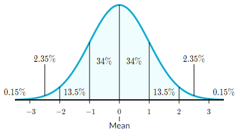
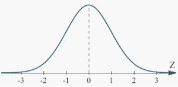

# Mean $$\mu$$

就是求[平均值](https://www.khanacademy.org/math/ap-statistics/summarizing-quantitative-data-ap/measuring-center-quantitative/v/statistics-intro-mean-median-and-mode)。

$$
\begin{aligned}
&4, 3, 1, 6, 1, 7 \\
&\mu = \frac{4+3+1+6+1+7}{6} = 3.6
\end{aligned}
$$

# Variance $$\sigma$$

代表每個數值的分散程度，越大代表越分散

就是找到[所有值跟 mean 的差的平方，然後全部合起來求平均](https://www.khanacademy.org/math/statistics-probability/summarizing-quantitative-data/variance-standard-deviation-population/v/range-variance-and-standard-deviation-as-measures-of-dispersion)。

$$
\begin{aligned}
&4, 3, 1, 6, 1, 7 \\
&\sigma^2 = \frac{(4-3.6)^2+(3-3.6)^2+(1-3.6)^2+(6-3.6)^2+(1-3.6)^2+(7-3.6)^2}{6} = 5.2
\end{aligned}
$$

 <!-- TODO -->
linearly variance

$$
if x, y independent\\
VAR[x+y] = VAR[x] + VAR[y]\\

else\\
VAR[x+y] = VAR[x] + VAR[y] + 2COV[x, y]\\

Covariance = COV[x, y] = E[(xi-\mu x)(yi-\mu y)]\\
\mu_x = E[x]\\
\mu_y = E[y]\\
$$

$$
VAR[x+x] = VAR[x] + VAR[x] + 2COV[x,x] = 4VAR[x]
$$

Pearsons correlation = 
$$\frac{COV[x, y]}{\sqrt{VAR[x]VAR[y]}}$$

Spearman's rank correlation

# Standard Deviation $$\sigma$$

一樣是用來表達數值間的分散程度

但更好的表達**每個數值跟 mean 的平均距離有多遠**

只是把 variance 開根號就好了

$$
\begin{aligned}
&4, 3, 1, 6, 1, 7 \\
&\sigma = \sqrt{5.2} = 2.28
\end{aligned}
$$

# Expectation $$E$$

期望值其實只是[每個數值乘上出現的機率，得出來的總和而已](https://www.khanacademy.org/tag/expected-value)

期望值又可以表達成 $$E(X) = \mu_X$$

例如一個骰子的機率是

| X   | prob(X) |
| --- | ------- |
| 1   | 1/6     |
| 2   | 1/6     |
| 3   | 1/6     |
| 4   | 1/6     |
| 5   | 1/6     |
| 6   | 1/6     |

所以期望值為

$$
E(X) = 1 \times \frac{1}{6} + 2 \times \frac{1}{6} + 3 \times \frac{1}{6} + 4 \times \frac{1}{6} + 5 \times \frac{1}{6} + 6 \times \frac{1}{6} = 3.5
$$

* [Expectation of binomial ditribution](https://www.khanacademy.org/math/in-in-grade-12-ncert/in-in-probability-of-events/copy-of-binomial-random-variables/v/expected-value-of-binomial-distribution)

<!-- TODO -->
linearly expectation

- expectation \(p1\)
  $$
  E[f(x)] = \sum_ipx_if(x_i)
  $$

# Normal Distribution

指的是現實中常見的[常態分布](https://www.khanacademy.org/math/statistics-probability/modeling-distributions-of-data/normal-distributions-library/a/normal-distributions-review)

又稱作**高斯分布 (Gaussian distribution)**

* 是一個 bell 的形狀
* mean = median，且都在 distribution 的中央
* 有大約 68% 的數值在 1 standard deviation of the mean
* 有大約 95% 的數值在 2 standard deviation of the mean
* 有大約 99.7% 的數值在 3 standard deviation of the mean
* 上面三個數值的分布又稱為 **Empirical rule**

* The probability density of the normal distribution is

$$
f(x \mid \mu, \sigma^2) = \frac{1}{\sqrt{2\pi\sigma^2}}e^{\frac{(x-\mu)^2}{2\sigma^2}}
$$

## Standard Normal Distribution

**標準常態分布**是 Normal distribution 的一種

他的平均在 0，且 variance = 1

$$\mu = 0, \sigma^2 = 1$$

* The probability density of the standard normal distribution is

$$
\varphi(x) = \frac{1}{\sqrt{2\pi}}e^{-\frac{1}{2}x^2} 
$$

# Entropy $$H$$
entropy \(p32\) [https://planetcalc.com/2476/](https://planetcalc.com/2476/)
  $$
  H(p_1 \cdots p_k) = \sum_i p_i \log\frac{1}{p_i} = E[\log\frac{1}{p_i}]
  $$
  entropy can be used to predict the least bits needs to be transfer a = 1/2, b = 1/2, h = 1 a = 2/3, b = 1/3, h = .92 =&gt; can use less than 1 bit to code \(use huffman code\)

# Probability

## Likelihood
https://www.statisticshowto.datasciencecentral.com/likelihood-function/

## Prior Probability
prior odds P\(A\) = 20% P\(-A\) = 80% =1/4

## Posterior Probability
https://www.statisticshowto.datasciencecentral.com/posterior-distribution-probability/

posterior odds

$$
\frac{P[A|S]}{P[-A|S]} = \frac{P[A]}{P[-A]} \frac{P[S|A]}{P[S|-A]}
$$
posterior = prior odds * likelihood

is better than bayes law \(P\[S\] is not easy to get.\)

## Bayes law
https://www.khanacademy.org/math/ap-statistics/probability-ap#stats-conditional-probability

<!-- TODO -->
- odds form of bayes law \(p29\)

## Odds ratio
https://www.statisticshowto.datasciencecentral.com/odds-ratio/

## Bent coin

beta integral with gamma function
$$
\forall k Prob[k success] = \frac{1}{n+1}
$$

$$
F_a + F_b = F
$$

$$
\frac{F_a!F_b!}{(F_a + F_b + 1)!} 
=\frac{1}{(N+1)}\frac{F_a!(F-F_a)!}{F!} = \frac{1}{(F+1)\binom{F}{F_a}}
$$

## 3.5 answer

$$
P[P_a\mid aba] = \frac{P[P_a]\times P[aba|P_a]}{P[aba]} 
$$

$$
P[aba|P_a] = P_a^2(1-P_a)
$$

$$
P[aba] = \frac{1}{(3+1)\binom{3}{2}}
$$

$$
P[P_a\mid aba] = 
\frac{P_a(P_a^2(1-P_a))}{\frac{1}{12}}
$$

Course goal: Full understanding of inferrence of Pa

- binomial distribution inferrence
- chapter 3

# Binomial Distribution

# Maximum Likelihood
## gaussian mixture model
https://medium.com/@chih.sheng.huang821/%E6%A9%9F%E5%99%A8%E5%AD%B8%E7%BF%92-em-%E6%BC%94%E7%AE%97%E6%B3%95-expectation-maximization-algorithm-em-%E9%AB%98%E6%96%AF%E6%B7%B7%E5%90%88%E6%A8%A1%E5%9E%8B-gaussian-mixture-model-gmm-%E5%92%8Cgmm-em%E8%A9%B3%E7%B4%B0%E6%8E%A8%E5%B0%8E-c6f634410483

## Bayesian inference
https://en.wikipedia.org/wiki/Bayesian_inference

## Belief update
https://en.wikipedia.org/wiki/Belief_revision

## Maximum Likelihood Estimation
https://bookdown.org/ccwang/medical_statistics6/likelihood-definition.html

$$
\text{Given } f(x) = N(\mu, \sigma^2) \text{ with fixed } \sigma^2\\
\text{data }x_1 \cdots x_n\\
\text{What is the maximum likelihood estimation of }\mu
$$

# Random Variables

$$
I(X, Y) = H(X) - H(X|Y) = H(Y) - H(Y|X)
$$

if x, y independent

$$
I(X, Y) = 0
$$

if X determines Y

$$
H(X|Y) = 0, I(X, Y) = H(X) = H(Y)
$$

hw : p-val = prob of data given hypothesis

## P-value

# Clustering
## k nearest neighbors
=> K-NN NEAREST NEIGHBORS https://zh.wikipedia.org/wiki/%E6%9C%80%E8%BF%91%E9%84%B0%E5%B1%85%E6%B3%95

## k-means clustering
=> K-MEANS CLUSTERING https://medium.com/@chih.sheng.huang821/%E6%A9%9F%E5%99%A8%E5%AD%B8%E7%BF%92-%E9%9B%86%E7%BE%A4%E5%88%86%E6%9E%90-k-means-clustering-e608a7fe1b43

## soft k-mean clustering
p289

## Curse of demensionality

## Demension Reduction
https://en.wikipedia.org/wiki/Dimensionality_reduction#Feature_selection
feature selection, PCA, assume features are independent

# Beta Binomial Reasoning

* Conjugate

$$
\begin{aligned}
\text{prior} + \text{likelihood} &= \text{posterior form} \\
P[P_H] &\propto P_H^a(1-P_H)^b
\end{aligned}
$$

* 這個的微分為 beta integral

$$
Beta(x, a, b) \Rightarrow \frac{x^{a-1}(1-x)^{b-1}}{B(a, b)}= \frac{\Gamma(a)\Gamma(b)x^a(1-x)^b}{\Gamma(a+b)}
$$

* 當 a = 1, b = 1 時為 uniform prior

$$
\frac{x^0(1-x)^0\Gamma(1)\Gamma(1)}{\Gamma(2)} = 1 \mid \text{ where } \Gamma(i) = (i-1)!
$$

* beta distribution 不夠表達
  * 可以加上 mixture model
* murphy p43

# Naive Bayes