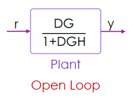
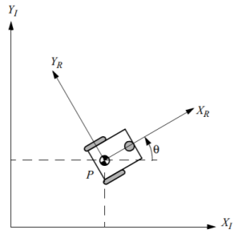

# Control Theory

* Control system
  * 能夠影響整個系統未來 state 的機制
* Control theory
  * 因應 output 來改變 input

## Open Loop Control

例如汽車油門要根據汽車的速度變化 (e.g. 上下坡) 而改變

## Close Loop Control

只有 input-output 很難去做修正，所以需要透過前一次 output 來修正

* Sensor
  * 量測上一次的 output 結果，用來和 reference 比對
* Reference
  * 用來比對和 output 的結果，計算出 error
* Controller
  * 根據 error 改變 input

例如根據汽車當前的速度，來調整要加速或減速

## Linear Time Invariant System

我們可以將 time domain 轉置成 frequency domain 重整一下 loop control

所有的運算和參數都以頻率來表達

* G = Input 運算結果
* H = Sensor 運算結果
* D = Controller 運算結果
* r = reference
* e = error
* y = output

我們可以得到 $$e = r - yH$$ (誤差等於 reference 減去 sensor 所算的結果)

頻率中 D 到 G 的運算可以視為相乘，我們可以得到 y 等於 e 經過 D 和 G 兩個運算

$$
y = e \cdot D \cdot G
$$

接著經過一連串的運算

$$
\begin{aligned}
e &= \frac{y}{DG} \\
r - yH &= \frac{y}{DG}\\
(DG)(r-yH) &= y\\
DGr -DGyH &= y\\
DGr &= y + DGyh = y(1+DGH)\\
y &= \frac{DGr}{1+DGH}
\end{aligned}
$$

於是我們可以將 output (y) 看成是 reference (r) 經過 $$\frac{DG}{1+DGH}$$ 運算而來

變成一個 open loop control

# Control Methods

## PID Control

* PID 分別為三個詞的縮寫
  * Proportional gain
  * Integral gain
  * Differential gain

### Proportional gain

Controller 設定一個值來與前一個 error 相乘，得到下一次修改的 input，這個值就叫做 proportional gain

在下圖，老皮根據終點距離來得到 error 並和 0.1 (proportional gain) 相乘

* 當距離 100 時，走 10 m/s (100*0.1)
* 當距離 90 時，走 9 m/s (90*0.1)
* 當距離 0 時，就停止了 (0*0.1)

#### Problem

老皮若想往天空飛，那只用 proportional gain 勢必是無法完美達成的，因為最終會停止掉下來，又往上升上去

假設老皮的螺旋槳轉速 200 rpm 可以對抗重力維持在空中

$$
\begin{aligned}
\text{Error} \times \text{Gain} &= \text{Propeller speed}\\
100 \times 2 &= 200 \text{rpm}\\
40 \times 5 &= 200 \text{rpm}\\
20 \times 10 &= 200 \text{rpm}\\
2 \times 100 &= 200 \text{rpm}\\
\end{aligned}
$$

不管設計多少的 gain (2, 5, 10, 100, ...) 都無法讓老皮到達並停留在天空上的終點

這個情況稱為 **steady state error** (y 會隨時間接近 r，但永遠存在 error)

### Integral gain

我們可以加入一個 integrator 來解決 steady state error 造成的問題

新增的 integrator 會累積 error 的資訊來補充 proportional gain 不足的量

例如 error 變成 0 時，integrator 就提供 200 rpm 來讓老皮維持在高空

#### Problem

Integrator 若沒有良好設計，會超過 200 rpm 讓老皮繼續往上飛

而超過 reference 又產生了 negative error，讓 proportional gain 變負，老皮往下降

### Differential gain

若能預測 error 變化量，就能預防 integral gain 忽高忽低的問題

我們在 controller 加上第三個 derivative 元件

因為 error 是往下變小的，變化量就是 error 的斜率 (紅線)

因為斜率是負的，所以 derivative 也產生一個負值，來和 integrator 抗衡

### Summary

PID control 可以寫成 discrete form

$$
K_pe(t) + K_i\sum_0^te_t + K_d(e(t)-e(t-1))
$$

其中的 $$K_p, K_i, K_d$$ 分別就代表了 proportional, integral, differential gain 的參數

通常就是調整這三個參數，來完成一個好的 controller

# Basic Kinematic Model

若我們想讓車子移動到路徑上到達終點，可以用前後和左右兩種 control 方式

若只使用 PID control 來完成，需要調整太多的參數

所以我們必須要引入一些車輛的特性，來減輕 control system 的負擔

* 在低速時
  * 可以用簡單的幾何模型來描述 car state
* 在高速時
  * 因會產生側向滑動，所以需要套入更難的動力學模型

我們用 x, y 代表車子的二維座標，$$\theta$$ 代表車子的轉向，合起來為車子的狀態

$$
\text{state: } \xi_1 = \begin{bmatrix}x\\y\\\theta\end{bmatrix}
$$

因為座標有分車子當前的座標，還有世界座標，我們有一個 rotation matrix 可以轉換兩個座標系統

$$
R(\theta) = \begin{bmatrix}
\cos\theta & \sin\theta & 0 \\
-\sin\theta & \cos\theta & 0 \\
0& 0& 1
\end{bmatrix}
$$

基本的模型 (basic kinematic model) 指的就是狀態 (state) 的變化 (derivative)

> 我們會在符號上加上一點代表微分後的變化

State 變化可以從車子的當前狀態，乘上 rotation matrix 的反矩陣得到

* 其中 $$\dot{x_R}$$ 是 $$x_R$$ 的變化，也就是前進速度 ($$v$$)
* 而側向是沒有速度的，所以 $$\dot{y_R} = 0$$
* 最後 $$\dot{\theta}$$ 是 $$\theta$$ 的變化，也就是角速度 ($$\omega$$)

$$
\begin{aligned}
\text{Kinematic Model:} \\
\begin{bmatrix}\dot{x} \\ \dot{y} \\ \dot{\theta}\end{bmatrix} &= 
R(\theta)^{-1}\begin{bmatrix}\dot{x_R}\\\dot{y_R}\\\dot{\theta}\end{bmatrix} \\
&= \begin{bmatrix}
\cos\theta & -\sin\theta & 0 \\
\sin\theta & \cos\theta & 0 \\
0& 0& 1\end{bmatrix}
\begin{bmatrix}v\\0\\\omega\end{bmatrix} \\
&= \begin{bmatrix}v\cos(\theta) \\ v\sin(\theta) \\\omega\end{bmatrix}
\end{aligned}
$$

----

## Differential Drive Vehicle

原點為 P，到兩輪的距離為 l

兩輪的轉速分別是 phi1 和 phi2

兩輪半徑為 r

座標依然為 xr yr

右輪速度 = 半徑*角速度 (r * phi1. )

原點速度 = 右輪速度一半
原點角速度 = 原點速度 / l

左輪同理

原點運動 = 左輪和右輪相加

用 v 和 omega 來推導 input 左右輪的馬達轉速

phi1. 和 phi2.

直線前進，相同轉速，兩邊都 v/r

原地旋轉，相反轉速，正負 omega

## Pure Pursuit Control

PPC : 根據速度與角速度來畫圓移動到前方某個點的位置

Ld 為與目標距離，R 為圓弧半徑
Ld 通常用速度來決定，速度越快就越遠

與車子直線前進形成一個夾角 alpha

車輛到目標畫的圓弧就是 2alpha (圓心角 = 2*弦切角)

因為是等腰三角形，所以其他兩個角是 pi/2 - alpha
然後可以用正弦定理得第二行
然後得到 R 

假設 v 速度透過 PID 已決定好
就可以得到角速度

# Kinematic Bicycle Model

