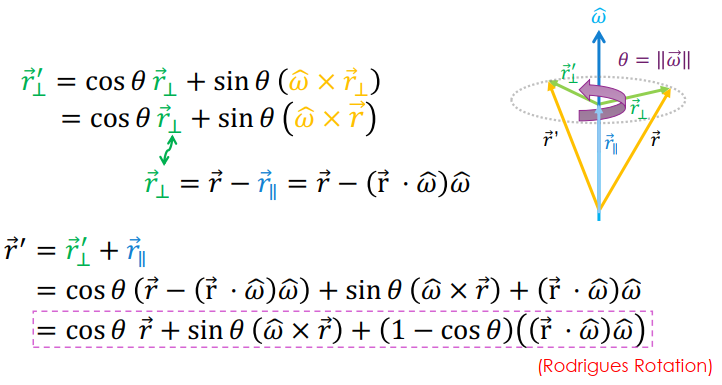
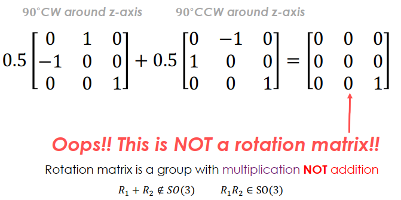
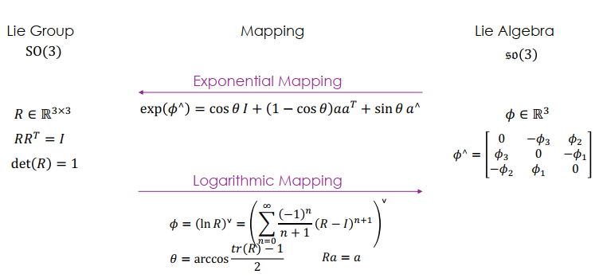
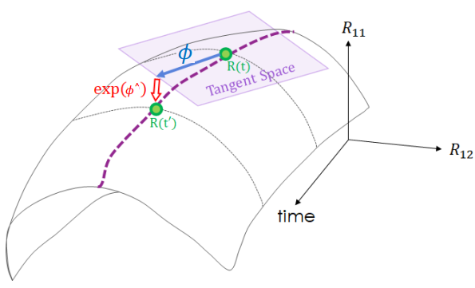

# Lee Group & Lee Algebra

還記得我們要求 Graph Optimization for 2D Pose 的時候，需要計算 rotation

這個 Rotation 在 2D 時可以用 $$\theta$$ 簡單表示就好，但在 3D 時會變得非常複雜，且無法簡單求導數 (原因是 rotation matrix 是無法使用加法運算的)

換句話說，在 3D 時我們只可以在 manifold space 解決 rotation matrix 的最佳化

Rotation 有很多種表達方式

* Rotation matrix
* Euler Angles
* Axis-angle
* Quaternion
* Etc.

## Axis-Angle

用 Axis-angle 舉例，定義旋轉軸 $$\omega$$ 跟旋轉角度 $$\theta = \lVert \vec{\omega}\rVert$$

其中 $$r'$$ 是 $$r$$ 延著旋轉軸 $$\omega$$ 進行 $$\theta$$ 度旋轉後的向量，可拆成平行和垂直於 $$\omega$$ 的向量 (水平不會改變，可以沿用舊的)

最後可以得到 rodrigues rotation 公式: 在 axis-angle 下用舊的向量來取得新的旋轉向量

## Group

把所有合法的 rotation matrix 集合起來稱為 Special Orthogonal Group (SO)，其中 R 要是 orthogonal 且 det = 1

例如當 R 在三維空間時為 SO(3): 

$$
SO(3) = \left\{ \mathbf{R}\in \mathbb{R}^{3\times3} \mid \mathbf{RR^T = I}, \det(\mathbf{R}) = 1 \right\}
$$

當你不只描述 rotation 還想描述 translation 時就要加入 t

因為連續的轉換太麻煩，用更簡潔的方式 T 來表達整個 transformation

$$
\begin{bmatrix} \mathbf{a}' \\1 \end{bmatrix}
= \begin{bmatrix} \mathbf{R} & \mathbf{t} \\ 0^T & 1\end{bmatrix}
\begin{bmatrix} \mathbf{a}\\ 1\end{bmatrix} \overset{\mathrm{def}}{=}
\mathbf{T}\begin{bmatrix} \mathbf{a} \\ 1\end{bmatrix}
$$

合法的 T 一樣可以組成 group，稱為 Special Euclidean group (SE)，必須滿足 R 在 SO 且 t 為合法向量

例如當 T 在三維空間時為 SE(3):

$$
SE(3) = \left\{ T = \begin{bmatrix} \mathbf{R} & \mathbf{t} \\ 0^T & 1\end{bmatrix} \in \mathbb{R}^{4\times 4} \mid
\mathbf{R} \in SO(3), t\in \mathbb{R}^3
  \right\}
$$

### Definition of Group

Group 的基本定義，必須滿足以下四點:

* closure: 進行 binary operation 還在同空間
* identity
* inverse
* associativity: 結合律

因為用簡單的三維矩陣來表達 rotation matrix，加法不滿足 group 的定義，無法進行導數，所以必須尋找替代方案

## Lie Group

Lie Group 裡的每個元素都是連續的，要解 manifold space 的最佳化，就要了解 lie group 和 mapping 對應的 lie algebra

現在有一個任意的 rotation matrix 滿足 orthogonal ($$\mathbf{RR^T = I}$$)，且跟著時間 t 改變 ($$\mathbf{R(t)}$$)

我們發現對 $$\mathbf{R(t)R(t)^T = I}$$ 中的 t 做導數，會得到一個**反對稱矩陣**

* $$\wedge$$ 代表建構反對稱 (antisymmetric) 矩陣
* $$\vee$$ 代表從反對稱矩陣中，推回三維向量矩陣

$$
\mathbf{a}^{\wedge} = \mathbf{A} = \begin{bmatrix} 0 & -a_3 & a_2 \\ a_3 & 0 & -a_1 \\ -a_2 & a_1 & 0\end{bmatrix}, 
\quad \mathbf{A}^{\vee} = \mathbf{a} = \begin{bmatrix} a_1 \\ a_2 \\ a_3\end{bmatrix}
$$

對 t 做導數，得到的反對稱矩陣記為 $$\Phi(t)$$

$$\dot{\mathbf{R}}(t) \mathbf{R}(t)^{\mathrm{T}}=\Phi(t)^{\wedge}$$

可以從 $$\phi(t)$$ 推回得到 $$\mathbf{R(t)}$$ 的一階導數結果

$$\dot{\mathbf{R}}(t)=\boldsymbol{\phi}(t)^{\wedge} \mathbf{R}(t)=\left[\begin{array}{ccc}
0 & -\phi_{3} & \phi_{2} \\
\phi_{3} & 0 & -\phi_{1} \\
-\phi_{2} & \phi_{1} & 0
\end{array}\right] \mathbf{R}(t)$$

而 $$\phi(t_0)$$ 其實就是 SO(3) 在原點附近的正切空間

## Lie Algebra

$$\boldsymbol{\phi}\left(t_{0}\right)=\boldsymbol{\phi}_{0} \quad \dot{\mathbf{R}}(t)=\boldsymbol{\phi}(t)^{\wedge} \mathbf{R}(t)=\boldsymbol{\phi}_{0}^{\wedge} \mathbf{R}(t)$$

因為知道怎麼求 R(t) 微分，就可以求 R(t)

$$
\mathbf{R(t)} = \exp (\boldsymbol{\phi}^\wedge_0 t)
$$

很多個 $$\Phi$$ 可以組成 Lie algebra，這些 $$\Phi$$ 必須可以形成反對稱矩陣

$$\begin{aligned}
&\Phi=\phi^{\wedge}=\left[\begin{array}{ccc}
0 & -\phi_{3} & \phi_{2} \\
\phi_{3} & 0 & -\phi_{1} \\
-\phi_{2} & \phi_{1} & 0
\end{array}\right] \in \mathbb{R}^{3 \times 3}\\
&\mathfrak{s} \mathfrak{d}(3)=\left\{\boldsymbol{\phi} \in \mathbb{R}^{3}, \boldsymbol{\Phi}=\boldsymbol{\phi}^{\wedge} \in \mathbb{R}^{3 \times 3}\right\}
\end{aligned}$$

Lie algebra 代表的就是 Lie group 的切線空間，也要滿足一些特性，其中的 binary operation 為 Lie bracket (外積可以是其中一種)

* closure
* bilinearity
* alternativity
* jacobi identity

對 Lie algebra 中由 $$\Phi$$ 而來的反對稱矩陣 A 取 exp 就可以對應回 lie group 的某個 R

$$
\exp(A) = \sum_{n=0}^\infty = \frac{1}{n!}A^n
$$

這個對 A 取 exp 就像在 Axis-Angle 的 Rodrigues Rotation 一樣在做 rotation 的描述

## Lie Group vs. Lie Algebra

* Rotation matrix 是特殊的 lie group
* Rotation matrix 會有一個對應的 lie algebra (R的切線空間)
* 可以用 exponential, logarithmic 來做 mapping

* 上圖顯示 lie group, lie algebra 的對應關係
* Lie group = manifold space
* 沿著時間 rotation 會不斷改變
* 在時間 t 可以找到切平面 $$\phi$$ (lie algebra 裡的一個元素)
* 用 $$\phi$$ 求反對稱矩陣，就能求得新的 rotation matrix

## Perturbation Model

因為對 lie algebra 求導太複雜，有比較簡單的做法稱為 perturbation model

最後可以得到更新 R 的方法

$$
R_{\text{new}} = \exp(\psi^{\wedge}) R_{\text{init}}
$$
