# State Estimation and SLAM Problem

## SLAM Problem

* SLAM (Simultaneous localization and mapping)
  * 希望能達到同時定位自己並且建構整個地圖

### Localization

以下是自走車在不同時間 ($$\mathbf{t}_k$$) 移動到不同的位置 ($$\mathbf{x}_k$$)

* 自走車會透過控制指令 ($$\mathbf{u}_k$$) 進行移動
* 當中也會有一些誤差 ($$\mathbf{w}_k$$)

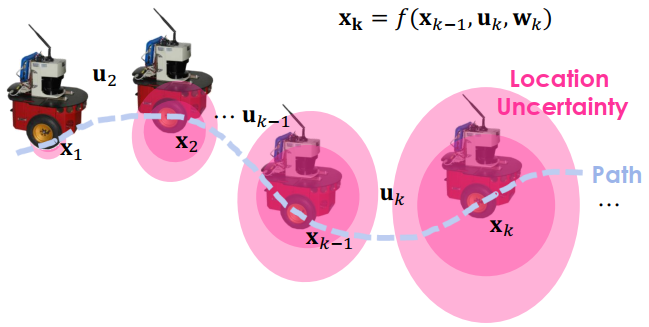

所以我們可以把移動到新位置的公式寫作 $$\mathbf{x}_k = f(\mathbf{x}_{k-1}, \mathbf{u}_k \mathbf{w}_k)$$

* 下一個位置 ($$\mathbf{x}_k$$) 等於以下三者一起計算出來的
  * 前一個位置 ($$\mathbf{x}_{k-1}$$)
  * 控制指令 ($$\mathbf{u}_k$$)
  * 移動的 noise ($$\mathbf{w}_k$$)

### Mapping

自走車行走中，同時也會用 sensor 來感測周圍的標的物 ($$\mathbf{m}_j$$)，計算測量值 ($$\mathbf{z}_{k, j}$$)

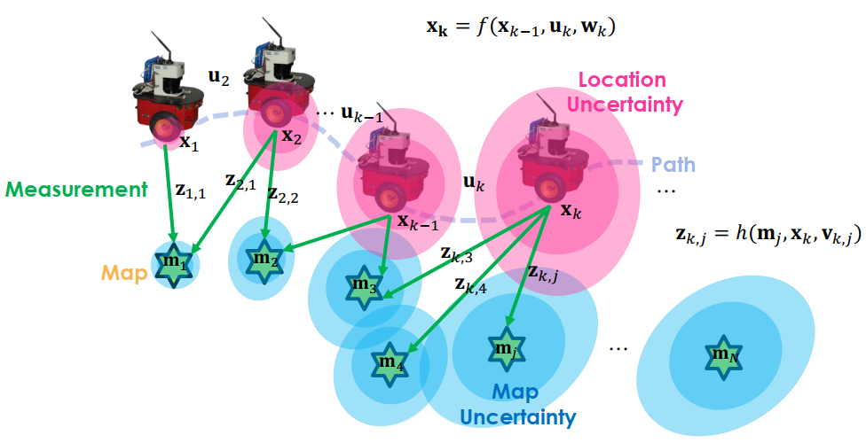

在時間 k 測量目標 j 的結果可以寫成 $$\mathbf{z}_{k, j} = h(\mathbf{m}_j, \mathbf{x}_k, \mathbf{v}_{k, j})$$

* 在時間 k 對目標 j 測量的值 ($$\mathbf{z}_{k, j}$$) 等於以下三者所計算出來的
  * 目標物 ($$\mathbf{m}_j$$)
  * 車子位置 ($$\mathbf{x}_k$$)
  * 測量的 noise ($$\mathbf{v}_{k, j}$$)

### Problem

可以看到 localize 和 mapping 都會有誤差，分別是 $$\mathbf{w}_k$$ 和 $$\mathbf{v}_{k, j}$$

* $$\mathbf{w}_k$$ 造成粉紅色的 location uncertainty
* $$\mathbf{v}_{k, j}$$ 造成藍色的 map uncertainty

而 SLAM 問題就是如何利用帶有這些 noise 的資料，也就是 $$\mathbf{u}$$ 和 $$\mathbf{z}$$，來估計自走車狀態 ($$\mathbf{x}$$)、和目標物狀態 ($$\mathbf{m}$$)

## Probability Graphical Model for SLAM Problem

我們可以將 SLAM problem 轉為 probability graphical model 的樣式

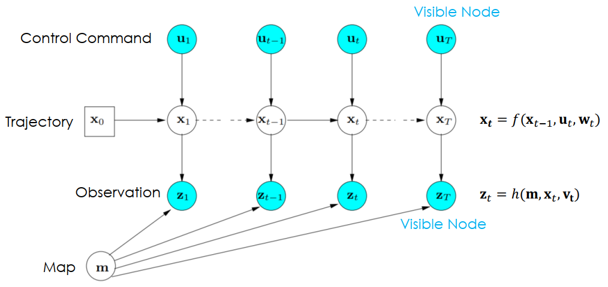

* 每個變數變成了一個節點
* 藍色節點為 visible node 代表可以直接被偵測
* 箭頭代表了因果的關係
* Noise ($$\mathbf{w}_t, \mathbf{v}_t$$) 被自動 model 在這個機率模型裡面

可以看到在 SLAM problem 的兩個式子都可以在圖上被表現出來

$$\begin{aligned}
&\mathbf{x}_{t}=f\left(\mathbf{x}_{t-1}, \mathbf{u}_{t}, \mathbf{w}_{t}\right)\\
&\mathbf{z}_{t}=h\left(\mathbf{m}, \mathbf{x}_{t}, \mathbf{v}_{\mathbf{t}}\right)
\end{aligned}$$

### Front-end

SLAM 有三個前端架構，結合在一起可以在特定時間 t 建立車子的位置 (pose, $$\mathbf{x}_t$$) 和環境的地圖 ($$\mathbf{m}$$)

若感測器為視覺感測器，那麼 front-end 又稱 visual odometry

* Prediction
  * 從前一刻的 $$\mathbf{x}_{t-1}$$ 還有同時刻的 $$\mathbf{u}_t$$ 來推測該時刻的 $$\mathbf{x}_t$$

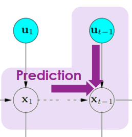

* Tracking
  * 根據目前觀測資訊 $$\mathbf{z}_t$$ 來推測目前的位置狀態 $$\mathbf{x}_t$$

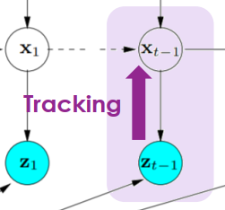

* Mapping
  * 根據目前觀測資訊 $$\mathbf{z}_t$$ 來建構地圖 $$\mathbf{m}$$

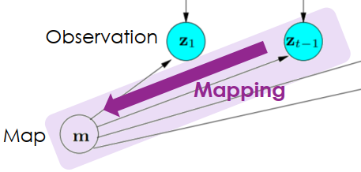

### Back-end

上面的觀測、預測通常會有誤差，累積後會產生錯誤，所以需要由 back-end 來修飾

在 back-end 有兩種做法來補償誤差，一種是 filter-based 一種是 graph-based

* Filter-based error compensation
  * 直接根據最近的誤差來調整
  * 即時 (online) 但整體優化不佳

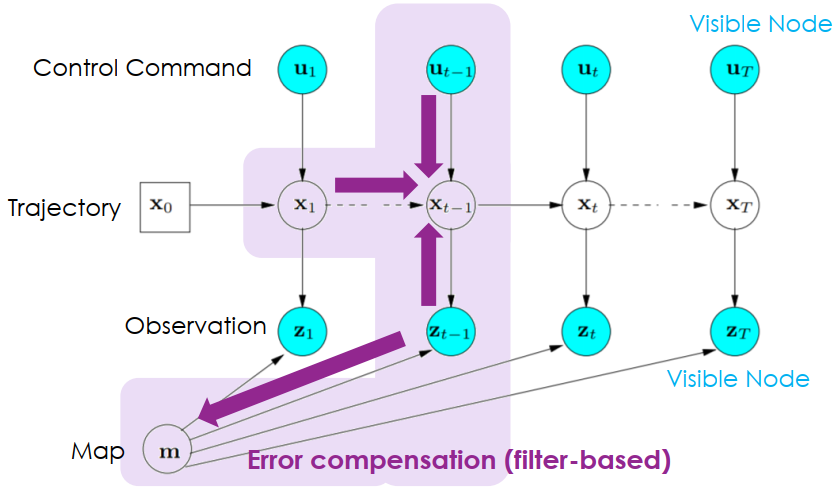

* Graph-based error compensation
  * 每個時間點，都使用過去多個時間點的誤差來調整

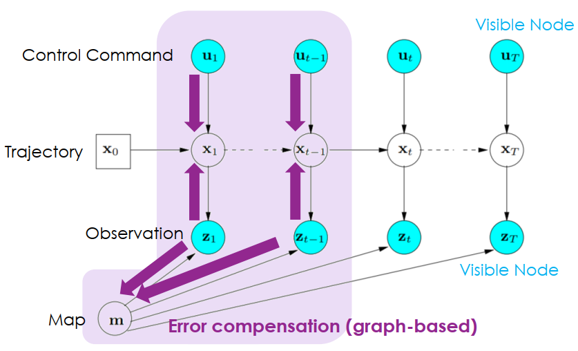

發現 error 的方法稱為 loop closure detection

* 檢查自走車是否到達以前到過的位置
* 確定繞一圈後，將資訊丟給 error compensation

# Probability Theory and Bayes Filter

## Statistical Inference

Inference 是從 premises 來推測出 consequences 的過程

因為不可能從所有 premises 來推測，所以只拿一些 samples 來測，叫做 statistical inference

* Hypothesis Testing (Top-down)
  * 是機器學習常用作法
  * 透過不斷假設 parameters 並帶入 samples 來評估結果是否正確
  * 最終得到最棒的 parameters
* Estimation (Bottom-up)
  * 直接從 samples 去推測 parameters

### Maximum Likelihood Estimation

最有名的 estimation 是 MLE

MLE 看看哪一個參數 ($$\theta_k$$) 的 likelihood 分布最有可能產生 samples ($$x$$)

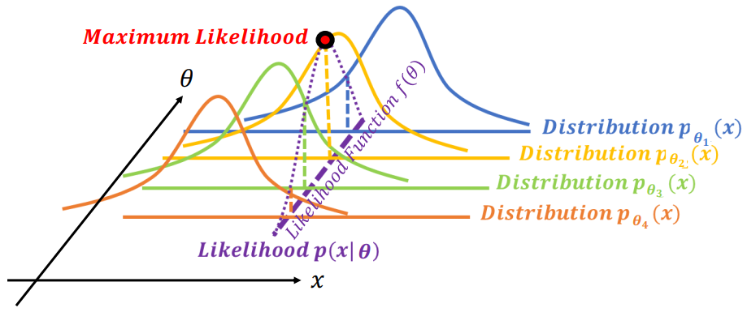

可以看到在不同 $$\theta$$ 分布下產生 $$x$$ 的機率為 likelihood ($$p(x\mid\theta)$$)

而所有不同參數 $$p(x\mid\theta)$$ 所連成的線就是 likelihood function ($$f(\theta)$$)

### Maximum a Posteriori Estimation

MLE 採樣時可能產生誤差，猜錯真正的 likelihood 分布，所以有了 MAP

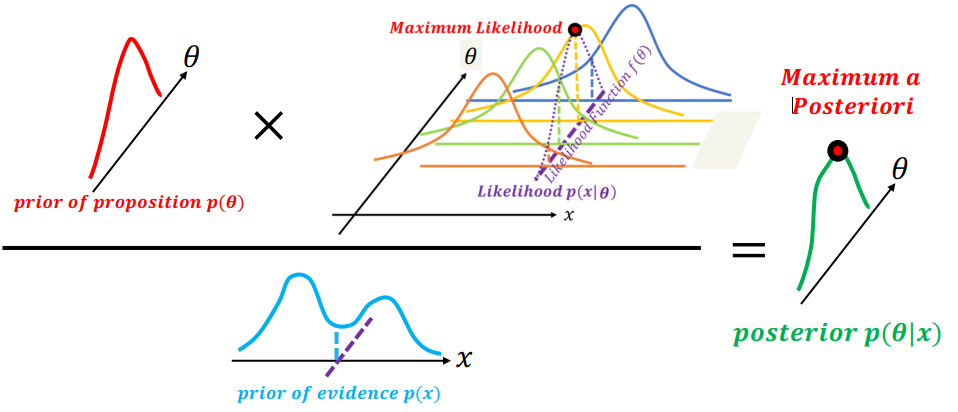

MAP 多考量了 prior 的機率，所以可以降低 MLE 採樣錯誤所產生的誤差

### Example

#### MLE

以投硬幣舉例，總共投了五次 (Tail, Tail, Tail, Head, Tail)

我們想知道正面機率 ($$\theta$$) 是多少，才造成上面的結果 ($$x$$)，也就是要求 likelihood ($$p(x\mid\theta)$$)

$$\begin{aligned}
&\text{Find } \max _{p} \theta(1-\theta)^{4}\\\\
&\frac{d \theta(1-\theta)^{4}}{d \theta}=(1-\theta)^{4}+4 \theta(1-\theta)^{3}(-1)=(1-\theta)^{3}(5 \theta-1)=0\\\\
&\theta = 0.2
\end{aligned}$$

#### MAP

$$\frac{p(\theta) p(x | \theta)}{p(x)}=p(\theta | x)$$

同樣的題目，我們定義 prior 為 Discrete Uniform Distribution，也就是各為 1/11 (0.0 到 1.0)

$$
\frac{\begin{bmatrix}
1/11 \\ 1/11 \\ 1/11 \\\vdots
\end{bmatrix}
\times \begin{bmatrix}
(0)^1(1)^4 \\ (0.1)^1(0.9)^4 \\ (0.2)^1(0.8)^4 \\\vdots
\end{bmatrix}
}{p(x) = \sum_\theta p(x, \theta) = \sum_\theta p(x\mid\theta)p(\theta)}
= \begin{bmatrix}
0.000\\0.213\\0.333\\\vdots
\end{bmatrix}
$$

因為 prior 是 uniform distribution，所以其實 MAP 沒有改變太多

## Bayesian Approach

不斷用 prior + likelihood 來計算 posterior 並更新假設

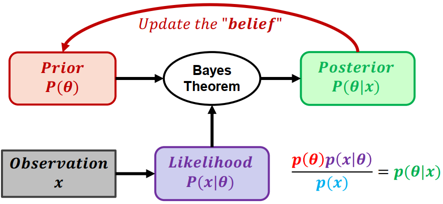

不再是看誰讓 likelihood 或 posterior 最大化，而是直接觀察 parameters 的分布

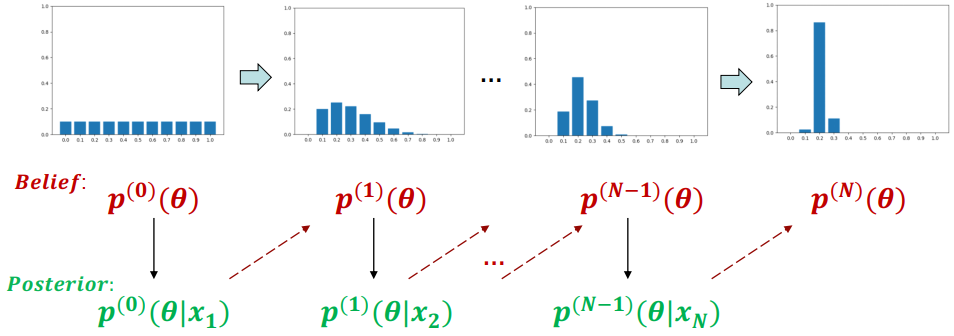

## Bayes Filter

Bayesian approach 會將參數 ($$\theta$$) 帶入 prior、likelihood 計算出 posterior。posterior 再重新做為下一輪的 belief 進行計算，最終找出參數 ($$\theta$$) 的分布

### State Prediction

我們也可以應用於 SLAM 的 probability graphical model

$$\begin{aligned}
P\left(\mathbf{x}_{\mathrm{t}} | \mathbf{z}_{1: t-1}, \mathbf{u}_{1: t}\right) &=\int P\left(\mathbf{x}_{\mathrm{t}} | \mathbf{x}_{t-1}, \mathbf{z}_{1: t-1}, \mathbf{u}_{1: t}\right) \mathrm{P}\left(\mathbf{x}_{t-1} | \mathbf{z}_{1: t-1}, \mathbf{u}_{1: t}\right) d x_{t-1} \\
&=\int P\left(\mathbf{x}_{\mathrm{t}} | \mathbf{x}_{t-1}, \mathbf{u}_{t}\right) \mathrm{P}\left(\mathbf{x}_{t-1} | \mathbf{z}_{1: t-1}, \mathbf{u}_{1: t}\right) d x_{t-1} 
\end{aligned}$$

* 我們可以用 $$\mathbf{u}_1$$ 到 $$\mathbf{u}_t$$
* 以及 $$\mathbf{z}_1$$ 到 $$\mathbf{z}_t$$
* 來估算當前時間點的 $$\mathbf{x}_t$$

> * 化簡中，因為 $$\mathbf{x}_{t-1}$$ 為已知
> * 所以 $$\mathbf{x}_{t-1}$$ 之前的觀測資訊就都不重要了

我們可以將式子簡寫成以下樣子 (bel 代表 belief)

$$
\overline{b e l}\left(\mathbf{x}_{\mathrm{t}}\right)=\int P\left(\mathbf{x}_{\mathrm{t}} 
\mid \mathbf{x}_{t-1}, \mathbf{u}_{t}\right) b e l\left(\mathbf{x}_{\mathrm{t}}\right) d x_{t-1}
$$

* $$\overline{b e l}\left(\mathbf{x}_{\mathrm{t}}\right)$$ 為當下時刻的估測
  * 當下時刻還沒觀測到同時間的 $$\mathbf{z}_t$$
* $$b e l\left(\mathbf{x}_{\mathrm{t}}\right)$$ 為前一時刻的估測
  * 已經觀測到該時間點的 $$\mathbf{t}_{t-1}$$

### Measurement Update

當我們得到了觀測資訊 ($$\mathbf{z}_t$$) 就可以用來更新位置資訊 ($$\mathbf{x}_t$$)

$$\begin{aligned}
P\left(\mathbf{x}_{\mathrm{t}} | \mathbf{z}_{1: t}, \mathbf{u}_{1: t}\right) &=\frac{P\left(\mathbf{z}_{\mathrm{t}} | \mathbf{x}_{\mathrm{t}}, \mathbf{z}_{1: t-1}, \mathbf{u}_{1: t}\right) P\left(\mathbf{x}_{\mathrm{t}} | \mathbf{z}_{1: t-1}, \mathbf{u}_{1: t}\right)}{P\left(\mathbf{z}_{\mathrm{t}} | \mathbf{z}_{1: t-1}, \mathbf{u}_{1: t}\right)} \\
&=\eta P\left(\mathbf{z}_{\mathrm{t}} | \mathbf{x}_{\mathrm{t}}, \mathbf{z}_{1: t-1}, \mathbf{u}_{1: t}\right) P\left(\mathbf{x}_{\mathrm{t}} | \mathbf{z}_{1: t-1}, \mathbf{u}_{1: t}\right) \\
&=\eta P\left(\mathbf{z}_{\mathrm{t}} | \mathbf{x}_{\mathrm{t}}\right) P\left(\mathbf{x}_{\mathrm{t}} | \mathbf{z}_{1: t-1}, \mathbf{u}_{1: t}\right) \\
\end{aligned}$$

* 可以看到左邊的算式中有 $$\mathbf{z}_{1:t}$$
* 但右邊的只有 $$\mathbf{z}_{1:t-1}$$

一樣可以轉成以下的 belief 表達方式

$$
b e l\left(\mathbf{x}_{\mathrm{t}}\right)=\eta P\left(\mathbf{z}_{\mathrm{t}} | \mathbf{x}_{t}\right) \overline{b e l}\left(\mathbf{x}_{\mathrm{t}}\right)
$$

* $$bel$$ 表示有 $$\mathbf{z}_t$$ 資訊
* $$\overline{bel}$$ 表示沒有 $$\mathbf{z}_t$$ 資訊

### Bayes Filter Algorithm

Bayes filter 就是上面兩個式子遞迴互相更新所產生

寫成 pseudo code 表示為

#### Example

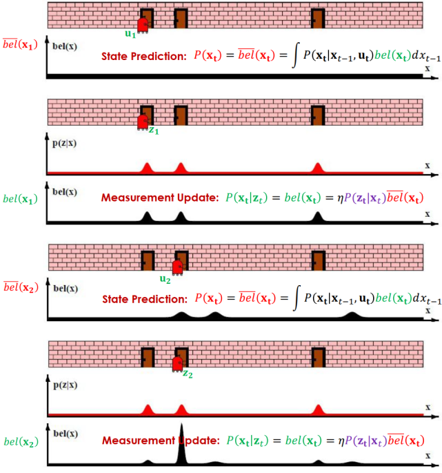

* 一開始的 $$bel(\mathbf{x}_t)$$ 是 prior distribution
* 感測到 $$\mathbf{z}_1$$ 得到 likelihood ($$P(\mathbf{z}_t\mid\mathbf{x}_t)$$) 後可以更新 $$bel(\mathbf{x}_1)$$
* 接著有了 $$\mathbf{u}_2$$ 可以更新運動狀態 $$\overline{bel}(\mathbf{x}_2)$$
* 接著一樣感測到 $$\mathbf{z}_2$$ 更新回去得到最新的 $$bel(\mathbf{x}_2)$$

# Kalman Filter

機器人透過 prior 分布 (原本就預測的目的地, $$x_k^{\text{pre}}$$) 和 likelihood 分布 (感應地標後得到的目的地, $$x_k^{\text{obs}}$$)

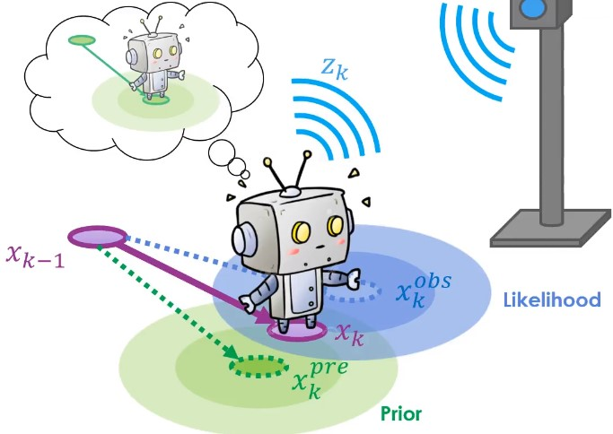

結合兩個分布就能得到 posterior 分布 (最終決定移動的點, $$x_k^{\text{est}}$$)

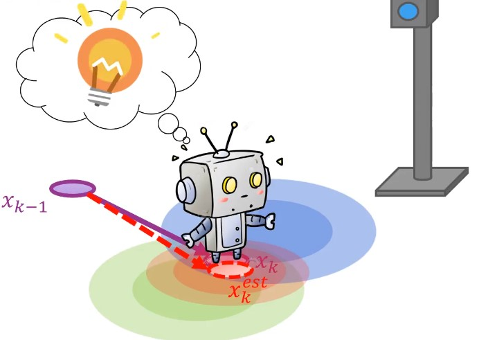

## Kalman Filter

以下是 kalman filter 對狀態的建模

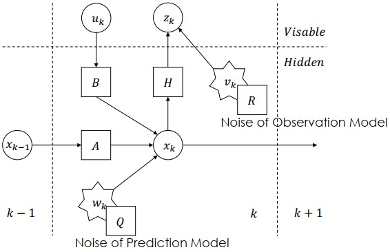

* x-axis: 時間方向
* y-axis: 可觀察、不可觀察
* Noise 的分布 (Q, R) 在假設中皆為高斯分布 (Gaussian distribution)
* Goal: 用可觀察的東西，對不可觀察的東西做出預測

假設所有變換都是線性的，可以得到以下公式:

$$
\begin{aligned}
&x_{k}=A x_{k-1}+B u_{k}+w_{k}\\
&z_{k}=H x_{k}+v_{k}
\end{aligned}
$$

### Kalman Filter Computation Steps

共有四個參數: $$A, B, Q, R$$

1. 預測下一個狀態

$$
x_{k}^{p r e}=A x_{k-1}^{e s t}+B u_{k}
$$

2. 計算預測的 covariance

$$
P_{k}^{p r e}=A P_{k-1}^{e s t} A^{T}+Q
$$

3. 計算 Kalman-gain

$$
K_{k}=P_{k}^{p r e} H^{T}\left(H P_{k}^{p r e} H^{T}+R\right)^{-1}
$$

4. 預測狀態的 mean

$$
x_{k}^{e s t}=x_{k}^{p r e}+K_{k}\left(z_{k}-H x_{k}^{p r e}\right)
$$

5. 預測狀態的 covariance

$$
P_{k}^{e s t}=\left(I-K_{k} H\right) P_{k}^{p r e}
$$

## Extended Kalman Filter

Kalman filter 線性以及高斯分布的假設讓所有運算都變得簡單

但在現實中的狀況大多不是這麼簡單

於是在 Kalman filter 上加入"線性近似"的概念，就得到了 extended Kalman filter

也就是在預測狀態的 mean 時，改用 1st order Taylor expansion 來求

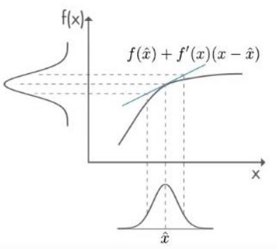

可以看到藍色線就是求得的近似線性值

我們可以得到新的公式:

* Prediction Model \& Observation Model

$$
\begin{aligned}
&x_{k}=f\left(x_{k-1}, u_{k}\right)+w_{k}\\
&z_{k}=h\left(x_{k}\right)+v_{k}
\end{aligned}
$$

* Jacobian Matrix:

$$
F_{k}=\frac{\partial f\left(\hat{x}_{k-1}, u_{k}\right)}{\partial x}, H_{k}=\frac{\partial h\left(\hat{x}_{k}\right)}{\partial x}
$$

* Linearized System

$$
\begin{aligned}
&x_{k}=f\left(\hat{x}_{k-1}, u_{k}\right)+F_{k}\left(x_{k-1}-\hat{x}_{k-1}\right)+w_{k}\\
&z_{k}=h\left(\hat{x}_{k}\right)+H_{k}\left(x_{k}-\hat{x}_{k}\right)+v_{k}
\end{aligned}
$$

### Extended Kalman Filter Computation Steps

在原本的 Kalman filter 時，計算中的 A, H 都是固定的

而在 EKF 中，每個時間點都須根據前一刻的估計值，重新用第一階的 taylor expansion 求得線性近似

$$\begin{aligned}
&x_{k}^{p r e}=f\left(x_{k-1}^{e s t}, u_{k}\right)\\
&P_{k}^{\text {pre}}=F_{k} P_{k-1}^{\text {pre}} F_{k}^{T}+Q\\
&K_{k}=P_{k}^{p r e} H^{T}\left(H P_{k}^{p r e} H^{T}+R\right)^{-1}\\
&x_{k}^{e s t}=x_{k}^{p r e}+K_{k}\left(z_{k}-H x_{k}^{p r e}\right)\\
&P_{k}^{e s t}=\left(I-K_{k} H\right) P_{k}^{p r e}
\end{aligned}$$

## EKF-SLAM

為了將 EKF 應用到 SLAM 問題中，首先要將 pose, landmark 定義成狀態 (state)

$$
s_{k}=\left(\underbrace{x, y, \theta}_{\text{robot's pose}}, \underbrace{m_{1, x}, m_{1, y}}_{\text{landmark 1}}, \underbrace{m_{2, x}, m_{2, y}}_{\text{landmark 2}}, \ldots, \underbrace{m_{n, x}, m_{n, y}}_{\text{landmark n}}\right)^{T}
$$

而狀態的分布如下，其中 covariance 可以拆成四個部分 (pose 本身關聯、pose 和 map 關聯、map 本身關聯)

$$\left[\begin{array}{c}
x \\
y \\
\theta \\
m_{1,x} \\
m_{1,y} \\
\vdots \\
m_{n,x} \\
m_{n,y}
\end{array}\right] \rightarrow \mu=\left[\begin{array}{c}
\mathbf{x} \\
\mathbf{m}
\end{array}\right], \Sigma=\left[\begin{array}{cc}
\Sigma_{\mathbf{x x}} & \Sigma_{\mathbf{x m}} \\
\Sigma_{\mathbf{m x}} & \Sigma_{\mathbf{m m}}
\end{array}\right]$$

### Prediction Model

* Prediction Model

$$\left[\begin{array}{l}
x^{\prime} \\
y^{\prime} \\
\theta^{\prime}
\end{array}\right]=\left[\begin{array}{l}
x \\
y \\
\theta
\end{array}\right]+\left[\begin{array}{c}
-\frac{v}{\omega} \sin (\theta)+\frac{v}{\omega} \sin \left(\theta+\omega_{t} \Delta t\right) \\
\frac{v}{\omega} \cos (\theta)-\frac{v}{\omega} \cos \left(\theta+\omega_{t} \Delta t\right) \\
\omega \Delta t
\end{array}\right]$$

* Linearized the velocity motion model (對 prediction model 微分)

$$
F_t^x = \frac{\partial f}{\partial(x,y,\theta)^T}\left[\begin{array}{l}
x^{\prime} \\
y^{\prime} \\
\theta^{\prime}
\end{array}\right] = 
\left[\begin{array}{ccc}
1 & 0 & -\frac{v_{t}}{\omega_{t}} \cos (\theta)+\frac{v_{t}}{\omega_{t}} \cos \left(\theta+\omega_{t} \Delta t\right) \\
0 & 1 & -\frac{v_{t}}{\omega_{t}} \sin (\theta)+\frac{v_{t}}{\omega_{t}} \sin \left(\theta+\omega_{t} \Delta t\right) \\
0 & 0 & 1
\end{array}\right]
$$

### Observation Model

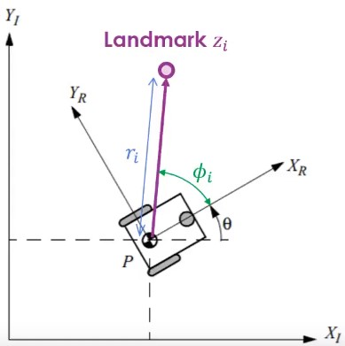

* Given observation model

$$z_{i}=\left[\begin{array}{c}
\sqrt{q} \\
\operatorname{atan} 2\left(\delta_{x}, \delta_{y}\right)-\theta
\end{array}\right], \delta=\left[\begin{array}{c}
m_{i, x}-x \\
m_{i, y}-y
\end{array}\right], q=\delta^{T} \delta$$

* Linearized the observation model (對 observation model 微分)

$$H^{i}=\frac{\partial z_{i}}{\partial\left(x, y, \theta, m_{i, x}, m_{i, y}\right)}=\frac{1}{q}\left[\begin{array}{ccccc}
-\sqrt{q} \delta_{x} & -\sqrt{q} \delta_{y} & 0 & \sqrt{q} \delta_{x} & \sqrt{q} \delta_{y} \\
\delta_{y} & -\delta_{x} & -q & -\delta_{y} & \delta_{x}
\end{array}\right]$$

* 矩陣大小為 2 * 5
  * 2 為某個地標的 x, y 座標
  * 5 為自走車 pose 的 3 個變數 + 地標的 2 個座標 (x, y)
* 如果今天觀察 l 個地標
  * 那矩陣大小就是 (2l) * (3 + 2l)

### Summary

我們可以建構關聯性的轉換矩陣，把上面兩種的局部結果，轉換到全局的整個狀態情況下

* Prediction model (3*n, n 為狀態數量)

$$F_{t}=\left[\begin{array}{llllll}
1 & 0 & 0 & 0 & \cdots & 0 \\
0 & 1 & 0 & 0 & \cdots & 0 \\
0 & 0 & 1 & 0 & \cdots & 0
\end{array}\right]^{T} \times F_{t}^{x}$$

* Observation model (5*n, 左上角 3 個與 pose 有關, 其餘每 2 個為 landmark)

$$H_{t}=\left[\begin{array}{ccccccccc}
1 & 0 & 0 & 0 & \cdots & 0 & 0 & 0 & 0 & \cdots & 0 \\
0 & 1 & 0 & 0 & \cdots & 0 & 0 & 0 & 0 & \cdots & 0 \\
0 & 0 & 1 & 0 & \cdots & 0 & 0 & 0 & 0 & \cdots & 0 \\
0 & 0 & 0 & 0 & \cdots & 0 & 1 & 0 & 0 & \cdots & 0 \\
0 & 0 & 0 & 0 & \cdots & 0 & 0 & 1 & 0 & \cdots & 0
\end{array}\right] \times H_{t}^{i}$$

有了全局的 $$F_{t}, H_{t}$$ 就可以帶進 EKF 中開始計算

$$\begin{aligned}
&x_{k}^{p r e}=f\left(x_{k-1}^{e s t}, u_{k}\right)\\
&P_{k}^{\text {pre}}={\color{red}F_{k}} P_{k-1}^{\text {pre}} {\color{red}F_{k}^{T}}+Q\\
&K_{k}=P_{k}^{p r e} {\color{red}H^{T}}\left({\color{red}H} P_{k}^{p r e} {\color{red}H^{T}}+R\right)^{-1}\\
&x_{k}^{e s t}=x_{k}^{p r e}+K_{k}\left(z_{k}-{\color{red}H} x_{k}^{p r e}\right)\\
&P_{k}^{e s t}=\left(I-K_{k} {\color{red}H}\right) P_{k}^{p r e}
\end{aligned}$$