# SLAM Overview

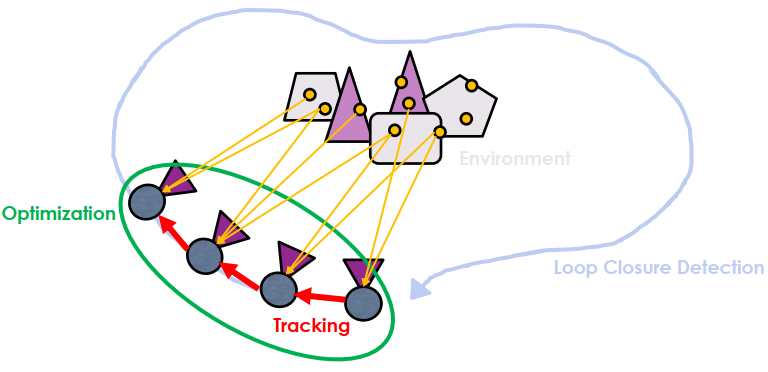

* Pose Tracking
利用連續的測量來估計運動

* Local optimization
利用幾次測量來優化對地圖的誤差

* Loop Closure Detection
檢查是否形成環路，來穩定整個 SLAM 架構

## Information from Image Data

一種 SLAM 定義方式是由抓點方式定義，因為 ICP 時要抓點，所以有幾種方法可以抓點

* Dense: 接收全點
* Demi-Dense: 接收較重要的點
* Sparse: 接收較少的點

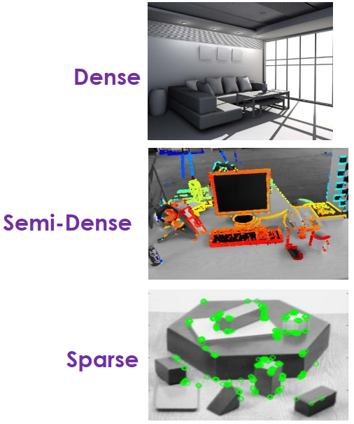

## Objective Function

另一種 SLAM 定義方式為 direct, indirect

* Indirect: 跟對應點的投影結果比較，越像越好
* Direct: 畫面點都已定義好，所以可以直接比較

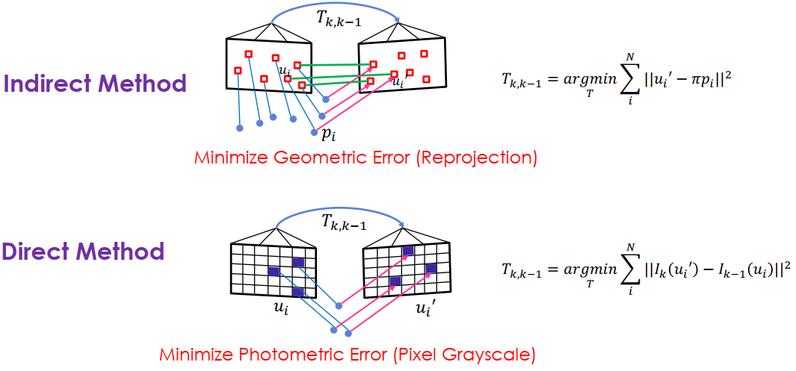

## History of Visual SLAM

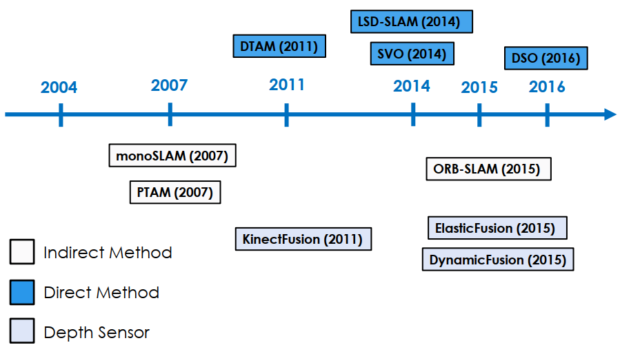

* [ORB-SLAM](https://www.youtube.com/watch?v=IuBGKxgaxS0) (sparse + indirect)
* [LSD-SLAM](https://www.youtube.com/watch?v=GnuQzP3gty4) (semi-dense + direct)
* [Kinect Fusion](https://www.youtube.com/watch?v=KOUSSlKUJ-A) (depth sensor addition)

我們可以把 Feature-based Visual SLAM 分成兩大學問

* Computer Vision (measurement)
  * Feature Points Matching
  * Perspective-n-Points
  * Bundle Adjustment
  * Epipolar Geometry

* System Pipeline (optimization)
  * Map storage
  * Graph Optimization
  * Loop Closure Detection

# SLAM Direct Method

Indirect method 雖然能夠容忍環境的變化，但 matching 耗時，在特殊場景會找不到特徵點，且大量的特徵點可能不會被使用

而 direct method 雖然需要在光源需穩定 (亮度不變)，相機移動小 (特徵點位置不會劇烈變化) 的情況才能實作，但計算較快速 (省略 matching)

* 光流法: 直接找到像素點下個 frame 的位置 (不用 matching)
* 直接法: 直接找特徵點，其 transform 的 intensity 誤差盡量小 (最佳化問題)

## Optical flow

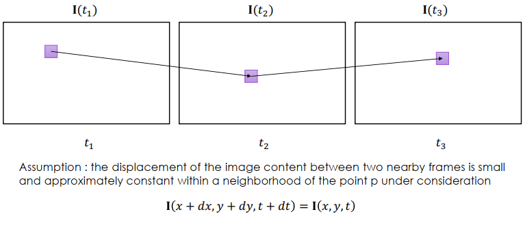

必須滿足 intensity invariant，也就是 intensity 不變 (一階微分等於 I(x,y,t))

Lucas–Kanade (L-K) Method 是 optical flow 的一個算法

必須要滿足另一個條件 local consistency，也就是每個 pixel 的 optical flow displacement 一致

## Direct Method

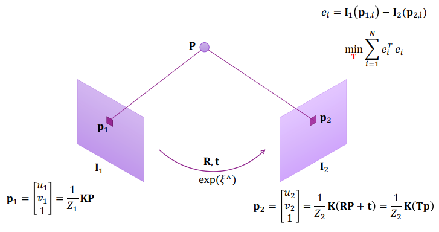

Direct Method 一樣要滿足 intensity invariant，想法是最小化轉換產生的 error term

* p2 是轉換得來的
* 最小化 error term = e 對 T 的導數為 0
* 前提是 P 要已知，可以用 sensor 求
* 得到 J 就可以用高斯牛頓或 LM 計算最佳化

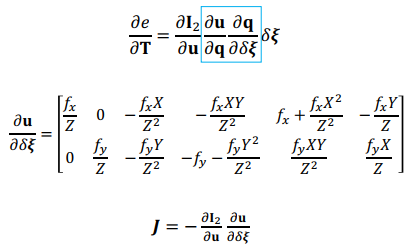

# ORB SLAM

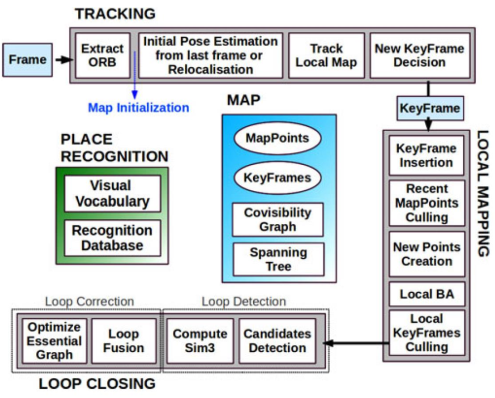

ORB-SLAM 主要可以分成三大部分:

* Tracking
* Local Mapping
* Loop Closing

這三者是非同步處理的

## Covisibility Graph & Essential Graph

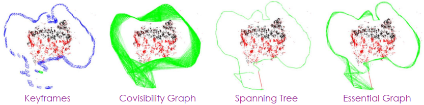

在 ORB SLAM 中有幾種方法表示地圖

* Covisibility Graph 
  * 每個 node 都是 keyframe，而 edges 的權重代表 keyframe 間共同分享的 points 數量

* Essential Graph 
  * Covisibility graph 做完 spanning tree 之後所產生
  * 做法是只對有最多共同點的 keyframe 進行連接
  * 最後再連接共同點大於 100 的 keyframe 得到新的 edges

最後就可以直接用 essential graph 進行最佳化

## Tracking

使用 constant velocity motion model 來預測相機的 pose，根據上個 frame 和現在的 frame 來優化 pose

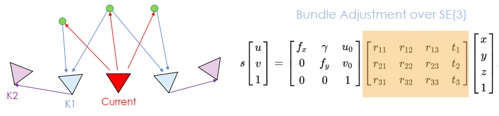

實作時先找附近的 keyframe (K1) 再從 K1 找到 K2 一起最佳化現在的 keyframe

## Mapping

找出潛在的 map points，然後再對他們進行優化

* Keyframe Insertion
針對每個 unmatched ORB，在 covisibility graph 中尋找其他連接的 keyframe (Kc) 有沒有可以 match 的 points

* Map Point Creation
在 covisibility graph 的 connected keyframes 對 ORB 進行 triangulation

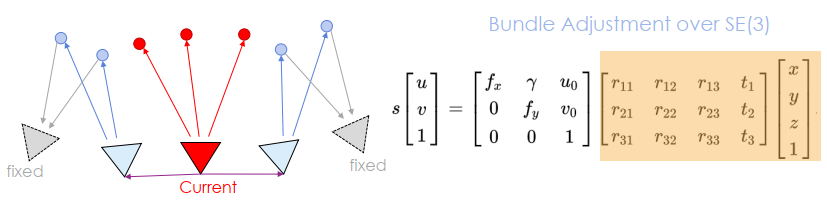

優化當前的 keyframe 和所有連接的 keyframes，以及這些 keyframes 看到的所有 map points

那些看的到 map points 但不跟 current keyframe 連接的 keyframes 會被包含在最佳化中，但是不會改變

## Loop Closing

時間拉長 error 會累積，所以 loop closing 可以穩定整個 ORB-SLAM

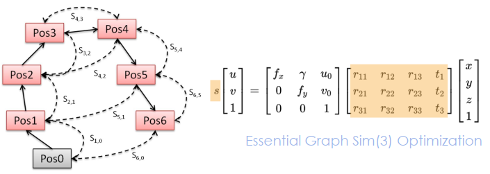

融合重複的地圖點，將 edges 插入 covisibility graph 並傳播 scale 的資訊，修正鄰近 keyframes 的 pose，最後進行 global pose graph 最佳化
